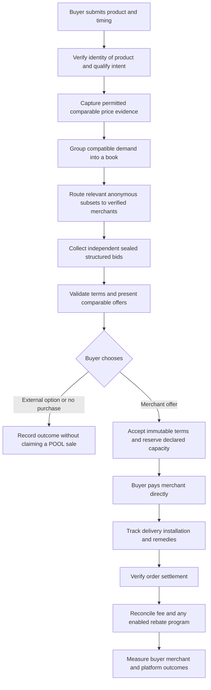

# POOL — Founder Master Specification

**Before you buy it, POOL it.**

| Document control | Value |
| --- | --- |
| Version | 1.1 — frozen baseline with controlled founder-scope amendment recorded 28 September 2026; unrelated rules remain frozen |
| Date | Started 27 September 2026; completed 28 September 2026 |
| Initial discovery scope | Hyderabad, Bengaluru, Mumbai and Delhi; physical consumer products with documented current comparable transaction value approximately INR 5,000+; evidence and applicable gates govern active lanes |
| Working category | Buyer-side demand aggregation and private merchant competition |
| Current evidence | Founder source documents and subsequent recorded amendments; workspace initially empty; selected earlier public-source checks. No empirical pilot results or completed external clearances are supplied. |
| Current implementation | None. This document specifies a proposed system; it does not certify working software, partnerships, compliance, or product-market fit. |
| Decision owner | Founder; required domain responsibilities and specialist reviews are defined below. Actual personnel appointments and completed sign-offs are not established by this document. |
| Controlling rule | Prepare and approve G2/G3 instruments; pass live readiness before commerce; require real business evidence before a full build; POOLBACK remains OFF |

This document replaces contradictory or underspecified instructions in the two source prompts for future POOL planning. It preserves their central thesis while making conservative, explicit operating decisions. A proposed policy is not an executed merchant agreement. A source-backed capability is not access granted to POOL. A software invariant is not a guarantee that an external party will perform.

The goal is a business whose buyers receive better verifiable outcomes, whose merchants earn worthwhile incremental revenue, and whose platform collects enough revenue to operate sustainably. A sophisticated application without those outcomes is a failed experiment.

## POOL Founder Master Specification v1.1 — Adversarial Amendment

Amended on 28 September 2026 against the entire 1,407-line v1.0, read before editing. Baseline SHA-256: `66161841F71224D64ED8B0176E4A1A784D6AD4B20E917D7D07982548E00770A3`. The founder's repeated amendment attachments have identical SHA-256 `9A4FCE0D47A025DA50E5C73E169705BF1187B4D8B5B904D92B8F09A273A6001D`. This is an amendment of the existing file, not another specification or implementation. Sound baseline requirements remain. No new external commercial evidence is claimed.

Each row identifies the defect, exact controlling correction through the merged section cited, type, consequences, validation, later implementation checks, and remaining risk. “Later tests” are requirements only. Sections numbered below retain their v1.0 identities; decimal subsections identify exact amended/additional text.

| Defect identified | Corrected policy and exact merged location | Affected v1.0 sections | Change type | Consequence | Required validation | Required tests later | Unresolved risk |
| --- | --- | --- | --- | --- | --- | --- | --- |
| D01 One pooling label hides two mechanisms | Name Demand Visibility Effect/Advantage (A) and Realized Volume Effect/Advantage (B); initial quote study tests A; own settled economics required for B (§1, §21, §22) | 1, 4, 18, 21, 22, 36, 37 | CORRECTION | A, B and ordinary public-market savings cannot substitute for one another | Genuine quotes, followed transactions, merchant evidence with comparator | Report definitions and mechanism labels; no addressable-to-settled conversion | HYPOTHESIS: either mechanism may fail |
| D02 Fragmentation treated as a minor caveat | Competition–Concentration Tension; independent choice; measure merchant shares/shortfalls (§4.1) | 4, 12, 18, 21, 22, 37 | NEW HYPOTHESIS | No promise of maximal competition plus maximal seller volume; no tier allocation | Actual choice distribution and merchant participation | Dedup/share denominators; ranking independent of tiers | UNKNOWN: volume may never concentrate enough |
| D03 Merchant delay can reduce its own rebate bill | Human evidence-based Settlement Delay Attribution; affected-cohort treatment must be agreed before activation (§18.7) | 15–18, 23, 27–30, 33, 36–38 | BLOCKER | Future suspension alone cannot authorize a live program | Milestone/evidence history; signed commercial treatment; specialist review | Near-tier delay, disputed attribution and approved remedy paths; launch guard | UNKNOWN: fair acceptable remedy; strategic delay |
| D04 Computation confused with recoverable money | Separate calculated, secured, merchant-due and verified-paid amounts; commercial/legal/payment credit decision (§18.8) | 9, 18–20, 22, 24, 28, 34, 36–37 | BLOCKER | No security/guarantee inferred; live POOLBACK OFF | Exposure, security/partner necessity, default/loss allocation and buyer claims reviewed | Unsecured cap, partial receipt, unknown result, default and admission freeze | UNKNOWN: loss recovery and POOL reputational/legal exposure |
| D05 Delayed benefit assumed useful | POOLBACK Delay-Sensitivity Hypothesis; 45 days remains shadow proposal (§18.3, §18.9) | 7, 18, 21, 25, 36–38 | NEW HYPOTHESIS | No production timing engine committed | INR 500/1,000/2,000 delayed versus same upfront benefit; merchant delay data | Timing/version boundaries only after approved design | UNKNOWN: stated preference may not predict behavior |
| D06 Crossover falsely restores control purity | Full Merchant Treatment Exposure History; stable ownership assignment per block (§21.2) | 6, 12, 21, 22, 27, 35–37 | CORRECTION | Experienced crossover never naïve clean control | Ownership, historical disclosures, spillover and feasible design | Stable assignment/history retention; cluster analysis denominators | UNKNOWN: contamination and small independent sample |
| D07 Three merchants mistaken for adequate evidence | Marketplace Coverage Minimum separate from Experimental Evidence Requirement (§3.2, §21.2–21.3) | 3, 12, 21, 22, 37 | CLARIFICATION | No universal experimental N or pseudoreplication | Feasibility variance, clusters, windows, effect and missingness | No automatic causal-success flag from lane count | REQUIRES VALIDATION: confirmatory study may be infeasible |
| D08 Transition details left to implementation invention | Closed transition sets, common enforcement envelope, term definitions, cross-state answers and status priority (§28.3–28.5) | 11, 14–19, 27–30, 33 | CORRECTION | All unlisted edges forbidden; facts and obligations remain independent | Operators walk actual exceptions and applicable contracts | Every edge/complement, role, retry, race, correction and priority case | REQUIRES VALIDATION: evidence quality and external performance |
| D09 Arbitrary loss window proposed | Provider-defined justified RPO/RTO plus exercised backup/restore and divergence reconciliation (§34.2) | 30–31, 33–34, 36 | RELEASE-GATE CHANGE | Live records prohibited without demonstrated acceptable recovery | Selected system, achieved timings, gap detection and restore evidence | Lost internal record with external payment/return; safe replay | UNKNOWN: actual recovery capability until selected/exercised |
| D10 Direct-pay trust gap hidden in conversion | Trust Discount / Trust Premium; evidence-preferred merchants; separate trust refusal (§11, §22.3) | 6, 11, 15, 21–23, 25, 37 | NEW HYPOTHESIS | Cheap offer does not prove adoption | Actual buyer choice/reasons and truthful seller/payment evidence | Distinct refusal reasons, multiple causes, UNKNOWN; no inferred ceiling | UNKNOWN: sufficient proposition to induce switching |
| D11 Unneeded sensitive ceiling collected | No buyer maximum willingness-to-pay in MVP; future feature review required (§1.1, §10, §24, §27, §29) | 1, 10, 12, 23–25, 27, 29, 31, 33–34 | CORRECTION | Remove optional storage/permission; reject inputs, redact unsolicited material | Review intake, interview, import, analytics and retention processes | No field/projection/inference or leak via free-text/logs | REQUIRES VALIDATION: staff adherence and accidental disclosures |
| D12 Legal work not a hard pre-live dependency | LIVE PILOT READINESS GATE with adviser/scope/version/date/issues/dispositions (§24.1, §36) | 7, 21, 24, 33–36 | RELEASE-GATE CHANGE | G4 remains blocked; research permission does not authorize selling | Actual legal/tax/privacy/commercial/payment/competition review | Gate required on release and material scope changes | REQUIRES SPECIALIST REVIEW: actual classification/duties |
| D13 Buyer purchase mistaken for merchant viability | Merchant Economic Acceptance evidence profile (§22.2) | 5–6, 19, 21–22, 35–37 | NEW INVARIANT | Honor, repeat at real fee, burden and receipts matter; refusals count negatively | Merchant interviews, equivalent reinvitations, invoices/receipts | Correct denominators; nonresponse/refusal retained | UNKNOWN: confidential margins and true incrementality |
| D14 Product/logistics benefits conflated | Five effect categories with source, perspective and no double count (§4.2) | 4–5, 9, 15, 21–22 | CLARIFICATION | Service quality not assigned invented cash value | Comparable price/service/cost evidence | Component totals and overlap checks | UNKNOWN: true logistics/acquisition cost saving |
| D15 Addressable GMV inflated or treated as achieved | Named demand/commerce values including city/lane segmentation with unique IDs and explicit basis (§22.1) | 4, 10, 12, 18, 20–22, 27 | NEW INVARIANT | Overlapping views/stages cannot be added as platform demand or sales | Actual serviceability and dedup method | Fragmentation, overlap, unknown price, hold and reversal fixtures | REQUIRES VALIDATION: real need uniqueness and capability |
| D16 Experiment may disadvantage buyers | Show valid permitted offers; no secret suppression in this pilot (§12, §21.2) | 9, 12–13, 21, 25 | NEW INVARIANT | Record contamination; preserve buyer choice | Operator protocol and offer presentation review | Better internal/external offer remains visible despite assignment/fee | UNKNOWN: resulting inferential limitations |
| D17 Marketplace/rebate validation blurred | Initial marketplace study excludes live POOLBACK; separate mandatory activation gate (§18.1, §36) | 7, 18, 21, 33–38 | RELEASE-GATE CHANGE | No rebate promises or production engine now | Initial market evidence first; then all delay/credit/economic/review conditions | Disabled-scope guards and accepted-version protection | REQUIRES VALIDATION: successful marketplace may still not support rebates |
| D18 Engineering mistaken for real-world assurance | NON-SOFTWARE RISKS constrain every release decision (§37.1) | 1–5, 23–24, 35–38, 40 | CLARIFICATION | Freeze theory; collect evidence; stop on negative results | Merchants, buyers, operations and qualified specialists | Reporting cannot label policy/software completion as business proof | UNKNOWN: profitability, trust, integrity, performance and product-market fit |

## Consolidated Replacement Text

The corrected text is **already merged below into the original 40 sections**. These are the exact resulting normative sections, not suggestions requiring a second manual merge. The amendment register identifies each affected v1.0 section; new transition contracts are in §28.3–28.5, numerical cases in §20.1–20.6, and operating packets, traceability, audit and freeze decision follow §40. Sound unrelated text has been retained. No separate replacement file, application, schema, dependency, API implementation or UI has been created.

## Controlled founder-scope amendment — 28 September 2026

**FOUNDER DECISION RECORDED:** [Founder Scope Amendment](<C:/Users/shyamjoel/.codex/attachments/2c3c831f-8c5a-4702-b6b5-6b37bc54bccc/Pasted text.txt>) supersedes conflicting discovery geography/category restrictions and supplies the team/time/ceiling inputs recorded in §35. The four-city strategy is founder-selected, not validated. Current field-research status remains **NO-GO**. Guaranteed Offers, settlement, POOLBACK OFF, payment boundaries, privacy, sealed bids, merchant verification, audit, experimental honesty, gates, specialist review and prohibited features remain unchanged.

**Search disposition:** REPLACED BY FOUNDER DECISION — initial-market control; §3 customer/category/geography; §5.3 universal appliance-frequency rationale; §35.4 Hyderabad-first/adjacent-appliance expansion sequence; obsolete absence-of-capacity/ceiling statements in §35/§37; appliance-only G2-M2 wording. STILL VALID AS AN EXAMPLE / HISTORICAL CONTEXT — §3.3 three-appliance illustration; §5.2 illustrative appliance costs; §15–16 appliance delivery/concession illustrations; §20 AC installation example; §32.2 and S04 historical appliance-specific integration limitations; §39 historical Hyderabad market-size verification limit. These examples neither restrict discovery nor establish suitability elsewhere.

## Contents

1. [Company thesis and boundaries](#1-company-thesis-and-boundaries)
2. [Evidence and decision discipline](#2-evidence-and-decision-discipline)
3. [Customer, category, and geography](#3-customer-category-and-geography)
4. [Market mechanism and the source of value](#4-market-mechanism-and-the-source-of-value)
5. [Business model and unit economics](#5-business-model-and-unit-economics)
6. [Distribution and merchant acquisition](#6-distribution-and-merchant-acquisition)
7. [Pilot scope and service promise](#7-pilot-scope-and-service-promise)
8. [Product identity and catalogue](#8-product-identity-and-catalogue)
9. [Price evidence and truthful comparison](#9-price-evidence-and-truthful-comparison)
10. [Buyer intent and demand qualification](#10-buyer-intent-and-demand-qualification)
11. [Merchant verification and capabilities](#11-merchant-verification-and-capabilities)
12. [Demand books, routing, and allocation](#12-demand-books-routing-and-allocation)
13. [Sealed bids, offers, and ranking](#13-sealed-bids-offers-and-ranking)
14. [Acceptance, inventory, and immutable terms](#14-acceptance-inventory-and-immutable-terms)
15. [Payment, fulfillment, and support](#15-payment-fulfillment-and-support)
16. [Cancellation, refunds, returns, and replacement](#16-cancellation-refunds-returns-and-replacement)
17. [Order settlement and evidence](#17-order-settlement-and-evidence)
18. [POOLBACK commercial specification](#18-poolback-commercial-specification)
19. [Merchant fees, collections, and accounting](#19-merchant-fees-collections-and-accounting)
20. [Worked economic cases](#20-worked-economic-cases)
21. [Experiment design and decision gates](#21-experiment-design-and-decision-gates)
22. [Metrics and reporting definitions](#22-metrics-and-reporting-definitions)
23. [Trust, fraud, and reliability](#23-trust-fraud-and-reliability)
24. [Privacy, legal, and commercial readiness](#24-privacy-legal-and-commercial-readiness)
25. [Product experience and accessibility](#25-product-experience-and-accessibility)
26. [Technical architecture and decisions](#26-technical-architecture-and-decisions)
27. [Domain model and database integrity](#27-domain-model-and-database-integrity)
28. [State machines and transition contracts](#28-state-machines-and-transition-contracts)
29. [API and authorization contracts](#29-api-and-authorization-contracts)
30. [Concurrency, idempotency, and jobs](#30-concurrency-idempotency-and-jobs)
31. [Security and evidence handling](#31-security-and-evidence-handling)
32. [AI and integration policy](#32-ai-and-integration-policy)
33. [Testing and acceptance evidence](#33-testing-and-acceptance-evidence)
34. [Deployment, observability, and incident response](#34-deployment-observability-and-incident-response)
35. [Team, operating cadence, and capital discipline](#35-team-operating-cadence-and-capital-discipline)
36. [Execution roadmap and release gates](#36-execution-roadmap-and-release-gates)
37. [Assumption and risk register](#37-assumption-and-risk-register)
38. [Resolved design conflicts](#38-resolved-design-conflicts)
39. [Source register and verification limits](#39-source-register-and-verification-limits)
40. [Source coverage and completion standard](#40-source-coverage-and-completion-standard)

---

## 1. Company thesis and boundaries

**Company sentence:** POOL aggregates qualified purchase intent, lets verified merchants compete privately, and tracks the resulting transactions to measure whether aggregation improves buyer and merchant economics.

**Buyer sentence:** Share the product you intend to buy. Receive clear, comparable offers without unsolicited merchant calls or group coordination.

**Merchant sentence:** Quote privately for relevant buyers, fulfill the orders you win, and pay an agreed fee for verified settled business.

**Mechanism A — Demand Visibility Effect (HYPOTHESIS):** Showing genuine, qualified, merchant-addressable aggregate demand improves the merchant's quantity-one-valid guaranteed offer or objectively specified service terms relative to comparable isolated exposure. **Demand Visibility Advantage** is the prespecified exposure contrast, not total saving against a public retailer.

**Mechanism B — Realized Volume Effect (HYPOTHESIS):** Multiple independently chosen purchases that actually become eligible settled commerce at the same merchant create additional merchant-specific economics. **Realized Volume Advantage** requires evidence of those incremental economics and their basis; volume alone, an example tier, or a calculated rebate does not prove it. Future POOLBACK concerns this mechanism.

The initial quote study tests A. The initial transaction follow-through tests adoption, performance, merchant participation, collected fees, and operating cost. B requires a separate later validation gate. Every experiment, report, stop/go decision, and public claim must name the mechanism. Neither mechanism is proven by ordinary public-market savings.

The hypothesis must survive five tests:

1. Merchants improve actual prices or objectively specified service terms.
2. Enough buyers accept and retain the purchases.
3. Merchants remain willing to participate after discounts, rebates, fulfillment costs, and POOL fees.
4. POOL collects revenue exceeding the costs attributable to winning and servicing those transactions.
5. The incremental benefit persists beyond founder intervention and one-off favors.

The business starts as a managed marketplace with substantial manual operations. The long-term possibility is a neutral demand interface used by consumers, retailers, brands, and eventually external agents. That possibility does not justify implementing agent infrastructure now.

### 1.1 Constitutional rules

- Interest, qualified intent, conditional commitment, accepted order, payment, delivery, and settlement are separate facts.
- An accepted guaranteed price is not increased because another buyer cancels or returns.
- A merchant's upfront offer must stand at quantity one. Additional conditional volume benefits are separate.
- Buyers never have to form groups, pool their purchase money, or coordinate with strangers.
- Buyer contact details are not sold as leads. Losing merchants receive no fulfillment PII.
- Do not collect buyer maximum willingness-to-pay in the MVP, including optional fields, interview answers solicited for this purpose, inferred ceilings, or merchant-facing derivatives. A future reservation-price feature requires separate review; it must retain strict merchant non-disclosure.
- Compare exact products and explicitly specified conditions. Do not claim savings against fictitious MRP benchmarks.
- Show a better verified external option honestly, including when POOL earns nothing.
- Merchants cannot see competitors' bids through POOL. Staff cannot use confidential bids to pressure another merchant.
- Merchant-controlled payments, invoices, fulfillment, refunds, and rebates remain merchant responsibilities in the pilot. POOL operates the buyer-facing workflow and evidence process.
- LLM output never establishes contractual terms, payment, stock, settlement, or a financial entitlement.
- Accepted terms and economic events are versioned and auditable. Corrections append history.
- No fabricated merchants, demand, stock, prices, integrations, or transactions enter live operation.
- No customer discount funded by POOL to manufacture apparent mechanism success.
- Safety controls required by a live workflow exist before that workflow serves genuine users.

### 1.2 Boundaries

POOL initially owns product clarification, demand qualification, routing, private quoting, offer comparison, acceptance records, operational coordination, and evidence-based reconciliation. Merchants own merchandise and execute fulfillment. Existing financial institutions and merchant payment providers move purchase money.

POOL does not initially build inventory ownership, warehouses, drivers, lending, COD, BNPL, wallets, escrow, subscriptions, referral cash, public seller advertising, a social feed, native mobile apps, autonomous purchases, national catalogue coverage, or proprietary payment/logistics networks.

Failure to substantiate A prevents a Demand Visibility Advantage claim; failure to substantiate B prevents a Realized Volume Advantage claim and blocks live POOLBACK. A failure does not automatically disprove B, or vice versa. Continuing as a procurement service without either demonstrated mechanism requires an explicit revised thesis and sustainable observed economics, not relabeling the failed experiment.

## 2. Evidence and decision discipline

Every substantive claim or requirement has one of these meanings:

| Label | Meaning |
| --- | --- |
| DECISION | Selected founder policy or implementation default, reversible prospectively through change control |
| INVARIANT | Rule that every applicable live workflow must preserve |
| HYPOTHESIS | Empirical proposition to test; no assumed truth |
| EXAMPLE | Illustrative numbers; neither market data nor an agreed price |
| EXTERNAL DEPENDENCY | Requires confirmed provider access, terms, specialist review, or real-world action |
| OBSERVED | Evidence actually collected, with source, scope, date, and verification method |
| UNKNOWN | A real-world fact has not been established |
| REQUIRES VALIDATION | Empirical evidence is needed before the specified decision |
| REQUIRES SPECIALIST REVIEW | A qualified professional must review the actual proposed arrangement |

Selected defaults in this document are DECISIONS unless stated otherwise. Their commercial application requires acceptance by the relevant parties. No illustrative fee, rebate, SLA, or benchmark becomes binding by being written here.

For integrations retain separate statuses: documentation inspected; capability supported; Indian/geographic eligibility confirmed; intended use permitted; commercial access approved; credentials obtained; sandbox exercised; production flow verified. Overall `VERIFIED` alone is insufficient. Also allow `UNVERIFIED`, `NOT_AVAILABLE`, and `MOCKED_FOR_DEVELOPMENT`.

A claim register records ID, statement, category, evidence, date, confidence, impact if wrong, owner, test, deadline, and status. The register in Section 37 is the initial version.

### 2.1 Change control

Engineering defaults may change through an ADR with consequences and tests. Money, eligibility, data-sharing purposes, legal responsibilities, or buyer obligations require a business decision and any necessary specialist review before activation. New rules apply prospectively; existing accepted records retain their governing versions.

Evidence can disprove a policy's usefulness. It cannot justify rewriting historical experiment assignments or deleting unfavorable outcomes. Threshold changes are documented before the next evaluation block, with the old results retained.

## 3. Customer, category, and geography

### 3.1 Initial customer

A consumer in Hyderabad, Bengaluru, Mumbai or Delhi considering a physical consumer product within the approximately INR 5,000+ discovery universe, with an identifiable product or narrowly defined requirement and willingness to consider an independent verified merchant. Price qualification and serviceability require evidence; the city/product universe alone establishes neither supply nor suitability.

Start with concentrated purchase events: apartment possession, relocation, housing communities, and interior-project completion. These are distribution hypotheses, not established cheap acquisition channels.

Do not manufacture intent from generic shopping traffic. Watching is useful research data but is never sold to a merchant as committed demand.

### 3.2 Category selection

**FOUNDER DECISION RECORDED — product universe:** physical consumer products with documented current comparable transaction value approximately INR 5,000 or more. This is an intake/discovery threshold, not proof of pricing discretion, meaningful pooling, suitable economics or live eligibility. No appliance-only discovery restriction remains.

The former washing-machine/refrigerator-first sequencing is **REPLACED BY FOUNDER DECISION**; reducing installation ambiguity remains historical rationale, not current category policy. Use the best supported current comparable actual selling/landed-price observation where reasonably available. Do not use MRP alone to cross the threshold, invent prices or bundle unrelated products artificially. Uncertain qualification is **UNKNOWN / NEEDS REVIEW**; no numeric tolerance around “approximately” is invented.

For every encountered category investigate merchant availability, ownership independence, SKU/product identity clarity, price transparency, pricing discretion, warranty/authenticity, delivery, installation, return/replacement complexity, fulfillment cost, merchant acquisition economics, buyer trust and observed transaction value. Preserve evidence and self-report separately; unknowns are not scores.

**Marketplace Coverage Minimum:** target at least three verified capable quoting merchants for a supported model/locality lane. A lower-coverage exception must be declared and disclosed; it is not robust competition. This is an operational choice, never an experimental sample-size justification. **Experimental Evidence Requirement:** independent ownership clusters, variability, windows, detectable practical effect, prior exposure, and missing quotes determine whether reliable inference is feasible. These inputs are UNKNOWN until discovery; no universal experimental N is asserted.

The broad discovery universe does not approve any commercial lane or product condition. Existing live-pilot exclusions for used/refurbished/open-box products, uncertain Indian warranty, unavailable models and speculative substitution remain; discovery may record encountered conditions without making them live-eligible. Exact identity/comparability remains mandatory where applicable. A commercially equivalent alternative requires explicit buyer consent and separate presentation.

### 3.3 Geographic scope

**FOUNDER DECISION RECORDED — initial cities:** Hyderabad, Bengaluru, Mumbai and Delhi. All four are initial discovery markets, not three future expansion markets. Planning may cover all four concurrently; field activity requires human city ownership, actual outreach permissions, approved record handling and bounded budget/time. Sub-localities and merchant serviceability remain evidence to collect/approve. Record delivery area, access/carrying charges, installation coverage and pickup options where relevant. A city name alone is not a serviceability promise.

One-unit orders are the pilot accounting unit. A household wanting three appliances creates three linked but independent orders; it does not receive an invented bundle promise. Multi-unit and multi-line order support is deferred until partial fulfillment and allocation are specified and tested.

### 3.4 City × product lanes

The **PRODUCT UNIVERSE** is the broad discovery boundary. An **ACTIVE MARKET LANE** is a specific context with sufficient evidence for its permitted activity. Each lane identifies city; product/category context; exact identity requirements where applicable; comparable-price method; merchant capability universe; fulfillment/service requirements; observation/clearing window. No lane is activated by filling a label alone.

Conceptual progression: DISCOVERED → EVIDENCE COLLECTED → COMPARABILITY REVIEWED → MERCHANT CAPABILITY ESTABLISHED → RESEARCH LANE → EXPERIMENT-ELIGIBLE LANE → LIVE-ELIGIBLE LANE only after applicable gates. Implementation state names remain undecided; these are not implemented states. Approved initial discovery may gather the evidence needed for lane formation.

Preserve CITY × PRODUCT LANE, merchant ownership cluster, time/window and treatment exposure in all relevant research and later marketplace records. Evidence does not automatically transfer between cities, categories or transaction-value segments. Transferability requires evidence.

## 4. Market mechanism and the source of value

The operating sequence is:



Possible sources of incremental merchant value are lower selling effort, relevant incremental customers, geographic batching, inventory clearance, and merchant-specific volume incentives. Each must be measured or documented. No retailer margin, brand incentive, or logistics saving is assumed.

### 4.1 Competition–Concentration Tension

Competing merchants give buyers alternatives, but buyers may split their orders across those merchants while realized-volume economics require concentration at one merchant. Software cannot make the same independently chosen purchase settle at three sellers. POOL cannot promise both maximal seller competition and maximal merchant-specific volume; accurately labeled visibility is not guaranteed business.

Measure each ownership cluster's addressable, accepted, and current net settled value; its share of unique settled platform value; losses between stages; eligible program value; threshold shortfall; and participation under the observed distribution. Concentration statistics describe outcomes, not instructions to allocate buyers. Do not suppress better offers, steer allocation to hit tiers, or add overlapping addressable views. Whether fragmented wins support attractive merchant economics and future POOLBACK is REQUIRES VALIDATION.

Define four distinct quantities:

- **Book demand:** unique eligible requests in a window.
- **Merchant-addressable demand:** the subset a merchant can actually serve.
- **Merchant accepted volume:** orders buyers accepted from that merchant.
- **Merchant eligible settled volume:** verified qualifying commerce under one merchant's agreed program.

Never sum overlapping merchant-addressable totals to report platform demand. A buyer may appear in several merchant views but only once in the platform request denominator. A household may have multiple distinct real purchase needs, each with its own identifier.

By default, demand in one city is not addressable demand for a merchant in another. Cross-city presentation requires verification that the specific merchant is capable and willing to fulfill those cities under equivalent represented commercial conditions; record city composition explicitly. Cross-category addressable demand includes only products that merchant can genuinely fulfill and economically value. Preserve this distinction in books and merchant projections; city-wide/category-wide platform totals are not merchant-specific purchasing power.

Mixed-brand GMV matters only if the merchant agrees that those products share an economic program. Brand-specific incentives cannot be assumed to combine. Seller competition may fragment volume enough to eliminate a rebate; that is a legitimate experimental result.

### 4.2 Distinct sources of value

Tag evidenced differences as PRODUCT_PRICE_EFFECT, FULFILLMENT_EFFECT, INSTALLATION_EFFECT, ACQUISITION_EFFORT_EFFECT, or OTHER_VERIFIED_EFFECT. Record comparison basis, perspective (buyer or merchant), source, units, window, and confidence. A cheaper product quote is not proof of reduced merchant cost. Inventory clearance belongs under OTHER_VERIFIED_EFFECT only with supporting evidence. Merchant-reported costs remain self-reported. Do not monetize vague convenience or service quality; do not double-count a charge reduction both inside total landed savings and again as additional logistics savings. Logistics or installation cost claims require merchant evidence for comparable scope, not geographic proximity alone.

## 5. Business model and unit economics

### 5.1 Revenue

Primary revenue is an agreed merchant success fee on verified eligible settled orders. Pilot default: a fixed INR fee per settled single-unit order, recorded in a merchant/category-specific schedule. The amount is negotiated before the relevant quotes; there is no invented universal rate.

A short, explicitly time-limited free discovery phase is allowed. It measures workflows, not paid willingness. The commercial experiment must contain actual fee agreements and collections. A merchant saying it would pay later is weaker evidence than an invoice paid.

Affiliate revenue is optional for a verified external referral and only under permitted terms. Count it when attributable and earned under that program, with cash collection separately recorded. Do not assume the same order yields both a merchant success fee and affiliate income.

No bid credits, pay-per-lead charges, listing fees, or paid organic ranking in the pilot. Merchant analytics and agent/API revenue remain future hypotheses.

### 5.2 Unit economics

```text
Accrual contribution for a defined acquisition/settlement cohort
  = net platform fees earned + eligible referral revenue earned
  - acquisition expense allocated to all relevant requests
  - merchant acquisition and servicing allocation
  - operations and customer-support labor
  - fraud/default/remedy expense borne by POOL
  - platform-funded incentives, if any approved exception exists
  - attributable infrastructure, messaging, and payment-service costs
  - any logistics cost borne by POOL

Cash contribution
  = related net cash collected by POOL - related cash operating outflows
```

Exclude GST collected on POOL services from net revenue. Include failed requests and unpaid work in costs. Merchant-funded buyer POOLBACK is not POOL revenue and is not silently netted against merchant fee liabilities. The final accounting and tax treatment needs a qualified professional.

Measure founder labor at a documented replacement-cost estimate alongside actual cash spending. Track per-request effort as well as per-settled-order effort. Do not declare profitability by ignoring acquisition or support labor.

Illustrative diagnostic: a collected fee of INR 600 with acquisition INR 250, support/operations INR 200, merchant servicing INR 100, and variable technology INR 50 leaves zero contribution before fixed costs and unexpected losses. These amounts are examples, not appliance-market estimates.

### 5.3 Economic feasibility condition

The merchant's incremental benefit must cover the buyer's improved terms, POOL's fee, incremental operational/risk costs, and the merchant's required profit. This is an economic accounting condition, not a claim that all existing merchant margin is available to share.

The previous appliance-frequency rationale is historical context, not an assumption about the expanded universe. Purchase frequency and economics require evidence by city/product lane and transaction value. Do not model high lifetime value until repeat or referral behavior is observed; discovery scope is not live eligibility.

## 6. Distribution and merchant acquisition

### 6.1 Merchant discovery before selling the vision

Interview 10–15 legitimate merchants as an inherited feasibility recruitment target, subject to the four-city allocation clarification in §21.2 and the actual approved bounded-cycle limits. It is not an automatic per-city quota. Ask for specific recent examples of discount discretion, exact-model availability, monthly targets, payment preferences, service boundaries, installation costs, returns, and bad customer-acquisition experiences.

Ask separately whether one qualified request, ten uncertain requests, ten accepted orders, and ten retained purchases change terms. Do not describe them all as bulk demand. Ask what changes with mixed brands and geographies.

Collect actual structured trial quotes. Document refusal reasons. Verify willingness to honor offers at quantity one. Agree bidding effort limits and a contact responsible for fulfillment and reconciliation.

### 6.2 Buyer distribution

**FOUNDER-STATED NETWORK CAPABILITY:** the founder reports a large network and expects strong access across the four metros. This is not OUTREACH PERMISSION VERIFIED. A08/B02 still require actual channel/contact permission and reviewed handling; easy access is not consent.

Recruit through community administrators, relocation channels, and interior businesses with permission for the specific outreach. Publish plain terms, supported models/localities, service hours, and the fact that POOL may find no superior offer.

Any channel fee must be recorded as CAC. No undisclosed kickback, scraping of member phone numbers, or contact resale. Buyers opt into their own request; a community organizer cannot consent on behalf of all residents.

Intake asks about an actual upcoming purchase and the buyer's real alternative. Record acquisition source and household relationship without assuming every community member is a buyer.

### 6.3 Merchant and buyer retention

Earn repeat participation through useful demand, low quoting effort, collected settlement evidence, honest comparison, and effective issue handling. Do not create hostile lock-in. Track merchants that stop quoting and the reasons, including poor win rates, low margins, payment risk, and excessive servicing.

Buyer reminders require a stated purpose and appropriate consent. Do not manufacture urgency or public pool counters. Referral behavior can be measured without a cash referral scheme.

## 7. Pilot scope and service promise

The pilot supports product-link or model submission, human confirmation, a verified benchmark when available, private merchant quotes, independent buyer acceptance, merchant payment, seller fulfillment or pickup, support, settlement evidence, and fee reconciliation.

POOLBACK is **off** initially. Shadow calculations may test the model internally, explicitly excluded from buyer prices and entitlements. A real program activates only after Section 18's conditions are met.

Proposed operating hours are 10:00–19:00 IST on staffed days; publish the actual roster and holiday coverage before launch. Proposed service targets are first human acknowledgment within four staffed hours and an offer or clear no-offer update within one business day. These are internal defaults requiring capacity validation, not claims of current service.

Urgent buyers may leave at any time before acceptance. After acceptance, applicable disclosed merchant cancellation and consumer terms govern. No fake universal return window. No universal lowest-price guarantee. No promise of native share-sheet support on every device: copying/pasting a URL is the dependable initial entry path.

The buyer can always see whether a price is current, stale, conditional, incomplete, or unavailable. If total mandatory charges cannot be bounded, do not present a fixed guaranteed landed offer.

## 8. Product identity and catalogue

Canonical product records represent physical product variants, not retailer listing titles. Fields include brand, manufacturer model, market/region, model generation, condition, capacity, size, color where relevant, energy label specification, identifiers, included accessories, and warranty eligibility.

Identifiers are namespaced: a manufacturer model is unique only in the appropriate brand/market context. GTINs require format and check-digit validation and corroboration; their presence alone is not infallible product evidence.

Listing-to-product classifications are:

| Classification | Use |
| --- | --- |
| EXACT | All commercially relevant characteristics verified; direct comparison permitted |
| EQUIVALENT | Different product with an explained alternative value proposition; no identical-product savings claim |
| POSSIBLE | Insufficient evidence; operations review required |
| NOT_COMPARABLE | Excluded from savings comparison |

Every mapping stores provenance, verified attributes, reviewer/rule version, timestamp, and uncertainty. For the amended universe, record lane-specific identity requirements where applicable; manufacturer SKU alone is not presumed sufficient for every category. Missing coherent identity/comparability blocks lane advancement. AI can propose a mapping; it cannot invent missing model characters.

Catalogue merges and splits are controlled actions. Preserve historical offer snapshots and aliases; never rewrite an accepted order into another product. Counterfeit, market-specific warranty, accessory, and model-year mismatches are explicit review cases.

## 9. Price evidence and truthful comparison

A price observation is dated evidence for one product, seller, locality, availability state, and set of conditions. Store currency, item price, tax inclusion, mandatory delivery/installation/other charges, coupon, payment, membership and exchange conditions, timestamp, expiry/freshness policy, evidence reference, verification method, and source rights.

Historical observation metadata is append-only, but retention of source payloads must respect licenses and privacy rules. Do not copy an API's content indefinitely merely because the internal audit log is immutable. Keep a rights-approved minimal record of a past decision; purge restricted payloads as required and record the purge.

```text
Guaranteed landed cost
  = tax-inclusive item consideration after unconditional reductions
  + all agreed mandatory delivery/installation/access charges

Conditional comparable cost
  = guaranteed landed cost - verified buyer-eligible conditional discount

Realized effective cost
  = actual buyer outlay for the agreed proposition
  - verified rebate/concession receipts attributable to that proposition
```

Do not subtract an estimated or unpaid POOLBACK from the guaranteed price. Show potential POOLBACK separately. Compare pickup to pickup or disclose transport differences; do not invent the buyer's travel cost. Treat exchange assets separately from a cash discount. Financing cost and card eligibility must be explicit where supported; defer complex EMI comparisons until their total costs can be verified.

Proposed pilot freshness ceiling: manually verified public offer no older than 24 hours, shortened by explicit expiry, volatility, or source rules. Recheck at acceptance when a current savings claim is shown. If rechecking is impossible, label the benchmark historical and suppress an unsupported current-savings claim; a buyer may still accept a valid merchant offer with that disclosure.

Unknown mandatory cost is not zero. Range estimates are not fixed landed prices. Use identical model, condition, usable warranty, serviceability, and buyer-eligible conditions for a direct comparison.

Ranking does not monetize vague service improvements in rupees. Display cash comparisons and service differences separately. Use the phrase “best verified option we found,” not “cheapest everywhere.”

## 10. Buyer intent and demand qualification

An intent contains a unique purchase need, source reference, product/version, locality, timing, non-price requirements, permitted contact method, evidence of buyer confirmation, acquisition channel, and lifecycle state. Do not collect buyer maximum willingness-to-pay. A considered retailer's evidenced price is a benchmark, not a buyer ceiling; an observed offer acceptance/rejection is an outcome, not permission to infer a ceiling.

Intent strength is a separate field:

- WATCHING: forecast only; not counted as qualified buying power.
- READY: buyer confirms a near-term purchase and relevant requirements.
- CONDITIONAL_COMMITMENT: buyer states explicit conditions under which they expect to buy. This is not payment authorization or an enforceable purchase contract by itself.

Qualification verifies contact control through the chosen authentication channel, exact requirement, serviceability, timing, duplicate needs, and consent. It does not certify solvency or certainty of purchase. If phone verification is not operational, do not label a phone number verified.

Default request horizon is seven days for ready demand, with buyer-selected shorter deadlines. Reconfirm before a later bidding window; expiration removes the request from current books. Withdrawal stops new routing. Existing accepted orders follow their own lifecycle.

Estimate demand value only from a permissioned public reference or disclosed catalogue methodology, with unknown values reported separately. Intake, imports, free-text operator scripts, exports, analytics, and future application schemas must exclude buyer-ceiling collection. Unsolicited ceiling data is minimized/redacted from ordinary records and never routed to merchants. Any future reservation-price feature requires a documented purpose, necessity, privacy notice, restricted access, merchant non-disclosure including derivatives, audit, tests, and explicit feature review before collection.

No early buyer score based on a tiny history. Begin with factual history and cause-classified events, not an opaque trust number. Legitimate returns and merchant-caused failures do not automatically harm the buyer.

## 11. Merchant verification and capabilities

Onboarding records business identity, GST status where relevant, physical presence or credible business evidence, responsible contacts, payment beneficiary verification, invoice capability, relevant brand authorization evidence, warranty validity, stock practices, service areas, and remedy procedures.

For the initial pilot strongly prefer an established physical business, verifiable legal identity and payment beneficiary, proper invoice capability, relevant manufacturer warranty evidence, demonstrated fulfillment, useful store pickup, and a reputable merchant-controlled digital payment flow. Record evidence rather than assuming these qualities. They reduce uncertainty; they do not eliminate default, counterfeit, warranty, or service risk.

Brand authorization is a specific claim with evidence and expiry/recheck requirements. A GST registration is not proof of brand authorization, genuine stock, or excellent service.

States: APPLIED, UNDER_REVIEW, VERIFIED, RESTRICTED, SUSPENDED, CLOSED. VERIFIED means named checks passed on specified dates. It does not mean POOL guarantees all future conduct.

Capability records are per merchant location, brand/category/model where needed, service area, installation/pickup ability, and operating hours. Reverify expired documents or materially changed bank/payment details. A changed beneficiary requires independent confirmation before publishing a payment instruction.

Merchant users belong to an organization and explicit locations/roles. Revoking an employee ends their sessions. Merchants cannot self-approve verification, settle their own disputed transactions, or mark POOL fees collected without reconciliation.

## 12. Demand books, routing, and allocation

A demand book is a time-bounded snapshot of unique qualified requests. A merchant view is a separately authorized projection of that book. Neither is the financial rebate cohort. Retain city × product-lane composition and apply §4.1 merchant capability/willingness and equivalent-condition checks before combining cities or categories. The whole product universe is not one merchant's buying power.

Proposed concierge cadence: one scheduled clearing window per staffed day plus separately recorded urgent requests. Publish bid opening/closing times and buyer response deadlines. Use exact stored UTC instants with IST display; do not infer windows from a browser's timezone.

Merchant projection includes product, quantities, broad delivery zone, requested delivery period, installation requirements, intent-strength counts, and evidence-qualified demand estimates. It excludes names, direct contacts, exact addresses, experiment control results, competing bids, and granular fraud signals. Buyer ceilings are not collected in the MVP.

For very small communities, broad location plus rare products can identify someone. Generalize geography/time fields where needed, use opaque request identifiers, and avoid unnecessarily revealing household composition.

Route initially to the three to five eligible merchants with verified coverage, manageable workload, and recorded invitation-selection rules. During an experimental block these rules cannot rotate a cluster between treatments or erase prior exposure. The experiment fixes the invitation policy before comparison. Revenue does not determine invitation priority. Record who was eligible, invited, declined, and responded.

The buyer selects offers independently. No automatic allocation to maximize merchant fees or cohort tiers. Do not degrade an individual's offer to manufacture collective statistics. Demand estimates disappear or update when requests expire, withdraw, or become accepted, with snapshot history preserved.

Buyer sees legitimate valid offers that POOL is permitted to present. In this initial pilot no materially better available offer may be secretly suppressed to preserve experimental separation. Merchant exposure is the treatment; buyers are not forced into inferior offers or an assigned seller. If showing an offer contaminates subsequent merchant exposure, record the contamination and limit the analysis instead of reducing buyer choice.

## 13. Sealed bids, offers, and ranking

### 13.1 Structured merchant bid

Each bid version contains merchant/location, exact product and condition, unit quantity, currency, item and mandatory charges, warranty, delivery/installation/pickup obligations, serviceability assumptions, cancellation/return/replacement terms, stock assertion time, expiration, reservation/payment deadline policy, and any rebate program version.

The merchant confirms the full structure; staff transcription requires recorded merchant confirmation. Material fields cannot be inferred from a message fragment. Missing data produces a review task, not a silently valid offer.

Merchant bids remain private throughout and after the window. Losing merchants receive their own outcomes and appropriately aggregated feedback, never competitors' confidential quotes. Operations access to sealed bids is need-based and audited.

### 13.2 Offer validation

An offer is a buyer-presentable projection of a validated bid, buyer requirements, product evidence, and a comparison snapshot. Validate merchant status, exact match, complete mandatory charges, relevant stock capacity, serviceability, expiry, warranty, and policy version.

Buyer-specific options may change the price only before acceptance and with a new explicit quote. Potential additional installation work must be surveyed/quoted first or clearly excluded from an offer that does not claim to be fully installed.

### 13.3 Explainable ranking

Filter infeasible or invalid offers first. Compare guaranteed landed costs, then display reliability evidence and delivery/warranty differences. Default ordering: lower comparable guaranteed cost; ties resolved by supported fulfillment reliability, then delivery fit, then stable ID. Buyers can select another offer.

Sparse reliability data displays “limited history,” not a fabricated five-star reputation. External offers remain visible when better. Potential rebates have a separate field and do not outrank a materially better guaranteed offer by pretending contingent money is certain.

No sponsored positions in the pilot. No platform-fee term enters the organic ranking function. Store ranking version and explanation to reconstruct what the buyer saw.

## 14. Acceptance, inventory, and immutable terms

Buyer acceptance creates one immutable order snapshot linked to the exact offer, merchant, product, price components, policies, rebate/fee versions, benchmark, and buyer acknowledgment. A request can have only one active accepted order; a later attempt after cancellation creates a linked new order, not a second simultaneous purchase accidentally.

Merchant-declared capacity must have a shared stock allocation record across bids that draw from the same merchant/location/product inventory. Otherwise five different bids could each oversell the same last unit. POOL cannot guarantee stock sold outside its system; record the age and scope of the assertion.

Acceptance transaction locks/checks the shared allocation, offer validity, merchant status, expected versions, and request eligibility; it reserves capacity or returns an explicit conflict. Merchant withdrawal can stop future acceptance but cannot rewrite an already accepted snapshot.

For the pilot, the merchant confirms the reservation and verified payment route before the buyer is asked to pay. The merchant is expected to honor its accepted quote; this additional check does not authorize a price increase. Failure is recorded as merchant refusal, with a buyer choice to cancel or request a fresh alternative.

Reservation and payment deadlines are explicit offer terms. There is no automatic claim that an unpaid expired reservation means a received payment cannot arrive later. Late payment creates a reconciliation hold; if capacity cannot be restored, the merchant refunds through its process. POOL must not create a second order or silently allocate different stock.

Accepted guaranteed consideration never increases because pool size changes. A buyer-requested added service requires a separate, explicit amendment or new service agreement; preserve the original offer and show the new total before authorization. No merchant-unilateral surcharge workflow.

## 15. Payment, fulfillment, and support

### 15.1 Purchase payment

The buyer pays the merchant through a verified merchant-controlled route after reservation confirmation. POOL does not collect purchase funds, store card data, operate balances, or initiate an autonomous purchase. Approved payment methods and payment-service charges are part of the offer.

Record an order-linked payment report, amount, currency, beneficiary, masked reference, event time, evidence, and verifier. A buyer screenshot or merchant tick alone is a report, not conclusive receipt. For manual verification reconcile merchant receipt/statement evidence, invoice/order reference, and buyer confirmation; conflicts create a hold. Minimize collection of unrelated statement information.

Support multiple payment records if a real exception occurs, but only exact reconciled totals can satisfy the order's payment obligation. Overpayment, duplicate payment, unexplained shortfall, wrong beneficiary, or unknown result enters finance review. Do not silently net a rebate against unpaid purchase consideration.

No payment API is presumed available. Payment verification can be manual with signed-off evidence. Direct merchant checkout is authorized behavior; circumvention means bypassing registered attribution or required evidence, not merely paying outside POOL's website.

### 15.2 Fulfillment

The seller supplies, delivers, installs when agreed, and manages reverse logistics. POOL displays order events, verifies material milestones, and owns the issue intake. Required installation must complete before ordinary settlement eligibility.

Track promised versus actual dispatch, delivery, and installation times separately. Proof of delivery may include buyer acknowledgment and redacted merchant evidence. A delivery photo is not automatically proof of an undamaged correct appliance or completed installation.

Pickup uses an expiring collection code, merchant invoice, and buyer acknowledgment. A collection code is proof of an event, not permission to waive legitimate product rights. Avoid storing raw code values after use; record the verified exchange.

Batch delivery is optional, buyer-agreed, and merchant-executed. Record actual route/service cost evidence where merchants provide it, with self-reported data labeled. Do not assume that geographic proximity automatically saves money or that every buyer accepts a shared slot.

### 15.3 Support and escalation

Every support case links relevant order, merchant, buyer, evidence, responsible actor, category, due date, and resolution. Categories include delay, wrong item, damage, installation, refusal, cancellation, return, replacement, refund, rebate, payment mismatch, and privacy/fraud issues.

Proposed pilot workflow: acknowledge within staffed service target; assign a named operator; request merchant response within one business day; escalate unresolved money/delivery issues to the founder on the next staffed day. Actual obligations follow applicable law and accepted terms; internal SLAs cannot weaken them.

A critical active fraud/payment-routing incident immediately suspends affected new payment instructions. Existing buyers receive factual updates. Notification failure opens a task and does not erase the obligation. No fake 24/7 coverage or undefined “POOL Protection.”

## 16. Cancellation, refunds, returns, and replacement

The initial order contains one product unit. Full physical returns reverse that product's eligible purchase. A partial cash concession for a retained appliance can still occur and must be modeled. Multi-unit partial physical returns are outside the supported pilot interface and require an explicit manual exception, never an inaccurate full-return record.

| Financial movement | Meaning | Eligibility consequence |
| --- | --- | --- |
| PURCHASE_PAYMENT | Buyer pays merchant for order | Necessary evidence; not settlement by itself |
| PURCHASE_REVERSAL | Full rescission/cancellation of eligible merchandise purchase | Eligible merchandise value becomes zero after the verified decision; outstanding refund remains an obligation |
| PURCHASE_ADJUSTMENT | Agreed merchandise price concession while product is retained | Reduces eligible merchandise base before assessment; later adjustment handled explicitly |
| SERVICE_REFUND | Refund of separately priced delivery/installation/service | Does not automatically reverse merchandise; unresolved required service may still block settlement |
| POOLBACK_PAYMENT | Merchant pays an earned program rebate | Does not reduce the pre-POOLBACK eligibility base |
| WARRANTY_REMEDY | Repair, replacement, or compensation under warranty | No automatic historic invalidation; classify any full purchase rescission separately |
| MERCHANT_FEE_PAYMENT/CREDIT | POOL fee receipt or adjustment | Separate platform-revenue record |
| ERROR_RECOVERY | Correction of a duplicate/incorrect money movement | Human-reviewed recovery; no automatic buyer debit |

Cancellation is requested, adjudicated under the disclosed terms, and completed with the appropriate payment/remedy state. A commercial cancellation does not prove a refund was received. Retain both facts.

For a return record request time, reason, policy version, evidence, decision, collection, receipt, and refund obligation/result. Timely return requests remain timely even if staff process them later. The system must not settle merely because a reviewer has not yet opened the message.

A replacement stays attached to the original order. Track old-unit collection, replacement identity, required new delivery/installation, applicable policy clock, and buyer retention. It yields at most one eligible purchase. A different model requires explicit amendment/acceptance and product re-verification; no silent substitution.

Late payment after cancellation, replacement failure, merchant refusal to refund, disputed damage, and contradictory evidence hold eligibility until a documented resolution. No arbitrary timeout may assert a false successful delivery or refund.

For ordinary legitimate late full reversals, merchant assumption of previously paid rebate risk is a proposed condition of any future signed program, not an existing agreement. Do not debit the buyer automatically or reduce a lawful refund through software. Suspected buyer fraud or duplicate payout recovery requires case-specific human/legal review and a separate documented outcome. POOLBACK remains disabled until the late-risk and counterparty terms are approved.

## 17. Order settlement and evidence

**Order settlement is an evidence-backed commercial eligibility decision under a versioned policy. It is not payment-provider fund settlement and does not extinguish later rights.**

Eligibility requires all applicable facts:

1. Valid accepted terms and identified merchant/product.
2. Merchant receipt of the required purchase payment verified; any discrepancy resolved.
3. Correct product delivery or pickup evidenced.
4. Required installation and included services complete or explicitly resolved with the buyer.
5. The actual applicable ordinary return/replacement maturity conditions reached.
6. No unresolved cancellation, timely return, refund, replacement, material dispute, or fraud hold.
7. Required invoice and reconciliation evidence available.
8. An authorized verifier records the inputs, policy version, and outcome.

An elapsed timer can request an evaluation; it cannot manufacture these facts. A merchant cannot self-settle a disputed order. Where the applicable policy has no ordinary change-of-mind return period, use the documented terms and completion checks; do not invent a seven-day right or deny applicable rights.

The settlement decision freezes its base calculation and evidence references. Later verified purchase adjustments create linked compensating entries. Historic “settled at time T” remains in the audit record; current net retained commerce and program assessment snapshots can differ for a documented reason.

Disputes about evidence are resolved by fact type:

- Merchant confirmation establishes the merchant's quoted obligation.
- Buyer acceptance establishes acceptance of the displayed snapshot.
- Reconciled transaction evidence supports payments/refunds.
- Delivery/service evidence and buyer reports support fulfillment assessments.
- A conflicting credible report blocks automatic financial advancement.
- AI suggestions never outrank those records.

## 18. POOLBACK commercial specification

### 18.1 Activation and responsibility

POOLBACK is a separate contingent merchant rebate. It is **OFF** in the initial transaction pilot. All formulas and lifecycle rules below are shadow specifications, not authority to build or sell a live program. After marketplace validation, a separate activation decision requires demonstrated merchant-specific realized-volume behavior, evidence for incremental economics, signed program terms, the settlement-delay treatment in 18.7, the credit/default decision in 18.8, legal/tax/payment review, a verified payout mechanism, calculation and recovery tests, buyer delay-sensitivity evidence, and staffed default/support procedures. Every condition is required; there is no bypass.

The merchant is the debtor. “Merchant-funded” does not mean funds have been secured. POOL does not promise a platform-funded guarantee. If the merchant will not accept the funding and late-correction obligations below, no live POOLBACK program is published.

Before activation the merchant signs: eligible models/lines, geography, acceptance dates, rate tiers, exact basis, assessment cutoff, late-eligibility rule, maximum admitted exposure, payout method/deadline, dispute process, fees, and correction/default responsibility. The buyer sees the relevant terms before acceptance.

### 18.2 Merchant-specific cohort

A cohort belongs to one merchant legal entity, currency, and immutable program version. A seven-day admission window is a shadow proposal, using exact IST-derived UTC boundaries. Admission is determined by order acceptance; accepted membership does not migrate between cohorts to reach a tier. No live admission is currently authorized.

One order can participate in at most one POOLBACK program in the pilot. Cross-program stacking is disabled. A mixed-SKU program counts different products only when expressly included by that merchant. Demand-book totals are never substituted for settled cohort volume.

Default eligible base is the tax-inclusive eligible merchandise price after unconditional discounts and verified ordinary merchandise adjustments, **before POOLBACK**, excluding separately priced delivery, installation, exchange value, financing, and optional services. This is a selected commercial basis; tax/accounting review must confirm how actual documentation represents it.

### 18.3 Fixed assessment and delayed orders

The assessment cutoff 45 calendar days after admission closes is **A POLICY PROPOSAL FOR SHADOW TESTING**, not a production default committed to coding. Seven-day admission plus assessment plus payout can create a materially longer buyer wait. Actual timing requires buyer evidence, merchant operational evidence, signed terms, and the complete activation gate. It is never a universal product-return period or evidence of finality.

The cutoff triggers the scheduled assessment. Freeze the eligible base through the serialized, database-visible assessment boundary defined in Section 30.3; the actual capture timestamp is recorded. Orders must actually meet Section 17. Fully reversed orders contribute zero. Unresolved orders contribute zero to this rate-setting snapshot and remain visibly pending; they are not falsely marked settled. Do not promise a stricter wall-clock boundary than the implemented and disclosed protocol provides.

Calculate and freeze the cohort rate from that snapshot. Eligible buyers' entitlements mature at assessment. A pending admitted order that later legitimately becomes eligible earns a **late entitlement at the same frozen rate**, using its then-verified base; it cannot retrospectively lift the tier or reduce another buyer's entitlement. Late eligibility includes an order originally recognized before assessment, subsequently held and excluded from the snapshot, then restored through a linked reviewed eligibility correction. Do not create another original settlement or fee to restore eligibility. If the frozen rate is zero, this program yields zero unless a separate merchant-funded remedy is agreed.

This shadow rule bounds assessment waiting but lets slow resolution lower everyone's tier. If the merchant controls that delay, it can benefit financially from its own failure. Disclosure and future suspension do not resolve harm to the affected cohort. Sections 18.7–18.9 therefore block activation; no commercial remedy is invented here. A later approved treatment must be specified, agreed, and checked for consistency with snapshot immutability and buyer rights before any live admission.

Merchant responsibility for late entitlements survives cohort rate assessment. Do not declare a cohort fully reconciled while admitted orders or matured obligations remain unresolved. After the cutoff, ongoing reviews and ordinary rights continue; no hidden expiry erases an earned entitlement.

### 18.4 Rate and arithmetic

Use whole-cohort tiers, not marginal tiers, for the first enabled program. Lower boundaries are inclusive, upper boundaries exclusive. Rates are integer basis points; 100 basis points = 1%.

The following is an **example schedule only**, requiring explicit merchant agreement before use:

| Eligible snapshot GMV | Rate |
| --- | --- |
| INR 0 <= G < INR 200,000 | 0 bps |
| INR 200,000 <= G < INR 500,000 | 50 bps |
| INR 500,000 <= G < INR 1,000,000 | 100 bps |
| G >= INR 1,000,000 | 150 bps |

```text
G = sum(eligible_base_minor for included unique cohort orders at assessment)
r = agreed whole-cohort rate in basis points at G
rebate_minor(order) = floor((eligible_base_minor(order) * r + 5,000) / 10,000)
```

The formula rounds nonnegative values half-up to one minor unit. INR minor units are paise. Apply rounding once per beneficiary entitlement; merchant liability is the sum of rounded entitlements, not an independently rounded aggregate. Negative corrections reference/reverse the original amount or use a separately defined exact adjustment, not the nonnegative rounding formula blindly.

The first program has no pro-rata aggregate cap. Bound maximum exposure by limiting new admissions against the maximum contracted rate before acceptance. Existing obligations cannot be reduced because a budget was exhausted. Limit offer duration and admitted order count to a merchant-approved worst-case liability.

The admission guard reserves each accepted order's maximum possible rebate liability in the same transaction as its membership. Its base cannot exceed the accepted eligible merchandise amount; buyer-requested extras are not automatically rebate-eligible. Retain the reservation through an unresolved return, payment expiry, or cancellation request. Release it only after an evidenced terminal exclusion or reconcile it to a matured liability under the program rules. Different products drawing on the same program must contend on the same exposure guard. A program-wide budget covering multiple cohorts also requires a shared program guard.

Treat the agreed funding ceiling as a total program budget unless the contract explicitly defines another limit. Admission headroom therefore subtracts verified payouts already made, matured unpaid obligations, and maximum reserved contingent obligations, without double counting an obligation as it changes category. Paying a rebate does not replenish this cumulative budget. Only a documented unused reservation release or a prospective merchant-approved budget increase creates new headroom; no adjustment reduces existing buyer entitlements.

### 18.5 Post-assessment changes and default

- Paying POOLBACK does not lower the same order's rebate base.
- A legitimate later return changes current net commerce but does not reopen the frozen cohort rate.
- Other buyers never lose matured benefits because a later order reverses.
- An ordinary late adjustment to a beneficiary's own purchase does not trigger an automatic rebate clawback; the merchant bears the agreed risk. Confirm this policy contractually.
- Proven calculation errors or fraud use an audited adjudication and recovery process; no silent history rewrite or automatic debit.
- Merchant-reported payout is not verified payout. Use the exact obligation states in Section 28; a failed attempt is an event, not proof that the obligation disappeared.
- Proposed payout deadline is seven business days after entitlement maturity, using the calendar version accepted in the program. Publish actual terms. Late-eligible orders use their own maturity timestamp.
- Default freezes new program admissions, preserves outstanding obligations, triggers escalation, and informs affected buyers. POOL does not change “owed” to “not earned” to hide default.

### 18.6 Anti-manipulation result and limits

If 50 orders are admitted and only one is eligible at assessment, the snapshot counts one. If 49 later settle, they receive the frozen rate and do not recreate a tier based on provisional orders. A valid replacement remains one order. A rebate payout is not a purchase reversal.

This protects rebate calculation against gross-order inflation. It does not eliminate return logistics loss, collusion, forged evidence, or strategic settlement delays. Those are separate operating risks with explicit monitoring and commercial remedies.

### 18.7 Settlement Delay Attribution — BLOCKER

Every admitted order unresolved at assessment receives an evidence-linked attribution: BUYER_CAUSED, MERCHANT_CAUSED, PLATFORM_CAUSED, EXTERNAL/THIRD_PARTY, DISPUTED, or UNKNOWN. Retain promised and actual milestone times, evidence requested/received, dispatch/delivery/installation/replacement/refund records, support contacts, relevant actor statements, reviewer, rationale, and contested facts. Multiple alleged causes stay in the evidence record; uncertainty must not be forced into a single blame label. An authorized human reviews attribution and appeals; AI may suggest classification but never decide it conclusively.

Before activation the merchant agreement must define how merchant-caused delay affects the affected cohort's tier, obligations and buyer treatment; timing/cure and evidence standards; platform-caused and disputed/unknown cases; adjudication and appeal; who funds any remedy; and post-assessment corrections without erasing history or taking another buyer's matured entitlement. **REQUIRES SPECIALIST REVIEW** and merchant agreement. The final financial treatment is UNKNOWN. No order is falsely settled to repair the incentive. Without an approved, technically specified treatment, live POOLBACK is blocked, including when only one unresolved order could cross a tier. Future suspension alone is insufficient.

### 18.8 Merchant Rebate Counterparty Risk — BLOCKER

Distinguish these facts, which are not a single linear state chain:

- **Calculated Entitlement:** formula output with inputs/version; shadow output is not a live debt.
- **Secured Entitlement:** an enforceable, evidenced security arrangement covers a defined amount under reviewed terms. No such arrangement exists here; do not infer security from a budget reservation in POOL's database.
- **Merchant-Due Entitlement:** a live agreed obligation has matured and remains owed, independently of security.
- **Verified Paid Entitlement:** reconciled receipt by the entitled beneficiary. Only the paid amount can enter received cashback or realized savings.

**REQUIRES COMMERCIAL + LEGAL + PAYMENT REVIEW.** Before activation approve merchant credit exposure; maximum unsecured liability and how it is measured; default triggers and collection/support; buyer-facing representations; whether prefunding, security or a reserve is necessary and legally workable; whether a licensed payment/payout partner is necessary; whether POOL guarantees anything under the actual arrangement; and who bears loss. These answers are UNKNOWN. This document does not choose escrow, a reserve, prefunding, a partner, or a guarantee. Future agreements and verified operating capability must resolve them. Logical exposure caps limit admissions, not credit losses. Default stops new admissions, preserves debts, and triggers factual buyer updates and escalation; it does not make buyers paid.

### 18.9 POOLBACK Delay-Sensitivity Hypothesis

**HYPOTHESIS:** buyers find the delayed, merchant-risk-bearing benefit worthwhile. Before live design, use a descriptive interview or carefully designed choice study comparing INR 500, INR 1,000, and INR 2,000 after 45–60 days with the same guaranteed discount now. Explain timing uncertainty, responsible payer, conditions and credit risk consistently; vary scenario order, retain refusals and comprehension errors, and distinguish stated preference from actual behavior. Record sample/recruitment, exact script, choice, reason, confidence, and prior experience. Do not ask for maximum willingness-to-pay. Conclusions are REQUIRES VALIDATION; small interviews establish neither demand nor causal conversion lift. Timing remains a shadow proposal until both buyer and merchant evidence support a reviewed design.

## 19. Merchant fees, collections, and accounting

Each merchant's accepted fee schedule specifies amount/basis, currency, eligibility event, tax treatment, invoice cycle, due date, credits, disputes, and collection method. Fee changes do not affect already accepted orders. The pilot fixed fee is recognized once at initial verified order settlement.

Proposed invoice cadence is weekly, with seven calendar days to pay unless a different signed schedule applies. Report fee earned, invoiced, due, disputed, overdue, collected, and credited separately. A unique original assessment per order/fee schedule prevents duplicate charges.

Conservative pilot correction rule: a later full verified purchase reversal credits the original success fee. A retained-product price concession does not change a fixed per-order fee; a percentage-fee program, if introduced, must specify its adjustment base and rounding. Fraud-related penalties are not invented by the billing engine.

A credit note and a refund of a collected fee are separate events. The finance workflow reconciles bank evidence to invoices and credits. Preserve tax documents and issue corrections through the approved process. Do not count amounts held in dispute as collected cash.

Merchant underreporting controls: accepted order token, buyer follow-up, invoice and delivery evidence, reconciliation exceptions, contract rights, and periodic sample audits. POOL support for a genuine safety/consumer issue is not withheld merely to force fee attribution. Buyers should be encouraged to register the order for accurate terms and rebate tracking, not threatened.

The economic subledger records obligations, calculations, and their evidence. It is not a customer wallet, bank balance, or representation that POOL holds merchant purchase proceeds. A qualified accountant maps platform revenue, taxes, credits, merchant rebate obligations, and cash receipts into statutory accounts.

## 20. Worked economic cases

All numbers below are examples. Test code must reproduce exact outcomes for the corresponding configured rules.

| Case | Inputs | Expected outcome |
| --- | --- | --- |
| Guaranteed price survives | Accepted total INR 50,900; every other buyer withdraws | Accepted total remains INR 50,900; conditional rebate may be zero |
| Tier and paise | Eligible base INR 50,900; frozen cohort rate 150 bps | POOLBACK INR 763.50; effective merchandise cost after verified receipt INR 50,136.50 |
| Excluded services | Item INR 50,000; delivery INR 500; installation INR 1,000; rate 100 bps | Guaranteed landed total INR 51,500; rebate INR 500; realized cost after receipt INR 51,000 |
| Exact boundary | G exactly INR 500,000 under example schedule | Rate 100 bps, not 50 bps |
| Whole-cohort threshold | G INR 199,999.99 then a legitimate included amount brings G to INR 200,000 before assessment | Whole snapshot rate moves from 0 to 50 bps; admission/eligibility evidence must be real |
| Fifty-friend cancellation | 50 admitted; 49 verified full reversals; one INR 50,900 order eligible | G INR 50,900 and rate zero under example tiers; no phantom tier |
| Replacement | One paid order, damaged unit collected, replacement retained and obligations complete | One eligible base; no second sale or fee |
| Partial concession before assessment | Item INR 50,000; verified retained-product price concession INR 1,000 | Eligible merchandise base INR 49,000; payout calculation uses that base |
| Rebate payment | INR 500 POOLBACK paid as a merchant partial refund transaction | Movement classified POOLBACK_PAYMENT; it does not reduce its own calculation base |
| Delayed settlement | Order pending at assessment; cohort rate frozen at 100 bps; order later settles at base INR 40,000 | Late entitlement INR 400; no tier recomputation |
| Restored eligibility | Order recognized before assessment, then held and excluded; later case resolution restores eligibility at INR 40,000; frozen rate 100 bps | One late entitlement INR 400; original settlement and fee are not duplicated |
| Late reversal | An included order fully reverses after cohort assessment | Current net GMV adjusted; other matured rebates unchanged; merchant bears signed rebate risk; original platform fee credited |
| Duplicate jobs | Same settlement, fee, or entitlement command delivered twice | One original economic effect; retry returns existing result |
| Merchant says paid | Merchant reports rebate but evidence is contradictory | Reported/disputed obligation; no verified payout or realized-savings claim |
| External alternative wins | Verified comparable external total INR 43,000; POOL total INR 43,500 | External option shown as cheaper; no fabricated POOL win |
| Unknown charge | AC installation has unknown unavoidable extras | No fixed installed-cost comparison until scoped; do not treat missing charge as zero |

### 20.1 Red-team case 1 — competition fragmentation

**EXAMPLE, not observations.** Assume one book contains unique qualified needs valued at INR 20,00,000 under a disclosed reference basis. Each of A, B and C can serve every need, so each may display **MERCHANT-ADDRESSABLE DEMAND INR 20,00,000** with “potential, not committed sales.” If actual capabilities differ, report their actual eligible subsets; the platform total alone cannot establish any merchant's addressable amount.

PLATFORM UNIQUE QUALIFIED DEMAND = INR 20,00,000; BOOK DEMAND = INR 20,00,000 for this one book. Summing three views gives INR 60,00,000 of duplicated exposure, not platform demand. Assume all needs later buy once and current eligible merchandise settlements are A INR 5,00,000, B INR 6,00,000 and C INR 9,00,000: platform unique current net settled value is INR 20,00,000. Each merchant reports only its own amount; no merchant achieved INR 20,00,000. Actual accepted, paid and delivered measures require their own records and bases; they are not inferred from this illustration's demand estimates.

Rebate basis is each merchant's own included eligible program snapshot, potentially smaller than its total settled commerce. **Only if** all illustrated settlements belong to that merchant's eligible program before capture, bases are INR 5,00,000 / 6,00,000 / 9,00,000 respectively. Under the example schedule each has 100 bps: aggregate order-rounded liabilities equal INR 5,000 / 6,000 / 9,000 if there is no rounding discrepancy across component orders. Do not use the city-wide INR 20,00,000 to award every merchant 150 bps. POOLBACK remains OFF; these are shadow amounts.

### 20.2 Red-team case 2 — merchant-caused tier delay

**EXAMPLE.** Eligible snapshot would be INR 9,70,000 without a pending INR 40,000 order. Example whole-cohort rate is 100 bps, liability INR 9,700 (assuming component rounding introduces no difference). If all INR 10,10,000 legitimately qualified before capture, 150 bps would imply INR 15,150. Naïve delayed eligibility yields the frozen 100 bps plus INR 400 late entitlement: INR 10,100 total, **INR 5,050 less** than timely eligibility.

If the merchant withheld required installation or evidence, it could reduce its own liability through its delay. The difference is an incentive illustration, not an approved remedy amount or proof of misconduct. Review promised/actual milestones, evidence requests and responses, buyer reports and competing explanations; classify MERCHANT_CAUSED only when supported. Do not falsely settle the order or rewrite the snapshot to fix the incentive. A contractual affected-cohort treatment, funding responsibility and specialist-reviewed implementation rule are missing: **LIVE PROGRAM BLOCKED**. Future suspension does not pay the harmed cohort.

### 20.3 Red-team case 3 — merchant rebate default

**EXAMPLE.** Eighty valid matured entitlements of INR 2,000 each create INR 1,60,000 merchant-due liability. Merchant pays INR 0. Calculated = INR 1,60,000; merchant-due unpaid = INR 1,60,000; verified paid = INR 0. Secured amount is UNKNOWN without an evidenced reviewed arrangement, never assumed INR 1,60,000.

Before the agreed deadline each obligation is MATURED_DUE; after it, OVERDUE unless an unresolved transfer or dispute requires the corresponding status plus overdue badge. Buyer display: “Merchant owes INR 2,000; payment not verified,” with actual due date and support route; after deadline show overdue. Do not display received cashback or subtract it from realized buyer cost. Restrict the merchant's new rebate admissions immediately on default; broader routing suspension follows the risk decision while existing servicing access remains. Open a named default incident, preserve all claims, notify factually, and escalate under the reviewed support/collection procedure. Reminders and merchant suspension are not discharge.

The obligation subledger retains INR 1,60,000 unpaid merchant debt and INR 0 verified payouts. It creates neither POOL revenue nor cash. A qualified accountant determines statutory recognition, disclosures and any POOL exposure from actual agreements; this example does not invent a POOL liability, reserve asset or guarantee. Approved credit/default terms are absent, so the example cannot authorize a real program.

### 20.4 Red-team case 4 — trust premium

**EXAMPLE.** Assume exact comparable, current, available offers: Amazon INR 49,000; independent POOL merchant INR 45,500. Guaranteed price difference is INR 3,500 (about 7.14% of INR 49,000). Buyer chooses the familiar retailer and explicitly cites refund/checkout trust. Record PREFERRED_FAMILIAR_RETAILER_DESPITE_SAVINGS, with buyer-stated supporting reason; do not relabel it PRICE_NOT_GOOD_ENOUGH. No POOL acceptance or settled sale is claimed. This one refusal does not identify the saving required to switch, prove a population trust premium, or justify collecting a price ceiling.

### 20.5 Red-team case 5 — experiment contamination

**EXAMPLE.** Ownership cluster A saw a genuine book of 14 buyers on day 1. On day 8 it receives a focal one-buyer invitation. Its record remains prior_pooled_exposure = yes, with both dated events and the day-1 first exposure; the later invitation does not reset history. Label the later observation experienced isolated exposure, possibly contaminated by inferred future demand. Exclude it from a prespecified naïve-control estimand or analyze it under the registered experienced-exposure model, retaining the original assignment/deviation record. Do not invent a washout interval. Fourteen quoted buyers are not fourteen independent merchant clusters. With insufficient independent evidence report DESCRIPTIVE FEASIBILITY STUDY, not a causal lift.

### 20.6 Red-team case 6 — lawful reversal after frozen assessment

**EXAMPLE under shadow late-risk policy.** Historic eligible snapshot INR 10,10,000, frozen rate 150 bps, example liability INR 15,150 before per-order rounding differences. An included INR 40,000 order later undergoes a lawful full rescission. Preserve historic snapshot INR 10,10,000 and rate; current net settled commerce becomes INR 9,70,000 through a linked INR 40,000 negative adjustment. Do not claim current retained volume still exceeds INR 10,00,000. Refund receipt and rescission decision remain separate facts.

Credit that order's original fixed success fee **F**, where F is its actual accepted fee; do not invent a numeric fee or reassess a new one. If F was collected, a credit and its cash refund/approved settlement remain separate. The returned order's original rebate was INR 600. Under the proposed late-risk policy, ordinary lawful reversal causes no automatic buyer debit and no reduction of other buyers' matured entitlements; merchant assumption of the INR 600 risk requires signed, reviewed terms. If unpaid, the proposed preservation of a matured obligation likewise requires that agreement; do not silently cancel it. Payout default remains a separate risk. This example does not assert a merchant has accepted those terms. No live program until late treatment, delay remedies and credit risk are resolved.

## 21. Experiment design and decision gates

### 21.1 Two separate studies

**Quote experiment — Mechanism A:** Does genuine aggregated demand visibility improve quantity-one-valid offers? Estimate Demand Visibility Advantage under the registered exposure design, holding other factors as comparable as feasible.

**Transaction follow-through:** Do selected offers produce verified buyer value, retained purchases, Merchant Economic Acceptance, collected fees, and manageable operating effort? This is marketplace validation. Realized Volume Advantage is a separate later study of incremental merchant-specific economics; POOLBACK is excluded from initial prices, promises and treatment.

Do not label subsequent buyer conversion a randomized Demand Visibility Effect when buyers choose offers from both experimental arms. Do not use an improved second negotiation as clean causal proof of either Demand Visibility Advantage or Realized Volume Advantage.

### 21.2 Initial scope and protocol

The inherited 10–15 recruited merchants and 50–100 genuine upcoming purchase requests are feasibility targets, not an automatic total or per-city allocation for the four-city program, a power calculation or proof of product-market fit. Actual city/lane limits remain founder decisions. Record city, product/category lane, independent ownership cluster, time/window and treatment exposure. Comparators must be economically coherent; Delhi televisions versus Hyderabad furniture cannot establish Demand Visibility Advantage. Mechanism B still requires actual merchant-specific eligible settled commerce, not cross-city/category platform demand.

1. Freeze eligible exact-model requests and buyer requirements before assignment.
2. Form real compatible groups; select a genuine focal request for comparable quotes.
3. Identify merchants capable of serving that focal product and block on relevant capability.
4. If the design supports causal inference, assign independent merchant ownership clusters to one treatment for the entire prespecified block, covering all its windows. Record seed, method, allocation, exclusions, cluster relationships, and prior exposure before invitations. Prior pooled exposure cannot become naïve control through a new label.
5. Isolated merchants receive the focal request only. Pooled merchants receive that same focal requirement plus actual compatible requests. Describe both truthfully; do not imply no other buyers exist outside the control invitation.
6. Hold quoting deadline, fee policy, qualification language, comparison requirements, operator script, and follow-up effort constant.
7. Do not give an ownership cluster both treatments or unregistered overlapping trial exposure during the block. Record breaches, ordinary recruitment disclosures, spillover and carryover rather than deleting affected outcomes.
8. Require all offers to be redeemable and quantity-one-valid. Never invent a buyer to obtain a quote.
9. Present legitimate valid offers POOL is permitted to present, including materially better alternatives; no hidden experimental suppression or obligation to choose an arm. Disclose analytical contamination instead of sacrificing buyer interests.
10. Keep assignment stable through the block. Any later crossover is experienced/possibly contaminated exposure, analyzed with prior treatment history; it is never a clean naïve control. Ownership-linked shops and repeated quotes are not independent merchants.
11. Follow selected orders through the full lifecycle and record all recruitment/operations costs.

Start with exact-SKU pooling. Test mixed-SKU books, concentrated delivery, and POOLBACK separately afterward. Combining them immediately makes interpretation difficult. If merchant count/coverage cannot support the randomized design, call the study descriptive and do not claim causality.

**Merchant Treatment Exposure History:** per ownership cluster retain first exposure date, prior isolated exposure, prior pooled exposure, counts by treatment, and a full dated history of invitations, shown demand, staff disclosures, deviations and known spillovers. Preserve history across blocks, shop accounts and category changes. Unknown prior exposure is UNKNOWN, not zero. Ten to fifteen merchant shops may represent substantially fewer independent clusters. Until design feasibility is established, results are **DESCRIPTIVE / FEASIBILITY EVIDENCE ONLY**; use the packet label **DESCRIPTIVE FEASIBILITY STUDY**. Estimate response variability and missingness from feasibility evidence before deciding whether a confirmatory study is possible.

### 21.3 Outcomes, missing data, and uncertainty

Primary quote outcomes jointly considered:

- Valid-offer coverage per eligible merchant invitation.
- Qualifying-offer rate per eligible invitation, with nonresponse counting as no qualifying offer.
- Distribution of guaranteed comparable cost among returned valid offers, accompanied by response-selection limitations.

Proposed qualifying buyer-value threshold: guaranteed saving at least `max(INR 1,000, 2% of the verified comparable benchmark)`. This deliberately resolves the source document's ambiguous “or”; it is a management choice to be tested, not a market fact. Service-only improvements are reported separately unless an objectively comparable cash value exists.

Proposed practical **Demand Visibility Advantage** target: an improvement of at least `max(INR 500, 1% of benchmark)` in the specified comparable quote outcome without material coverage/service deterioration. This is a management proposal, not an observed effect. Record it before the experiment; do not conflate this contrast with total public-market savings or Realized Volume Advantage.

Benchmark missing or stale means savings unknown. Such invitations remain in coverage denominators; report unknown-comparison counts separately. Analyze clustering by merchant/ownership group and window, show effect estimates with suitable uncertainty intervals, and state when independent clusters are too few for reliable inference. No automatic causal conclusion from a positive mean or arbitrary p-value.

Fifty buyer records do not necessarily represent fifty independent tests. Use feasibility results to estimate variability and size a confirmatory experiment if uncertainty would change the business decision. Preserve all assignments and deviations for intention-to-treat reporting; supplementary per-protocol results cannot replace unfavorable primary results.

### 21.4 Management decision gates

Pre-register evaluation window, fixed effort/cash budget, exclusions, metric denominators, and stopping rule. Proposed feasibility targets are 60% qualified-request coverage, over 25% acceptance among ready buyers with a qualifying offer, at least half of productive eligible merchants submitting another relevant bid, and multiple merchants actually paying agreed fees.

Those thresholds are decision aids. They are neither researched industry benchmarks nor sufficient evidence on their own. Review overall-ready acceptance, no-offer burden, realized savings, repeat delivery quality, and contribution alongside them.

Decision outcomes:

- **Continue marketplace validation narrowly:** credible evidence for A within the design's limits, honored offers, buyer trust/acceptance, settlement, Merchant Economic Acceptance, actual fee collection, acceptable support load, and an economic path based on measured costs. Descriptive feasibility can justify a bounded next study, not a causal claim.
- **Retest once within a separately approved budget:** a specific uncertainty or category constraint remains; define the changed test prospectively. Default maximum is two funded experimental cycles before a formal founder stop/pivot review, not endless automatic extension.
- **Stop or change marketplace thesis:** repeated lack of useful Demand Visibility Advantage, persistent public-market inferiority, poor trust conversion, negative Merchant Economic Acceptance, uncollectible fees, or costs unsupported by observed economics. Evaluate B separately: absent merchant-specific incremental economics, unacceptable delay, fragmentation, or unresolved credit/default risk blocks POOLBACK even if A succeeds. A future B result cannot retroactively turn an unsuccessful A experiment into a success.

No growth release merely because tooling is ready. Software progress and business validation have different acceptance evidence.

## 22. Metrics and reporting definitions

Every report includes numerator, denominator, eligibility rule, time window, currency, observation cutoff, and unresolved count. Report city × product-lane results before platform rollup, preserving ownership cluster, time/window and exposure where relevant. Rollups trace to their cells and retain weak, failed and missing results; a dominant successful cell does not prove that POOL works everywhere. Capture observed transaction values for value-band analysis. Breakpoints remain unset until supported by observed data; record rationale/version and distinguish exploratory findings from prospective evaluation, without retrospective manipulation for favorable results. Late updates generate a new report version; prior reports remain reproducible.

| Metric | Definition and required caveat |
| --- | --- |
| Qualified intents | Unique supported, buyer-confirmed needs qualified before cutoff; watchers excluded |
| Buyer offer coverage | Qualified requests receiving at least one valid offer by deadline / all admitted qualified requests |
| Merchant quote coverage | Valid responses / eligible invited merchant-request opportunities |
| Valid-offer rate | Valid bids / all submitted bids, including rejected ones |
| Time to first valid offer | Duration from qualification; report no-offer/timeouts alongside successful timings |
| Public-market advantage | Comparable verified benchmark less guaranteed merchant cost; not automatically pooling effect |
| Demand Visibility Advantage | Mechanism A: prespecified pooled-versus-isolated exposure contrast in valid quantity-one offers; cluster count, prior exposure, missingness and uncertainty required |
| Realized Volume Advantage | Mechanism B: evidenced incremental merchant economics attributable to its own eligible settled volume against a stated comparator; UNKNOWN without evidence; never addressable demand or a modeled rebate alone |
| Acceptance | Both accepted / all admitted ready requests and accepted / ready requests shown a qualifying offer |
| Payment conversion | Verified paid orders / accepted orders, with pending-age distribution |
| Settlement rate | Verified settled orders / paid orders with sufficient observation; pending and held shown separately |
| Returns/reversals | Orders with applicable events / delivered orders with sufficient follow-up; causes and full/partial amounts separate |
| Merchant repeat | Previously participating eligible merchants who bid on a later relevant invitation / those invited again; productive subset separately |
| Buyer repeat | Distinct buyers with a new real purchase need in a stated observation period; not page revisits |
| Fees | Earned, credited, invoiced, due, collected, overdue and disputed, without double counting |
| POOLBACK | Shadow/calculated, secured amount with evidence, merchant-due, reported paid, verified paid, disputed and overdue separately; security is independent of maturity/payment |
| Realized savings | Comparable documented alternative less verified actual total paid net of received eligible benefits; unknown when evidence insufficient |
| CAC | All attributable channel cost / unique acquired buyers at the named qualification or settlement stage |
| Support load | Total minutes/cost and cost per request and per settled order, including failed work |
| Contribution | Accrual and cash cohort views, with founder labor treatment and fixed costs disclosed |

### 22.1 Demand and commerce reporting invariant

| Required label | Definition |
| --- | --- |
| PLATFORM UNIQUE QUALIFIED DEMAND | Unique qualified purchase needs across the platform at the named cutoff; estimated value only from a disclosed reference basis; deduplicate repeated book appearances |
| CITY QUALIFIED DEMAND | Unique qualified needs in one named city at the cutoff; evidence-based value, counts and unknowns; deduplicate before platform aggregation |
| PRODUCT-LANE QUALIFIED DEMAND | Unique qualified needs in one named city × product lane/window; cross-city product rollups retain constituent cells and deduplicate overlapping membership |
| BOOK DEMAND | Unique qualified needs in one book snapshot; different books may overlap and cannot simply be added |
| MERCHANT-ADDRESSABLE DEMAND | Only needs that this merchant can serve, at the stated snapshot; overlapping views are not additive platform demand |
| MERCHANT ACCEPTED ORDER VALUE | Accepted immutable order consideration for that merchant; show cancellations separately, not as retained sales |
| MERCHANT PAID VALUE | Reconciled purchase receipts, with purchase refunds and net receipts separately; not proof of fulfillment |
| MERCHANT DELIVERED VALUE | Accepted consideration attached to evidenced deliveries/pickups; disclose subsequent returns and absent payment |
| MERCHANT CURRENT NET SETTLED VALUE | Original recognized eligible merchandise base plus reviewed restorations minus applicable reversals/concessions, with currently held value excluded and bridged; one contribution per purchase |
| PROGRAM ASSESSMENT VALUE / FROZEN PROGRAM ASSESSMENT VALUE | Merchant/program-specific eligible base frozen at the disclosed capture if POOLBACK is enabled; historic snapshot, not necessarily today's retained commerce; shadow values remain labeled nonlive |

Every value carries currency, basis (merchandise versus landed consideration), unique IDs, cutoff/window, gross/adjustment/net breakdown where relevant, and unknown-value counts. Report need/order counts too. No unknown price becomes zero; no sum of overlapping merchant views or funnel stages becomes platform GMV. Addressable value is never labeled achieved, guaranteed, accepted or settled. Current net settled value may fall after a frozen assessment; retain the reconciliation bridge. Section 20.1 demonstrates the distinction.

### 22.2 Merchant Economic Acceptance

Record quote honor; repeat quoting when equivalent eligible demand is offered; continued participation at a real agreed fee; fee invoices and verified receipts; stated incrementality; exposure-related discount changes; and reported fulfillment/support burden. Retain each numerator/denominator, observation window, evidence and nonresponse. Confidential COGS need not be invented or demanded; self-reported profit/incrementality stays self-reported. Report this as an evidence profile, not an arbitrary composite score. A buyer purchase alone is not merchant success or proof of profit. Repeated refusal of comparable future demand is negative evidence even after successful prior settlement.

### 22.3 Trust Discount / Trust Premium

**HYPOTHESIS / UNKNOWN:** how much better must an independent verified merchant's full proposition be to induce switching from a familiar retailer? Observe actual offered differences, choices and reasons; use nonbinding scenario interviews where useful. Do not infer a precise threshold from a small sample or collect maximum willingness-to-pay. Separate PREFERRED_FAMILIAR_RETAILER_DESPITE_SAVINGS from PRICE_NOT_GOOD_ENOUGH; allow multiple reasons, a primary buyer-stated reason, and UNKNOWN. Record payment-flow familiarity, refund/support confidence, delivery convenience and warranty concerns separately. Verification evidence reduces uncertainty, not buyer risk to zero.

## 23. Trust, fraud, and reliability

### 23.1 Threat controls

| Risk | Prevent/detect | Response and residual risk |
| --- | --- | --- |
| Fake demand or coordinated return cycling | Reconfirm needs; no gross-order rebate; deduplicate; monitor clusters | Hold suspicious cases with review; real people can coordinate and impose costs |
| Merchant bait-and-switch | Exact snapshots; stock timestamps; shared allocation; refusal history | No automatic substitution; restrict/suspend merchant; software cannot compel fulfillment |
| Merchant fee evasion | Registered acceptance, buyer confirmation, invoice reconciliation | Investigate attribution; preserve evidence; collect under contract; collection risk remains |
| Merchant-buyer fake settlement | Independent evidence, payout checks, anomaly sampling | Hold affected entitlements; two interested parties agreeing is not sufficient proof |
| Merchant collusion | Sealed bids, independent ownership tracking, benchmark checks, diverse supply | Investigate patterns; avoid claiming a statistical pattern proves collusion |
| Buyer PII leakage/unnecessary ceiling collection | Minimum projections and purpose-bound access; no MVP ceiling field or inference | Redact unsolicited ceiling data; incident response; coarse location may still identify someone |
| Staff manipulation | Least privilege, audit access, dual review for material corrections | Reconcile/export audit evidence; root operators remain a privileged risk |
| Rebate/fee duplicate execution | Unique constraints, idempotency, transactions | Reconcile unknown external results; no blind money retry |
| Fake payment evidence | Restricted verification procedure and redacted independent evidence | Payment hold; never accept screenshot appearance as sufficient certainty |
| Seller-triggered cohort delay | Attribution/evidence and approved affected-cohort commercial treatment required | Live POOLBACK blocked until treatment is signed and technically defined; future suspension alone is insufficient |

### 23.2 Reliability

Maintain factual merchant signals: bid honor, stock accuracy, confirmation, delivery, installation, cancellation causes, refund completion, dispute outcomes, and verified settled count. Show denominators and freshness. Avoid ranking a merchant with one completed order above an established merchant through an unqualified percentage.

Buyer signals describe commitment conversion, cause-classified cancellations, retained purchases, and investigated abuse. A lawful return is not automatically fraud. Never punish a buyer for merchant failure or lack of platform evidence they cannot control. Provide a correction/appeal path.

Progressive enforcement is warning, limited bidding/admissions, restricted actions, suspension, and closure according to severity and agreement. Immediate restriction is appropriate for credible payment-routing fraud or privacy exposure. Preserve unresolved obligations after merchant removal.

## 24. Privacy, legal, and commercial readiness

This is a readiness workstream, not legal clearance. Before real commercial launch, qualified Indian advisers review the actual contracts and workflows for consumer/e-commerce classification and duties; seller-of-record and platform liability; advertising and comparative claims; cancellation/refund/grievance processes; competition law; GST and fee invoices; rebate/credit-note treatment; payment-role boundaries; privacy; trademark; and any ownership/funding restrictions relevant to the company.

Merchant-direct payment is a selected operational boundary, not a universal exemption. RBI's inspected PA direction and CGST Section 52 are relevant context [S08–S09]. Applicability depends on the actual arrangement. DPDP implementation is phased; use the official commencement schedule rather than stating all substantive provisions are already operative on this document's date [S10].

Required commercial records before activation include merchant agreement, buyer-facing terms, program/fee schedules, privacy notices, evidence consent/purpose statements, service and remedy policies, support/grievance contacts, and incident responsibilities. The business name POOL remains subject to trademark/company/domain checks; do not spend heavily on brand assets before clearance.

Collect only data needed for explicit functions. Do not collect buyer maximum willingness-to-pay in the MVP. Keep addresses, contacts, verification documents, and risk evidence restricted. Reveal minimum fulfillment PII only to the accepted merchant at the necessary step, with the relevant buyer notice. No losing-merchant access and no promotional contact permission inferred from fulfillment.

Define a retention schedule by data class before live collection: purpose, access, encryption, ordinary retention, legal hold, source-license limit, deletion method, and owner. Statutory/accounting periods require specialist confirmation; do not invent universal retention years. Short-lived tokens and raw message payloads should expire quickly. Retained economic audits use identifiers and minimized facts rather than full personal documents.

Support correction, access, deletion/retention requests and consent changes according to applicable obligations. Withdrawal stops new optional processing; required order/dispute/accounting records follow their lawful retention basis. Deleting a contact profile must not silently destroy financial audit evidence, and audit immutability must not be used as an excuse to retain unnecessary PII forever.

The initial service is restricted to adult purchasers. Document the handling of discovered minor accounts rather than collecting excess identity documents from everyone. Marketing consent is separate from operational order communication.

### 24.1 LIVE PILOT READINESS GATE — mandatory before G4

**REQUIRES SPECIALIST REVIEW.** Review the actual intended workflow and documents for consumer/e-commerce responsibilities; seller-of-record wording; comparative price claims; cancellation/refund/grievance handling; merchant agreement; POOL fee terms; GST/invoicing; payment-role boundary; privacy notice, consent/purpose and retention; competition/auction concerns; trademark/business-name issues where needed; and POOLBACK separately if ever proposed. Review scope must match the products, locality, payment flow, communication channels and human/manual tools actually used.

For each topic record adviser and qualification, responsible owner, exact document/workflow version, scope, date, advice/evidence reference, open issues, required changes, unresolved questions, disposition, and approval date. Required issues must be resolved or explicitly accepted within a qualified responsible owner's authority, with rationale and permitted scope. No founder waiver substitutes for required legal duties or specialist competence. A material workflow change reopens the relevant review. Do not label the business “legally compliant.”

G4 real-money quotes/acceptances/transactions remain blocked until this record and the operating controls in Sections 33–36 are complete for the live scope. G2/G3 may prepare and conduct appropriately consented discovery research under a reviewed minimal data/outreach process; discovery is not a loophole for live selling. Before collecting personal research data, approve its purpose, notice, access and retention. No signed agreement, specialist sign-off, or permission to launch is established by this document.

## 25. Product experience and accessibility

### 25.1 Buyer surfaces

1. **Submit:** paste a URL or manufacturer model; identify locality and purchase timing. Do not fetch arbitrary URLs during form submission.
2. **Confirm:** review the exact product and requirements; uncertainty routes to operations.
3. **Compare:** view guaranteed landed offers, conditions, benchmark evidence date, merchant verification scope, service differences, and separately labeled potential rebates.
4. **Accept:** review the immutable terms, payment timing, cancellation/return rules, applicable cohort, and privacy disclosure. Confirm the exact offer version.
5. **Pay merchant:** show the verified beneficiary and merchant-controlled payment route only after reservation confirmation. Report payment for reconciliation.
6. **Track:** display payment verification, delivery, installation, cases, settlement assessment, and any rebate separately.
7. **Get help:** open an order-linked case without having to understand the internal state machine.

Explicit empty/error states include unsupported product/location, uncertain match, no current benchmark, no merchant response, uncompetitive quotes, expired offer, last unit unavailable, merchant refusal, payment evidence pending, delayed service, refund due, and rebate overdue. Do not replace missing data with demo results.

### 25.2 Merchant surfaces

Show invited demand, response deadlines, structured quoting, declared shared stock allocation, accepted orders, minimum fulfillment details, payment/fulfillment reporting, support cases, fee invoices, and any separately enabled rebate obligations. Never expose competitors through downloads, notifications, counters, search, or hidden client payloads. Buyer ceilings are not collected.

Allow saving bid drafts, but only merchant-confirmed submitted versions enter validation. Bulk operations require per-item results; one failed line must not silently mark a batch complete.

### 25.3 Operations surfaces

Work queues cover qualification, product review, benchmark review, verification expiry, merchant invitations, incomplete bids, acceptance conflicts, payment discrepancies, overdue fulfillment, returns/replacements, settlement holds, cohort assessment, rebate verification, fee collection, fraud review, and privacy requests.

Every material action displays current evidence, governing policy version, consequences, permitted actor, and reason requirement. Administrators do not receive a generic editable order-status dropdown.

### 25.4 Usability requirements

Mobile-first responsive forms; semantic HTML; keyboard navigation; visible focus; labels and error associations; sufficient contrast; large touch targets; understandable dates and INR amounts; no hover-only actions. Screen readers must distinguish guaranteed amounts from contingent benefits.

Start in clear English with operator-assisted Telugu/Hindi where actually staffed. Do not claim full localization until commercial terms, numbers, dates, and support are reviewed in that language. Never use machine translation alone to alter contractual meaning.

Use saved progress and idempotent submissions for unreliable connections. Do not cache authenticated financial/PII responses in a service worker. A retry must not create another order. Explain stale information and require reconfirmation when material pre-acceptance terms change.

## 26. Technical architecture and decisions

### 26.1 Selected stack

The inspected workspace contains no meaningful application. These are greenfield decisions, not a report of installed dependencies:

| Layer | Selected baseline | Reason and constraint |
| --- | --- | --- |
| Language/runtime | Strict TypeScript; Node.js 24 LTS line | Supported LTS baseline checked in official release sources [S11]; pin a supported patch at implementation |
| Backend | Fastify 5 modular monolith | Explicit request validation, authorization, and transaction boundaries; official compatibility source [S13] |
| Web | React with Vite; built static assets served by the backend | One deployable application; buyer/merchant/admin routes share infrastructure but not permissions |
| Database | PostgreSQL 18, supported current minor at build | Relational constraints and transactions; support policy [S12] |
| Data access | `pg` with parameterized SQL and explicit repositories | Financial transaction behavior remains inspectable |
| Migrations | Versioned SQL executed through a reviewed migration runner | Separate migration role, checksums, advisory deployment lock |
| Validation | Zod for domain/API schemas with tested JSON-schema/OpenAPI integration | Reject unsupported fields; no reliance on client validation |
| Package manager | npm with committed lockfile | Reproducible `npm ci`; exact versions recorded in first implementation ADR |
| Tests | Vitest, fast-check, PostgreSQL integration suite, Playwright | Pure economic checks plus real database and browser behavior |
| Background work | PostgreSQL job/outbox tables, worker mode in same application artifact | No additional broker until measured load requires one |
| Authentication | Established OIDC provider with required capabilities | Provider selection/access is a deployment dependency; no invented OAuth flow |
| Evidence storage | Private managed object storage with restricted access and retention | Provider unselected; references may remain manually controlled before application uploads |
| Logging | Structured JSON with redaction, request ID, and domain identifiers | Support reconstruction without leaking PII |

Confirm package compatibility and security status at implementation; do not infer exact SDK methods or plugin compatibility from this table. Pin dependencies and runtime images then. No dependency installation or build has been performed for this document.

### 26.2 Application boundaries

```text
apps/pool/
  server/             HTTP, sessions, authorization, routes, composition
  web/                React buyer, merchant, and operations interfaces
  modules/
    identity/         accounts, memberships, privacy boundaries
    catalogue/        products, mappings, observations
    demand/           intent, qualification, books, invitations
    merchants/        verification, capabilities, availability
    offers/           bids, validation, ranking, acceptance
    orders/           payment evidence, fulfillment, remedies
    economics/        settlement, fee, cohort, rebate, adjustments
    operations/       support, evidence review, audit, experiments
  infrastructure/     PostgreSQL, permitted adapters, storage, notifications
  worker/             job handlers using the same domain services
db/migrations/
tests/unit/
tests/integration/
tests/e2e/
docs/adr/
```

This is a proposed layout, not files already generated. Domain logic has no HTTP, UI, LLM, or provider SDK dependency. Repositories perform authorized, transaction-scoped persistence. Commands pass actor context, expected versions, and idempotency identifiers explicitly.

Use relational current state plus immutable domain/economic events. Do not introduce full event sourcing or rebuild the application from every historic event on each request. Versioned reports and calculations use frozen inputs; current-state projections remain reconcilable with their supporting history.

One codebase may run web and worker processes from the same artifact. Production workers must have a reliable execution environment; do not assume a sleeping web container will run scheduled jobs. No Kubernetes, Kafka, Redis, graph database, or dedicated vector database is required by this pilot.

### 26.3 Architecture decisions to record

ADR-001 monolith and selected stack; ADR-002 exact money representation; ADR-003 independent state dimensions and evidence authority; ADR-004 direct merchant payment boundary; ADR-005 transaction/outbox/idempotency strategy; ADR-006 PII and merchant isolation; ADR-007 no-rebate initial launch; ADR-008 fixed cohort assessment and late entitlements; ADR-009 integration access/rights gates; ADR-010 experiment assignment and metric semantics.

Each ADR records decision, alternatives considered, consequences, tests, and reversal/migration plan. Do not create twenty empty documents merely to satisfy a checklist; extract maintained modules from this master as implementation grows.

## 27. Domain model and database integrity

### 27.1 Canonical language

| Term | Canonical meaning |
| --- | --- |
| Product | Verified physical model/variant/market/condition definition |
| Listing | A source-specific commercial representation of a product |
| PriceObservation | Timestamped, conditional evidence; not an eternal current price |
| Intent | One buyer's identifiable purchase need, separate from an order |
| DemandBook | Frozen discovery/routing window of qualified intents |
| MerchantAddressableSubset | Merchant-authorized relevant projection of a book |
| Bid | Versioned merchant-confirmed commercial proposal |
| Offer | Validated proposal presented to a particular eligible buyer |
| Order | Buyer acceptance of one exact offer snapshot |
| SettlementDecision | Evidence-based order eligibility determination under a policy |
| EconomicCohort | Merchant/program-specific membership for a rebate assessment |
| Entitlement | Calculated amount a named party owes a beneficiary, distinct from payment |
| FinancialMovement | Typed evidence of an actual or owed payment/refund/adjustment |
| AuditEvent | Append-only record of a command, actor, evidence references, and effect |
| SupportCase | Tracked issue with responsibility and resolution, potentially blocking eligibility |

`Order`, `sale`, `payment`, `settled commerce`, and `rebate payout` must not be interchangeable field labels.

### 27.2 Relational inventory

| Group | Principal tables | Critical relations/constraints |
| --- | --- | --- |
| Access | users, external_identities, sessions, merchant_memberships, staff_permissions | Unique provider/subject identity; membership-scoped merchant access; revoked-session checks |
| Restricted data | buyer_profiles, buyer_addresses, privacy_consents | Owner/order access; no general merchant read; purpose/version recorded; no MVP reservation-price representation |
| Merchant | merchants, merchant_locations, verification_checks, capabilities, payment_destinations | Versioned verification and beneficiary review; organization/location consistency |
| Catalogue | products, product_identifiers, source_listings, match_decisions | Namespaced identifier uniqueness; historic mapping decisions preserved |
| Price | price_observations, comparison_snapshots, source_rights | Immutable permitted evidence; currency, required components and freshness |
| Demand | intents, qualification_decisions, purchase_events, demand_books, book_memberships, merchant_invitations | Unique need membership per book; immutable published snapshots; coarse merchant projection |
| Quotes | bids, bid_versions, offer_publications, stock_allocations, stock_reservations | Immutable submitted terms; shared allocation across revisions; reservation uniqueness |
| Orders | orders, order_snapshots, order_amendments | One active order per intent; immutable accepted economics; tenant-consistent foreign keys |
| Execution | payment_reports, payment_verifications, fulfillment_events, installations | Evidence and event time distinct from verification time; accepted order linkage |
| Remedies | remedy_cases, replacement_units, refund_obligations, financial_movements | Movement type required; replacement references original order; nonduplicated references |
| Settlement | settlement_policies, settlement_decisions, economic_adjustments | One original recognition; later corrections linked; reason/evidence mandatory |
| Rebate | rebate_program_versions, program_exposure_guards, cohorts, cohort_memberships, cohort_assessments, assessment_members, entitlements, payout_verifications | One active program per order; unique assessment and original entitlement; immutable cutoff/rate; reserved and owed exposure reconciled |
| Fees | fee_schedule_versions, fee_assessments, invoices, invoice_lines, credits, fee_receipts | One original fee per order/schedule; unique invoice allocation and receipt reconciliation |
| Operations | support_cases, case_events, evidence_objects, reliability_events, risk_reviews | Subject-specific authorization; cause classifications; append-only case events |
| Audit/jobs | audit_events, idempotency_records, outbox_events, jobs, provider_inbox | Unique command/event keys; leased execution; redacted event payloads |
| Experiments | experiment_versions, experiment_blocks, assignments, protocol_deviations, report_runs; exposure history within these records | Assignment before exposure; immutable ownership-cluster history across blocks; frozen input IDs and reporting cutoff |

Tables may be consolidated when semantics are preserved; their responsibilities cannot simply disappear. Use foreign keys, not unvalidated IDs hidden only in JSON. Commercial snapshots may use validated JSONB alongside relational keys, amount fields, and content hashes. A hash detects changes only within the protection of its storage; it is not proof against an unrestricted administrator.

### 27.3 Money, identifiers, and time

- Store money as PostgreSQL `BIGINT` minor units with explicit ISO currency. Use TypeScript `bigint` in domain calculations. PostgreSQL large integers must not be parsed through JavaScript `Number`.
- Money crosses JSON as a decimal string: `{"currency":"INR","minor":"5090000"}` means INR 50,900.00. Parse with strict syntax, configured bounds, and no exponential notation.
- Rates are integer basis points with constraints; positive purchase amounts and nonnegative fee/rebate values use appropriate checks. Signed adjustments have explicit direction/type and cannot masquerade as ordinary purchases.
- All financial operations assert matching currency. INR is the only enabled pilot currency; unsupported currencies fail explicitly.
- Use UUID identifiers generated by an established library/database mechanism. Public IDs do not replace authorization.
- Store instants as `timestamptz` in UTC; retain the program timezone/calendar version and render IST. Record `occurred_at`, `received_at`, and `verified_at` separately.
- Exact offer, policy, program, and fee versions are foreign-keyed at acceptance. Published versions cannot be updated in place through runtime permissions.

### 27.4 Integrity rules

Foreign keys should include merchant ownership where practical so an order cannot reference another merchant's offer. Use a partial unique index for one active accepted order per intent. Shared stock must never become negative; consumed/released reservation effects are unique. One order contributes once to its program assessment. One original settlement, original fee, and original rebate entitlement are permitted per appropriate business key; corrections are additional typed records.

Amount components sum to the accepted total. Verified purchase refunds cannot exceed supported refundable consideration without an explicitly classified separate compensation. Rebate transfers are not counted as ordinary purchase reversals. Unmatched external transactions remain exceptions rather than being forced into a valid total.

Audit and economic event tables deny UPDATE/DELETE to the runtime role. Separate migrations, restricted evidence deletion, and legal retention workflows use purpose-specific roles and logs. Index actual access patterns: merchant/state/deadline, buyer/order time, pending jobs, evidence case, cohort eligibility, and unique provider references. Paginate all user-visible lists.

## 28. State machines and transition contracts

### 28.1 Independent state dimensions

| Aggregate/dimension | States or outcomes |
| --- | --- |
| Intent lifecycle | OPEN, EXPIRED, WITHDRAWN, CONVERTED |
| Qualification | PENDING, QUALIFIED, REJECTED, NEEDS_REVIEW |
| Intent strength | WATCHING, READY, CONDITIONAL_COMMITMENT |
| Bid lifecycle | DRAFT, SUBMITTED, VALIDATED, REJECTED, WITHDRAWN, EXPIRED |
| Offer publication | ACTIVE, EXPIRED, WITHDRAWN, CAPACITY_EXHAUSTED; acceptance creates an order and does not erase other permitted quantity |
| Order commercial | ACCEPTED, MERCHANT_CONFIRMED, CANCELLATION_REQUESTED, CANCELLED, COMPLETED, CLOSED |
| Payment reconciliation | UNREPORTED, REPORTED, UNKNOWN, VERIFIED, DISPUTED; UNKNOWN means outcome cannot be reconciled, not unpaid; original receipts and later refunds remain separate |
| Fulfillment | PENDING, PREPARING, DISPATCHED, DELIVERED, FAILED; pickup equivalent recorded explicitly |
| Installation | NOT_REQUIRED, PENDING, SCHEDULED, COMPLETED, DISPUTED |
| Remedy case | OPEN, EVIDENCE_PENDING, APPROVED, REJECTED, IN_PROGRESS, RESOLVED; type specifies return/replacement/refund |
| Economic eligibility | PENDING, HELD, ELIGIBLE, RECOGNIZED, EXCLUDED; later corrections append adjustments |
| Cohort | DRAFT, OPEN, ADMISSION_CLOSED, ASSESSED, RECONCILING, RECONCILED |
| Rebate obligation | MATURED_DUE, PAYMENT_REPORTED, PAYMENT_VERIFIED, DISPUTED, OVERDUE, UNKNOWN_RESULT |
| Refund obligation | Same money-obligation states, but typed purchase/service refund; independent of original purchase receipt and live rebate activation |
| Fee invoice | DRAFT, ISSUED, PART_PAID, PAID, DISPUTED, OVERDUE, CREDITED as appropriate |

A delivered order can simultaneously have disputed installation and unverified payment. No single giant status enum should hide those facts. Buyer-facing summaries derive from these dimensions using a tested priority rule.

### 28.2 Required command transitions

| Command | Actor | Preconditions | Atomic effect and failure behavior |
| --- | --- | --- | --- |
| Qualify intent | Trained operations | Required fields/contact/consent and supported scope verified | Decision plus audit; insufficient evidence -> NEEDS_REVIEW |
| Publish bid version | Merchant authorized quoter | Structured terms complete; verified capability | Immutable submission; invalid fields rejected |
| Validate offer | Operations/rules with authority | Match, stock assertion, total, expiry and terms checked | Publication and comparison version; rejection reason retained |
| Accept offer | Owning buyer | Correct version, active request, eligible merchant and capacity | Snapshot, reservation, order, audit, outbox in one transaction; stale/conflict -> no partial order |
| Confirm reservation | Accepted merchant | Reserved order and unchanged guaranteed terms | Confirmation/payment instruction authorization; refusal -> incident, not repricing |
| Verify payment | Authorized finance reviewer | Reconciled evidence and amount/beneficiary match | Verification event; conflict -> hold |
| Report delivery | Assigned merchant | Order and delivery evidence | Report only; buyer/operator verification distinct |
| Request remedy | Buyer/authorized support | Owned order and described issue | Case and eligibility hold atomically; late processing preserves request timestamp |
| Record refund verification | Finance reviewer | Typed obligation and evidence | Movement reconciliation; not arbitrary settlement deletion |
| Recognize settlement | Authorized reviewer/job using approved evidence | All Section 17 conditions under stored policy | Original decision/base/fee event exactly once; unresolved -> held |
| Assess cohort | Finance operator plus reviewer for activation | Admission closed, cutoff reached, immutable event cut prepared | Frozen members/base/rate; concurrent late decisions excluded from snapshot |
| Mature late entitlement | Approved job/reviewer | Admitted order currently eligible after capture, absent from assessment, no original entitlement; includes reviewed restoration after an earlier hold | One entitlement using frozen rate and then-verified base; no tier rewrite or duplicate original settlement/fee |
| Verify rebate payout | Finance reviewer | Beneficiary, reference and amount reconciled | Paid evidence linked; ambiguity -> UNKNOWN_RESULT/DISPUTED |
| Correct economics | Restricted finance approver | Reason, evidence, affected policy and required second review | Compensating event; never silent field edits |

Every transition contract also specifies allowed source/target combinations, expected aggregate version, idempotency scope, audit event type, notifications, retry policy, and authorization tests. Direct `PATCH status=settled` is forbidden. Unhandled exceptions roll back the database transaction and return a typed failure without a false success message.

### 28.3 Complete transition contract — common envelope

The following closed transition sets replace any inference from the representative command list. They are specification requirements for later implementation. No transition not listed is allowed. A slash in a source/target cell means each listed state separately, subject to the stated guard; it is not permission for arbitrary transitions between them. `NEW` means creation, not an existing state. All rows inherit this envelope:

- **Authority:** B = owning buyer; M = assigned merchant user with the relevant role; O = trained scoped operations; F = authorized finance/evidence reviewer; R = independent authorized reviewer; J = scheduled deterministic job operating only on approved facts and an enabled scope. No AI actor is authorized. Actor shorthand never waives relationship checks.
- **Preconditions/concurrent exclusions:** validate policy/snapshot and expected version under the same aggregate guard as competing writers. Economic transitions additionally lock the order, relevant cohort/program and durable uniqueness key in Section 30's consistent order. A credible unresolved case blocks favorable economic advancement. Record physical/payment facts even when an order is cancelled; do not confuse recording facts with authorizing new performance or releasing money.
- **Side effects/audit:** atomically persist state, supporting evidence, any specified hold/adjustment/reservation effect, audit, and notification task. Audit type is exactly `dimension.source.target`, with command ID, actor, time, old/new version, reason, policy, evidence and linked effects. Initial creation uses source `NEW`. A same-state fact update uses `dimension.STATE.fact_recorded`; it never reissues entry effects. Failed guards leave no partial effects; record a redacted rejection log.
- **Idempotency:** principal + command + caller key + payload hash returns the original result on identical retry, conflicts on different payload. Durable business keys protect original acceptance, reservation release, settlement, fee, entitlement, assessment and verified external movement after request-key expiry. Independent evidence about the same event attaches to that event; it does not create another economic effect.
- **Recovery/reversibility:** no event or accepted snapshot is erased. Retry only after reconciling unknown external results. Evidence corrections require F+R for material economics and O+R for material verification/fulfillment corrections, linked to the original fact. A transition is reversible only through an explicitly listed edge and its guards, never by deleting history. Terminal states have no ordinary outgoing edges; a specified correction/reopening is the only exception. Notifications retry through the outbox without repeating state changes.

#### 28.3.1 Discovery, merchant and market dimensions

| Dimension: allowed source → target | Authorized actor; preconditions and forbidden combinations | Side effects and recovery |
| --- | --- | --- |
| Intent: NEW → OPEN | B/O with buyer authorization; unique need and permitted data | Create need; qualify separately; reject ceilings |
| Intent: OPEN → EXPIRED / WITHDRAWN | J at deadline / B request | Remove future routing; preserve snapshots and accepted orders |
| Intent: OPEN → CONVERTED | B successful atomic acceptance only; qualified, current, no active order | Create one accepted order; stock and membership effects per Section 30 |
| Intent: EXPIRED / WITHDRAWN → OPEN | B explicit reconfirmation; no active order; new deadline and current requirements | New intent version, qualification PENDING; never backfill old books |
| Intent: CONVERTED → OPEN | B new attempt only after original commercial CANCELLED and no active commitment; uncertain late payment/refund blocks a new acceptance pending F review | Preserve prior order; reset qualification; new acceptance needs new offer and intent version |
| Qualification: NEW → PENDING | B/O on intake/reconfirmation | No qualified demand counted |
| Qualification: PENDING → QUALIFIED / REJECTED / NEEDS_REVIEW | O documented checks; QUALIFIED requires all Section 10 facts | Decision and reason; routing only if current OPEN and READY/CONDITIONAL_COMMITMENT |
| Qualification: QUALIFIED → NEEDS_REVIEW / REJECTED | O material change/evidence | Stop new routing; do not rewrite existing accepted terms |
| Qualification: REJECTED → NEEDS_REVIEW | O new evidence or appeal | Reopen review with original decision preserved |
| Qualification: NEEDS_REVIEW → QUALIFIED / REJECTED | O completed review | New decision; no automatic qualification on timeout |
| Qualification: QUALIFIED / REJECTED / NEEDS_REVIEW → PENDING | O/J only on buyer-reconfirmed new intent version | Preserve previous qualification decision; perform fresh checks before routing |
| Strength: NEW → WATCHING / READY / CONDITIONAL_COMMITMENT | B/O records buyer's explicit current statement | READY/CONDITIONAL require timing; conditions exclude maximum price |
| Strength: WATCHING → READY / CONDITIONAL_COMMITMENT; READY → WATCHING / CONDITIONAL_COMMITMENT; CONDITIONAL_COMMITMENT → WATCHING / READY | B/O with reconfirmation, only nonconverted intent | Re-evaluate qualification/routing; never treat strength as authorization to buy |
| Merchant: NEW → APPLIED → UNDER_REVIEW | M/O creates application; O starts checks | Restricted evidence; no quoting permission |
| Merchant: UNDER_REVIEW → VERIFIED / CLOSED | O+R approves named checks / O closes rejected or withdrawn application | Record scope, expiry and reason; no self-approval |
| Merchant: VERIFIED → RESTRICTED / SUSPENDED / CLOSED | O risk/expiry or M closure request actioned by O; no deletion of debts | Stop affected new activity under shared acceptance guard; preserve servicing access needed for existing obligations |
| Merchant: RESTRICTED → UNDER_REVIEW / SUSPENDED / CLOSED; SUSPENDED → UNDER_REVIEW / CLOSED | O remediation evidence / severity / closure | Reverification required before VERIFIED; no direct reactivation or restored beneficiary without checks |
| Bid version: NEW → DRAFT | M/O transcribing own merchant proposal | Editable draft, no presentation |
| Bid version: DRAFT → SUBMITTED / WITHDRAWN | M confirms exact terms / M abandons | SUBMITTED freezes version; withdrawal has no accepted-order effect |
| Bid version: SUBMITTED → VALIDATED / REJECTED | O complete product/price/capacity/policy check | Record validation or reason; no publish on missing data |
| Bid version: SUBMITTED / VALIDATED → WITHDRAWN / EXPIRED | M future withdrawal / J expiry | Stop new presentation/acceptance atomically; preserve existing orders |
| Offer: NEW → ACTIVE | O/J validated bid, merchant allowed, exact buyer scope, complete landed terms, current capacity/expiry | Immutable publication; no activation from rejected/expired bid |
| Offer: ACTIVE → CAPACITY_EXHAUSTED | B/J reservation consumes last shared unit | Competes atomically with acceptance across bid versions; no negative stock |
| Offer: CAPACITY_EXHAUSTED → ACTIVE | M verified replenishment or O/J unique reservation release; bid/merchant/expiry still valid | Recheck shared stock; cannot revive expired/withdrawn offer |
| Offer: ACTIVE / CAPACITY_EXHAUSTED → EXPIRED / WITHDRAWN | J deadline / M or O authorized stop | Reject later acceptances; no reprice/cancel of accepted orders |

For the merchant row with a chain, the two permitted edges are NEW→APPLIED (M/O) and APPLIED→UNDER_REVIEW (O); there is no shortcut. Intent, qualification and strength have no irreversible terminal state; their listed reopening rules are exhaustive. Merchant CLOSED is terminal; obligations survive and a new legal onboarding cannot erase them. Bid REJECTED, WITHDRAWN and EXPIRED are terminal for that version; correction creates a new draft version. Offer EXPIRED and WITHDRAWN are terminal for that publication. All other listed discovery/market states are nonterminal. An accepted order does not exhaust an offer with remaining shared capacity.

#### 28.3.2 Order, fact and remedy dimensions

| Dimension: allowed source → target | Authorized actor; preconditions and forbidden combinations | Side effects and recovery |
| --- | --- | --- |
| Commercial: NEW → ACCEPTED | B; Section 14/30 acceptance guards | Snapshot/order/reservation exactly once; no payment instruction yet |
| Commercial: ACCEPTED → MERCHANT_CONFIRMED | M confirms unchanged reservation and verified beneficiary | Authorize displayed payment route; no unilateral new charge |
| Commercial: ACCEPTED / MERCHANT_CONFIRMED / COMPLETED → CANCELLATION_REQUESTED | B/O records request; M refusal recorded by O also opens this path | Preserve prior state; open remedy and eligibility hold atomically; stop new payment prompts/dispatch authorization |
| Commercial: CANCELLATION_REQUESTED → CANCELLED | O with contractual decision/evidence; F for paid-order reconciliation | Record rescission and refund obligation if owed; exclude/adjust current commerce; capacity released only once when stock actually available |
| Commercial: CANCELLATION_REQUESTED → saved prior ACCEPTED / MERCHANT_CONFIRMED / COMPLETED | B withdraws request or O records reasoned denial under actual terms; O verifies other holds and saved state's predicates | Resolve that case only; no new settlement while other holds remain; denial does not waive appeal |
| Commercial: MERCHANT_CONFIRMED → COMPLETED | O; verified required payment, correct delivery/pickup, required installation/services complete, no unresolved operational remedy | Commercial performance complete; ordinary maturity may still be pending; no settlement/fee by this edge alone |
| Commercial: COMPLETED → CLOSED | O/J; current eligibility RECOGNIZED or conclusively EXCLUDED; no buyer purchase refund due or unresolved operational remedy | Close routine commercial work only; independent fee/rebate debts persist |
| Commercial: CLOSED → COMPLETED | O opens material new buyer case or F+R corrects material facts | Reopen work and HELD eligibility atomically; historical closure preserved; payment/fulfillment badges may conflict and must stay visible |
| Payment: NEW → UNREPORTED | J at acceptance | No receipt assumed |
| Payment: UNREPORTED → REPORTED / UNKNOWN | B/M report / F documents an uncertain initiated payment | Store evidence or uncertainty; no payment success claim |
| Payment: REPORTED → VERIFIED / DISPUTED / UNKNOWN | F reconciles exact beneficiary/required amount / conflict / inconclusive result | VERIFIED establishes receipt fact only; discrepancies hold settlement |
| Payment: UNKNOWN → REPORTED / VERIFIED / DISPUTED | B/M supply evidence or F reconciles/adjudicates | No blind repeated payment instruction; retain previous uncertainty |
| Payment: DISPUTED → VERIFIED / UNKNOWN | F reasoned evidence resolution | Resolve only payment hold; other cases survive |
| Payment: VERIFIED → DISPUTED | F/O credible contradiction, reversal or forged-evidence concern | Immediate economic hold; F+R reviews adjustments; ordinary legitimate refund is a separate movement, not deletion of original receipt |
| Fulfillment: NEW → PENDING → PREPARING | J creates tracking; M confirms preparation after reservation | NEW→PENDING creates no delivery claim; preparation/dispatch forbidden with pending cancellation unless O records buyer-authorized resolution |
| Fulfillment: PREPARING → DISPATCHED | M reports evidenced dispatch; O records a contrary actual event as an exception | Verified payment and no pending cancellation required to authorize dispatch; an actual contrary event remains recorded, with hold/support, not falsely denied |
| Fulfillment: PENDING / PREPARING / DISPATCHED → DELIVERED | O with buyer/merchant evidence of actual correct delivery/pickup | Late-reported facts may skip unobserved intermediary states without inventing them; unresolved payment/cancellation stays held |
| Fulfillment: PENDING / PREPARING / DISPATCHED → FAILED | M/O evidenced failed/refused fulfillment | Case/hold; no automatic cancellation or refund-success assertion |
| Fulfillment: FAILED → PREPARING | M+O with buyer-agreed retry under unchanged terms; no cancellation block | Retry event; new unit replacement stays linked to original order |
| Fulfillment: DELIVERED → FAILED | O+R only correction proving recorded delivery false | Preserve prior event; hold/adjust economics; ordinary return does not erase historic delivery |
| Installation: NEW → NOT_REQUIRED / PENDING | J derives accepted scope | NOT_REQUIRED only from accepted product/service scope; no waived safety or contractual requirement inferred |
| Installation: PENDING → SCHEDULED / COMPLETED / DISPUTED | M agrees slot / O verifies actual completion / B/O credible issue | Record actual facts; completion cannot be inferred from time elapsed |
| Installation: SCHEDULED → PENDING / COMPLETED / DISPUTED | M/O reschedule / O completion evidence / B/O issue | Record missed slot/cause; required incomplete work blocks settlement |
| Installation: COMPLETED → DISPUTED | B/O credible defect or O+R evidence correction | Open case and hold; retain completion history |
| Installation: DISPUTED → PENDING / SCHEDULED / COMPLETED | O reasoned resolution and agreed remedial plan/completion evidence | Resolve linked issue only; no auto-completion on nonresponse |
| Remedy: NEW → OPEN | B/O; linked order and alleged issue | Preserve received time; hold applicable economics atomically even if review is later |
| Remedy: OPEN → EVIDENCE_PENDING / APPROVED / REJECTED | O triage/evidence decision under actual terms; F for monetary adjudication | Record reason, evidence, appeal and any owed remedy; no automatic refund-paid effect |
| Remedy: EVIDENCE_PENDING → APPROVED / REJECTED | O/F evidence decision | Nonresponse alone does not invent resolution or waive a timely claim |
| Remedy: APPROVED → IN_PROGRESS / RESOLVED | M/O starts action / O+F verifies full remedy already executed | Create typed refund/replacement tasks once; monetary resolution needs verified outcome |
| Remedy: IN_PROGRESS → RESOLVED / EVIDENCE_PENDING | O/F verifies complete result / conflicting or missing execution evidence | RESOLVED only after applicable refund, delivery, installation or explicit reasoned disposition; other cases still block |
| Remedy: REJECTED / RESOLVED → EVIDENCE_PENDING | O accepts appeal/new material evidence | Reopen and hold; preserve original decision, no overwrite |

In the fulfillment chain, NEW→PENDING is J creation; PENDING→PREPARING is M after confirmation. Commercial CANCELLED is terminal and never resurrected by a late payment; track resulting refund/remedy separately. CLOSED is closed for routine work with only the specified reopening. Payment VERIFIED, delivery DELIVERED and installation COMPLETED are completed fact states with only the listed dispute/correction edges; they are not irreversible reality. Installation NOT_REQUIRED is terminal for that accepted task; a genuinely added service uses a separately authorized service record. Remedy REJECTED/RESOLVED are closed to routine processing but reopenable on evidence/appeal. Other listed states are nonterminal.

#### 28.3.3 Economic eligibility, cohort and money obligations

| Dimension: allowed source → target | Authorized actor; preconditions and forbidden combinations | Side effects and recovery |
| --- | --- | --- |
| Eligibility: NEW → PENDING | J at acceptance | No economic recognition |
| Eligibility: PENDING → HELD / ELIGIBLE / EXCLUDED | O/F/J credible issue / F/J all Section 17 facts and commercial COMPLETED / F conclusive ineligibility | Hold or evaluated base; ELIGIBLE is not original recognition; CANCELLED/CANCELLATION_REQUESTED cannot advance |
| Eligibility: HELD → ELIGIBLE / EXCLUDED | F/J clears all holds with evidence, commercial COMPLETED and no original recognition / F exclusion | No original fee while HELD; unsupported timeout cannot clear it |
| Eligibility: ELIGIBLE → RECOGNIZED | F/J rechecks all predicates under guard; no original settlement exists | One original settlement, base and fee assessment atomically; any due cohort effect obeys capture/late rules |
| Eligibility: ELIGIBLE → HELD / EXCLUDED | O/F adverse fact or reversal | Block recognition; append reason |
| Eligibility: RECOGNIZED → HELD / EXCLUDED | O/F credible issue / F verified reversal | Keep original event; record current-value hold exclusion or signed negative adjustment; fee credit for full reversal under Section 19 |
| Eligibility: EXCLUDED → HELD | F credible new evidence/appeal | No restoration until reviewed; preserve negative adjustments |
| Eligibility: HELD → RECOGNIZED | F+R approved restoration of an order with original recognition, all Section 17 predicates restored | Linked current-value restoration only; no second original settlement or fee; at most one original entitlement under frozen rate if applicable |
| Cohort: NEW → DRAFT | O/F shadow setup | No buyer promise, admission or liability |
| Cohort: DRAFT → OPEN | F+R live activation only after all 18/24/36 gates and signed version; or explicitly separate nonlive shadow records | Freeze version/window/exposure cap; no live shortcut from shadow approval |
| Cohort: OPEN → ADMISSION_CLOSED | J deadline or F/R risk stop | Stop admissions under shared guard; preserve admitted obligations |
| Cohort: ADMISSION_CLOSED → ASSESSED | F/J after approved cutoff and serialized capture, with required review | Freeze members/base/rate once; create original entitlements once; incomplete records remain pending, not settled |
| Cohort: ASSESSED → RECONCILING | F/J starts obligation/late-order reconciliation | Rate never changes; unresolved admitted orders remain tracked |
| Cohort: RECONCILING → RECONCILED | F+R all known admitted orders finally eligible/excluded and all due obligations reconciled, no unresolved cases/results | Close as-of reconciliation only; rights survive |
| Cohort: RECONCILED → RECONCILING | F new lawful remedy, correction or discovered obligation | Reopen obligations, never rewrite snapshot/rate |
| Rebate obligation: NEW → MATURED_DUE | F/J enabled signed program and eligible assessment/late event, durable original-entitlement key absent | One due amount with rule/base/version; no transfer initiated |
| Refund obligation: NEW → MATURED_DUE | F approved typed purchase/service refund decision; unique obligation basis | Amount owed under actual terms; commercial cancellation alone does not mean paid |
| Rebate/refund obligation: MATURED_DUE / OVERDUE → PAYMENT_REPORTED | M/B/F report transfer evidence | Append movement report; partial receipts remain separate and cannot mark full obligation paid |
| Rebate/refund obligation: MATURED_DUE / PAYMENT_REPORTED → OVERDUE | J due date passed with unpaid verified balance and no unresolved transfer result | Aging/escalation; disputed/unknown status keeps its own overdue badge |
| Rebate/refund obligation: MATURED_DUE / PAYMENT_REPORTED / OVERDUE → UNKNOWN_RESULT / DISPUTED | F inconclusive transfer / B or F credible conflict | Hold further money instruction; case, support and reconciliation |
| Rebate/refund obligation: UNKNOWN_RESULT → DISPUTED; DISPUTED → UNKNOWN_RESULT | F credible conflict / F resolves dispute but cannot establish transfer outcome | Preserve both evidence histories and unpaid/uncertain amount; no payment-success claim |
| Rebate/refund obligation: PAYMENT_REPORTED / UNKNOWN_RESULT / DISPUTED → PAYMENT_VERIFIED | F fully reconciled beneficiary receipts equal valid due amount; disputed resolution approved | Receipt links unique across reports; only verified received amount counts as paid |
| Rebate/refund obligation: UNKNOWN_RESULT / DISPUTED / PAYMENT_REPORTED → MATURED_DUE / OVERDUE | F establishes failure/nonpayment or resolves dispute without full receipt; target determined by due date | Record failed attempt/resolution; preserve unpaid balance; no blind retry of unknown result |
| Rebate/refund obligation: PAYMENT_VERIFIED → DISPUTED | F/O credible contradictory/reversed receipt | F+R compensating correction, never delete receipt; buyer lawful purchase reversal alone is not proof its rebate receipt vanished |
| Fee invoice: NEW → DRAFT | F/J; unique unallocated fee assessments | Draft totals only; no issued debt document claimed |
| Fee invoice: DRAFT → ISSUED | F; agreed schedule/tax treatment and exact lines, no duplicate allocation | Immutable invoice; record due date; corrections require credit documents |
| Fee invoice: ISSUED / PART_PAID / OVERDUE → DISPUTED | M raises dispute or F evidence conflict | Preserve receivable, receipts and disputed amount; no collected-cash assumption |
| Fee invoice: ISSUED / PART_PAID / OVERDUE / DISPUTED / PAID / CREDITED → derived ISSUED / PART_PAID / PAID / OVERDUE / CREDITED / DISPUTED | F/J reconciles a receipt, due date or approved credit; F+R for correction/reopening of PAID/CREDITED | Only the derivation below selects a target; same-state events add evidence without reassessing the original fee; no manual status choice |

Eligibility EXCLUDED and RECOGNIZED are economic outcomes, reopenable only through the listed holds/corrections; the original recognition event is permanently unique. ELIGIBLE, HELD and PENDING are nonterminal. Cohort RECONCILED and obligation PAYMENT_VERIFIED are closed as-of outcomes with only the listed reopening; all others are nonterminal. No known unverified result is terminal. Invoice PAID/CREDITED are financially closed only while the derivation's conditions remain true; correction can reopen them, never create a second original charge.

**Exact invoice derivation:** keep immutable face amount, approved credits, verified receipts, returned fee cash, approved settled credit offsets and unresolved cash-recovery obligations. Reconcile monetary components; reject unexplained negative balances into DISPUTED. An unresolved invoice/cash dispute takes priority. Otherwise CREDITED means the full face is validly credited and all resulting cash repayment/offset obligations are settled; PAID means the remaining valid invoice balance is zero and no cash recovery is outstanding. Otherwise an unpaid obligation past its applicable due date yields OVERDUE; a positive verified partial settlement yields PART_PAID; otherwise ISSUED. Full credit with cash still owed is not financially closed. Due dates for credit repayments/offset rules must be agreed, not guessed. Corrections from PAID/CREDITED require F+R and evidence of the original error or new credit/obligation. No system-selected netting against buyer rebates is permitted.

For this invoice projection, PART_PAID denotes incomplete reconciliation after some verified cash/offset settlement, including a credit repayment still due from POOL. Always show direction, valid face less credits, verified cash in/out, approved offsets and remaining obligation; never label POOL's unpaid credit refund as money the merchant owes. A fee-credit repayment is a separate typed financial obligation with the same evidence/unknown-result safeguards. It cannot be hidden by setting the invoice to CREDITED.

For all monetary obligations, partial verified transfers update amount-paid and remaining balance without PAYMENT_VERIFIED until full discharge. A conclusively zero original rebate creates an assessed-zero result, not a fictitious payment. A disputed reduction/cancellation of a matured obligation requires a separately reviewed adjustment and retained legal basis; no automated expiry or merchant edit can reduce it. Shadow exercises never issue invoices or payment instructions.

### 28.4 Cross-dimension invariants and exact vocabulary

- **COMPLETED (commercial):** required payment and initial performance verified, with no unresolved operational remedy at the completion decision; maturity for economic settlement may still be pending. Later cases can place a completed order on hold.
- **CLOSED (commercial):** routine commercial work closed after the Section 28.3 predicates. It is not a waiver of buyer rights or clearance of fee/rebate debts. A material new operational case reopens work.
- **RETAINED:** a derived, time-stamped observation that the buyer has the correct unit, applicable ordinary maturity is reached, and no unresolved return/replacement/rescission exists. It is not an irreversible enum or an additional sale.
- **SETTLED:** only the Section 17 original recognition decision, with separate current eligibility/net value. It never means payment-provider settlement or final immunity from refund.
- **CANCELLED:** commercial rescission is established. Purchase refund receipt is a separate fact; cancelled orders contribute zero current eligible value.
- **REFUNDED:** a typed specified refund obligation's full amount has been verified received. A partial refund is displayed with amount/type; neither a service refund nor a POOLBACK payment automatically means the merchandise purchase was rescinded.

| Exact cross-dimension question | Controlling answer |
| --- | --- |
| May payment become VERIFIED while cancellation is pending? | Yes: record genuine receipt, including late receipt. Keep cancellation/remedy hold; do not release another payment prompt or settle. Establish any resulting refund obligation separately. |
| May fulfillment become DELIVERED while payment is UNKNOWN/unverified? | Yes as an evidenced physical fact, not dispatch authorization. Record an exception; block economic eligibility until receipt and other conditions are resolved. |
| May settlement become eligible during an unresolved replacement? | No. Every open replacement, required new installation, timely return, material dispute and purchase-refund obligation holds it. Replacement remains one purchase. |
| May refund be verified after SETTLED? | Yes. Preserve original recognition. A full verified rescission sets current eligible commerce to zero; a merchandise concession reduces its base; service refunds follow their typed scope; rebate payment does not reduce that base. Decision/hold may exclude value before refund cash arrives. |
| What happens to current net GMV? | Append adjustments/hold exclusions and a reconciliation bridge; current value cannot retain reversed or currently held commerce. Historical program snapshot remains unchanged under the shadow proposal; actual future remedy terms require approval. |
| May an order be CLOSED while merchant fee is disputed? | Yes if the dispute concerns only the platform's fee and commercial closure conditions pass. Invoice remains DISPUTED with its own aging/support; no claim all finances are closed. An underlying purchase dispute blocks/reopens commercial closure. |
| May rebate remain open after commercial closure? | Yes. Owed, overdue, disputed or unknown rebate is an independent obligation with visible buyer status and support. Commercial closure cannot extinguish it. |

### 28.5 Deterministic buyer-visible status

Compute from the latest committed facts at the displayed observation time. Show one primary label by the first matching rule below, plus persistent separate payment, delivery, installation, remedy, settlement, refund and (only if enabled) rebate badges/amounts. No overall green “all done” may hide a money obligation. Tie-break multiple cases by safety/payment-routing risk first, then earliest received case, then stable case ID; display the remaining case count.

1. Active safety/fraud/wrong-beneficiary warning → **Action needed — safety/payment issue**.
2. Buyer refund or rebate has DISPUTED or UNKNOWN_RESULT, or purchase payment is DISPUTED/UNKNOWN → **Payment/refund issue under review**. Show which fact and any overdue balance.
3. Verified unpaid buyer refund is past due → **Refund overdue**.
4. Buyer refund owed/reported but not fully verified → **Refund pending**.
5. Commercial CANCELLATION_REQUESTED → **Cancellation under review**.
6. Unresolved replacement/return/required-service case or installation DISPUTED → **Replacement/return/service issue in progress**, naming the selected case.
7. Commercial CANCELLED → **Cancelled — refund received** if purchase funds were received and all resulting refunds verified; **Cancelled — no payment received** only if reconciled evidence supports that fact; otherwise **Cancelled — payment/refund reconciliation pending**. Do not infer nonpayment from UNREPORTED.
8. Fulfillment FAILED or a recorded missed delivery/installation commitment remains unresolved → **Delivery/installation issue**.
9. Commercial ACCEPTED without confirmation → **Awaiting merchant confirmation**.
10. Required purchase payment unverified → **Payment verification pending** for REPORTED; otherwise **Awaiting payment** only while a confirmed safe payment instruction remains valid, else **Payment instructions pending**. If already delivered, add **Delivered; payment verification pending** as the primary label instead.
11. Fulfillment not DELIVERED → **Preparing order**, or **On the way** if DISPATCHED; show promised date and exceptions.
12. Required installation not COMPLETED → **Installation pending**, with confirmed slot if SCHEDULED.
13. Eligibility HELD/PENDING/ELIGIBLE → **Purchase delivered — settlement review pending**; show hold reason or actual maturity date where known. No estimated rebate appears as received.
14. Eligibility EXCLUDED → **Purchase reviewed — excluded from settlement**, with reason and appeal/support; do not disguise exclusion as a successful settlement.
15. Enabled unpaid rebate past due → **Purchase settled — rebate overdue**; unpaid due/reported rebate → **Purchase settled — rebate pending**. Rule 2 still wins for uncertain/disputed transfer.
16. Otherwise → **Purchase settled** when currently RECOGNIZED; add **rebate received** only for verified paid amount. Commercial CLOSED may show **Order closed** as a secondary badge. Any unrecognized combination → **Status needs review**, create an operator task and do not infer success.

Required later checks: enumerate every allowed edge and reject its complement; enforce actor/guard combinations; exercise every recovery and same-key/different-payload case; race cancellation/payment/delivery/return/settlement/assessment/closure; verify invoice derivation and partial receipts; enumerate the buyer-status precedence with contradictory fact fixtures. These are requirements, not executed software tests.

## 29. API and authorization contracts

### 29.1 API conventions

These are proposed **POOL-owned** endpoints, not claims about provider APIs. Use `/api/v1`, authenticated actor context, strict request/response schemas, documented pagination, and typed error codes. Commands carry `Idempotency-Key`; stale-sensitive commands carry `expectedVersion` or an equivalent conditional version token.

The server computes totals, permissions, eligibility, and ranking. Client-submitted role, merchant ID, money total, or settlement state is never trusted as authority. Unknown fields are rejected where they could conceal ambiguity. Validate lengths, currencies, timestamps, pagination bounds, and supported product-source URLs.

| Endpoint family | Purpose | Authorization |
| --- | --- | --- |
| `POST /intents`; `GET /intents/{id}` | Create/read own purchase need | Buyer owner; limited operations access |
| `POST /intents/{id}/withdraw` | Stop future routing | Buyer owner |
| `POST /ops/intents/{id}/qualification` | Record qualification decision | Qualification permission |
| `POST /ops/products/{id}/match-decisions` | Confirm a source mapping | Catalogue permission |
| `POST /ops/price-observations` | Record permitted price evidence | Price-review permission |
| `POST /ops/merchants/{id}/verification-decisions` | Approve/restrict merchant | Verification permission; no merchant self-approval |
| `POST /ops/demand-books`; `POST /ops/demand-books/{id}/publish` | Draft/freeze routing window | Demand-operations permission |
| `GET /merchant/invitations` | Read own anonymized demand | Membership plus invitation eligibility |
| `POST /merchant/invitations/{id}/bid-versions` | Submit confirmed quote | Merchant quoter on invitation |
| `POST /merchant/bids/{id}/withdraw` | Stop future acceptance | Owning merchant; existing orders untouched |
| `GET /intents/{id}/offers` | Read authorized comparison | Buyer owner; expiry/freshness included |
| `POST /offers/{id}/accept` | Accept specific immutable version | Buyer owner and matching active intent |
| `GET /orders/{id}` | Role-specific order view | Buyer owner, assigned merchant, or scoped staff |
| `POST /merchant/orders/{id}/reservation-confirmations` | Confirm performance/payment route | Assigned merchant fulfillment role |
| `POST /orders/{id}/payment-reports` | Attach payment report | Buyer/assigned merchant; restricted evidence |
| `POST /ops/payments/{id}/verification` | Reconcile evidence | Finance permission |
| `POST /merchant/orders/{id}/fulfillment-events` | Report fulfillment | Assigned merchant/location |
| `POST /orders/{id}/cases` | Raise delivery/remedy/support issue | Owner or authorized operator |
| `POST /ops/cases/{id}/decisions` | Resolve/hold under terms | Case-specific permission and evidence |
| `POST /ops/orders/{id}/settlement-evaluations` | Evaluate and record eligibility | Settlement permission; policy controls |
| `POST /ops/cohorts/{id}/assessments` | Freeze rate-setting snapshot | Rebate feature enabled; finance permission |
| `POST /ops/entitlements/{id}/payout-verifications` | Verify merchant payout | Finance permission and evidence |
| `GET /merchant/invoices`; `POST /ops/fee-receipts` | Own fee statements; receipt reconciliation | Merchant own-read / finance-write |
| `POST /ops/adjustments` | Controlled compensating correction | Elevated finance plus required review |
| `GET /ops/experiments/{id}/reports` | Frozen analytical report | Experiment permission; minimized data |

Every mutation returns the resulting resource/event identifiers, version, and applicable state; list APIs never expose entire internal row objects. Errors distinguish `VALIDATION_FAILED`, `UNAUTHENTICATED`, `FORBIDDEN`, `NOT_FOUND`, `VERSION_CONFLICT`, `OFFER_EXPIRED`, `CAPACITY_UNAVAILABLE`, `EVIDENCE_REQUIRED`, `COMMERCIAL_RULE_FAILED`, and `DEPENDENCY_UNAVAILABLE`. Use appropriate HTTP statuses; avoid resource-enumeration leaks across tenants.

Example acceptance request:

```json
{
  "intentId": "opaque-intent-id",
  "offerVersionId": "opaque-version-id",
  "expectedVersion": 3,
  "acknowledgedTermsDigest": "digest-of-server-presented-terms"
}
```

The digest detects stale presentation; it does not establish legal consent alone. Record authenticated actor, displayed version, acknowledgment, server timestamp, and applicable consent/notice record. Buyer reserve-price fields are rejected in the MVP, including imports; no collection endpoint is authorized. Merchant-facing order projections exclude internal fee comparisons and other merchants' confidential economics; each merchant retains access to its own agreed fees and invoices.

### 29.2 Authorization matrix

| Data/action | Buyer | Merchant | Support | Catalogue/verification ops | Finance | System admin |
| --- | --- | --- | --- | --- | --- | --- |
| Buyer contact/address | Own | Minimum assigned-order fulfillment need | Assigned case need | Only necessary verification scope | Redacted reconciliation need | No routine access; audited break-glass |
| Buyer maximum willingness-to-pay | Not collected | Not collected | Do not solicit/store | No field or inferred ceiling | No field | No override to collect |
| Sealed bids | Own presented offers | Own bids only | Assigned issue need | Bid-validation permission | Accepted economics needed for reconciliation | Break-glass only |
| Merchant verification | Published scope | Own submissions/status | Published scope | Review/decide | Necessary payment verification | Manage access, not fabricate evidence |
| Settlement/rebate | Own status | Own orders/obligations | Read and raise hold | No independent financial approval | Evaluate/approve within permissions | Cannot bypass domain rules |
| Audit/events | Own disclosed history | Own disclosed history | Case scope | Functional scope | Financial scope | Security scope |

Roles require relationship and purpose checks on every read/write. UUID unpredictability is not access control. Audit sensitive reads and exports. No public administrator registration; staff and merchant memberships are provisioned through reviewed invitations.

## 30. Concurrency, idempotency, and jobs

### 30.1 Acceptance transaction

Within one PostgreSQL transaction: authenticate/authorize; claim the scoped idempotency key; lock/revalidate merchant eligibility and offer publication using guards shared with suspension/withdrawal; lock any enabled program exposure guard, cohort, intent, and shared merchant stock allocation in a documented consistent order; check database time against expiry; validate relevant versions; reserve one unit and maximum rebate exposure if applicable; insert order/snapshot and cohort membership; append audit/outbox; persist command result; commit.

Specify the same lock order for every competing writer, including merchant suspension, bid withdrawal, cohort close, order cancellation, and reservation expiry. A conditional version check is sufficient only if its guarded write makes the competing operation conflict atomically; reading a version and later writing unrelated rows is not protection. When a check fails, roll back the whole command, including capacity and liability reservations.

Use transactional row locks and unique/check constraints for known contention points. Retry serialization/deadlock failures within bounded limits when safe. No network call runs while holding stock or financial locks. Confirming an external merchant action is a later command.

Cancellation/expiry/withdrawal use compatible locks and reservation records. Release capacity once. An accepted order protects its snapshot even if the original offer is withdrawn. Off-platform stock changes remain a merchant integration/operating risk, not a solved database problem.

### 30.2 Idempotency and external uncertainty

Keys are scoped to principal, operation, and caller key, with canonical payload hash. Same key and same payload returns the original result; same key and different payload returns conflict. A unique constraint closes concurrent insertion races. Durable business keys still prevent duplicate financial effects after ordinary request-key retention expires.

Write state change, economic event, audit, and outbox message in the same transaction. Deliver notifications at least once and deduplicate where possible. Do not claim universal exactly-once network execution.

Provider callbacks, if later verified, require signature validation, timestamp/replay controls, and unique provider event IDs. A timeout after a payment/payout request means the external result may be unknown. Reconcile through a verified provider mechanism or human evidence; never blindly send the money again. Initially POOL reports/reconciles merchant payouts instead of initiating them.

### 30.3 Cohort consistency

Assessment uses a fixed contractual cutoff and an immutable database-visible eligibility cut. Keep economic event time, evidence receipt, decision time, and assessment capture time distinct. An application timestamp does not prove that a transaction committed before the cutoff.

Eligibility changes and cohort assessment share the cohort guard. At or after the contractual cutoff, the first worker or relevant command holding that guard freezes the actually committed eligible member set before processing new eligibility changes; use a fresh statement snapshot after acquiring the guard. Decisions newly processed after cutoff become late eligibility. A pre-cutoff decision transaction already holding the guard may commit before the capture acquires it; this explicitly belongs to the serialized cut, and the actual capture time is recorded. No transaction may backdate its position across the captured boundary.

This is a defined serialization boundary, not a false claim of perfect wall-clock commit attribution. Keep transactions short and alert on assessment delay/long locks. The accepted program describes scheduled assessment after cutoff and excludes new post-cutoff eligibility decisions from tier formation. If the business requires strict commit-before-instant semantics instead, a separately reviewed protocol is needed before that promise is made.

Use a unique assessment business key, locked cohort record, and consistent member capture. Included order IDs, base amounts, source decision IDs, frozen rate, rounding policy, and totals are persisted. Settlement, remedy-opening and economic correction commands also share the relevant order lock/version guard; a received return case and its eligibility hold commit atomically. A handler that only inserts a case while a settlement worker checks an unlocked order does not satisfy this requirement.

Before approving assessment, operations checks known unresolved support channels and evidence exceptions. A later discovered timely case is corrected explicitly; the merchant's agreed late-risk policy protects other matured beneficiaries.

### 30.4 Jobs

Job types: intent/offer expiry, pending evidence reminders, settlement evaluation, cohort assessment eligibility, late-entitlement evaluation, fee invoicing, payment/rebate reconciliation reminders, notification delivery, retention cleanup, and report generation.

Workers claim leased jobs with transaction-safe locking, use attempt counters and exponential backoff with jitter, and place exhausted failures in a visible failed-job queue. Leases can expire; handlers must therefore be idempotent. Bound batch sizes and runtime, and expose lag/oldest pending age. Replay requires authorization and logs.

No mandatory financial transition relies solely on a browser remaining open. Stopping notifications must not stop reconciliation. Global kill switches stop new offers/orders/program admissions while preserving access to existing orders and remedies.

## 31. Security and evidence handling

### 31.1 Identity and session baseline

Use an established OIDC implementation/provider whose documented deployment supports authorization-code flow with PKCE where applicable, issuer/audience validation, state/nonce checks, verified identities, and staff MFA. Inspect the actual provider contract and integration before use. Provider not selected/working means public application authentication is not ready; local development identities stay visibly nonproduction.

Maintain server-side sessions with opaque tokens in Secure, HttpOnly, SameSite cookies; rotate at login/privilege change, expire idle sessions, and revoke on membership removal or incident. Do not store bearer access tokens in browser local storage. Enforce origin/CSRF protection for state-changing browser requests. Staff and merchant administrators require MFA and reviewed recovery procedures.

Define account-recovery ownership, provider outage behavior, user suspension, and emergency operator access. Authentication failure denies access; it does not grant a demo account. High-risk corrections and payment-destination changes require recent authentication and an independent reviewer where specified.

### 31.2 Application controls

Parameterize SQL. Validate all inputs server-side. Encode untrusted output; disallow raw merchant HTML. Apply CSP and relevant security headers, narrow CORS, per-actor/IP rate limits, bounded payloads, pagination, and brute-force controls. Rate limits must not silently lose time-sensitive return requests; offer a documented support fallback.

Merchant/buyer isolation tests include detail routes, search, exports, notifications, file URLs, aggregate counts, logs, and error messages. Do not rely on hiding a UI button. A staff account without finance permission cannot settle or amend economic records through another endpoint.

### 31.3 Product URL and file safety

Default URL handling stores a normalized reference and routes manual review. Automated fetching is permitted only through approved source adapters with explicit network policy. Reject unsupported schemes, embedded credentials, local/private/link-local/metadata destinations, unsafe ports, oversized responses, and unsupported content. Revalidate DNS and every redirect; use egress restrictions so string validation alone is not the defense.

Later screenshots/photos/documents require authenticated upload, content/type/size validation, malware scanning as appropriate, generated object names, quarantine, no public executable serving, short-lived authorized downloads, and retention policy. Strip unnecessary metadata. Prevent object-path traversal and cross-order evidence access. MIME or filename alone is insufficient.

Evidence metadata records source, uploader, subject, capture time, hash, review status, legal/source retention class, and access scope. Hashes support integrity checks, not proof that a forged document is true. Buyer/merchant uploads are untrusted evidence until reviewed.

### 31.4 Infrastructure and administrative access

TLS in transit; encryption at rest through selected services; secrets in an approved secret store/environment injection; separate development/staging/production credentials. Restricted database runtime role, separate migration role, least-privilege storage access, and encrypted backups. Never commit secrets or log passwords, tokens, full payment data, or unnecessary PII.

Dual review is required for activating rebate programs, changing merchant payment beneficiaries, and material economic corrections. A one-person team cannot pretend two-person separation exists: keep those actions disabled until an independent authorized reviewer is available, or document a narrower approved operating process before live exposure. Routine documented support actions remain available.

Before release review IDOR/BOLA, tenant isolation, injection, XSS, CSRF, SSRF, authentication/recovery, file handling, supply-chain dependencies, permissions, sensitive logs, webhook handling if any, and export leakage. A passed checklist is evidence of performed checks, not a claim of perfect security.

## 32. AI and integration policy

### 32.1 AI boundaries

Potential later uses: draft product extraction, match suggestions, merchant message structuring, support classification, summaries, and explanation of deterministic results. The first manual pilot needs no LLM dependency.

AI cannot authorize acceptance, change prices, establish stock/payment/refund/warranty truth, decide settlement, approve merchants, determine final delay attribution, calculate authoritative rebates/fees, or send external commitments independently. Suggestions go through typed schemas and authorized human/rule confirmation. Store model/prompt version and approved output only where needed, with privacy/retention controls.

External product pages, merchant messages, and evidence can contain prompt injection. Treat them as data, never system instructions. Tools available to an extraction process must not provide financial mutation or secret access. AI outage returns manual review, not a guessed result.

### 32.2 Integration register

| Capability | Evidence-backed position | POOL activation requirement / fallback |
| --- | --- | --- |
| Amazon catalogue/price | Creators API documented; enrollment and access conditions exist [S01]; published use guidance expects Amazon-directed sales [S02] | Verify applicable Indian rights for the precise neutral-routing use case, account eligibility and credentials; otherwise no dependent production API path |
| Flipkart catalogue/price | Registered-affiliate token workflow documented [S03] | Confirm current onboarding/access and permitted use; manual permitted evidence otherwise |
| Merchant catalogue/stock/payment | No signed integration or API established | Structured forms and verified manual updates; no invented webhook/SDK |
| ONDC supply/logistics | Network/ODP documented; listed partners do not prove appliance serviceability [S04] | Confirm onboarding, participant obligations, actual lanes, sizes, rates, installation and returns; seller fulfillment initially |
| UCP / Google surfaces | Open protocol and Google integration requirements documented [S05] | Separate protocol support from Google approval and geographic availability; no launch dependency |
| Auth, email, storage, monitoring | Provider not selected or configured in this workspace | Select, review, test, and record access before live use; no claim that an abstraction is operational |
| WhatsApp | No POOL provider approval established | Copy/paste and in-app flow; staffed manual communication only with appropriate authorization |
| Payment/payout initiation | Not part of initial POOL role | Merchant-controlled execution plus evidence reconciliation; licensed partner only after deliberate review |

Every adapter defines inputs/outputs, field provenance, rights/retention, credentials, timeout, retry/circuit policy, rate limits, idempotency where relevant, observability, and unavailable state. Implement adapters only for actually used sources; conceptual interfaces do not justify a generic integration framework.

Loss of a marketplace source removes its current benchmark and may reduce comparison coverage. It must not break existing orders, independent product records, direct merchant quotes, support, or economic reconciliation. Never preserve unavailable coverage by asking AI to supply prices.

## 33. Testing and acceptance evidence

### 33.1 Required automated layers

- Unit tests for exact money, eligibility, rates/boundaries, deadlines, ranking, and transition guards.
- Property tests for accepted-price immutability, nonnegative entitlements, bounded components, unique contributions, deterministic replay, and conservation between assessed liabilities and entitlements.
- PostgreSQL integration tests for constraints, transactions, shared stock, tenant relations, concurrent acceptance/settlement, rollback, and idempotency. An in-memory database does not prove PostgreSQL concurrency behavior.
- API authorization tests for every role/relationship, sensitive projection, file access, and error path.
- End-to-end tests for the buyer, merchant, and operator happy path and meaningful failure paths.
- Security tests appropriate to implemented inputs, including URL handling, files if enabled, cross-tenant references, stale sessions, and rate limits.

### 33.2 Mandatory scenario matrix

| Scenario | Required evidence |
| --- | --- |
| 50 commitments, one settled purchase | Only one eligible economic contribution |
| 49 full refunds after prepaid orders | Correct exclusion/adjustment; no gross-order rebate |
| COD attempt while disabled | Explicit rejection; no COD order reaches live commerce |
| Hypothetical later COD rejected delivery | Domain fixture proves no unpaid/unretained contribution without enabling COD |
| Merchant stock refusal | Recorded failure and buyer remedy; no silent repricing/substitution |
| Accepted price or rule version edit | Rejected by application and protected data paths |
| Valid replacement | One sale, one original fee, one eligible contribution |
| Purchase reversal versus rebate refund | Correct typed effects; rebate cannot invalidate itself |
| Partial retained-product concession | Correct merchandise base; service refund treated separately |
| Duplicate request/event/job | Original result reused; no extra order, fee, or entitlement |
| Two buyers accept last allocated unit | One success, one conflict, no negative capacity |
| Different bid versions share one unit | Shared allocation prevents oversell across versions |
| Withdrawal/expiry races acceptance | Consistent transaction winner and immutable accepted terms |
| Return request races settlement | Received hold cannot be ignored; transaction rules preserve order |
| Assessment races late verification | Frozen cutoff respected; late entitlement uses frozen rate |
| Previously recognized order excluded under hold, later restored | Late entitlement created once under frozen rate; original settlement/fee preserved without duplication |
| Late purchase reversal | Current commerce adjusted; other matured entitlements unchanged |
| Payout timeout/unknown evidence | Reconciliation required; no blind repeated money instruction |
| Merchant-direct payment | Valid registered route supported; not automatically flagged as circumvention |
| Unattributed external sale | No unsupported settlement, fee, or rebate claim |
| Stale/missing public price | No current verified-savings claim; unavailable state visible |
| Better external offer | Ranked/displayed honestly regardless of fee |
| Losing merchant PII / MVP ceiling submission | PII access denied across projections; ceiling fields rejected and unsolicited content minimized; no inferred ceiling |
| Notification failure after commit | Order remains valid; visible retry task |
| Migration/build/restore failure | Release blocked; no false readiness statement |

### 33.3 CI and manual checks

Define implementation commands for formatting, lint, type checking, unit/property tests, database integration tests, browser flows, migrations on a clean database, and production build. Expected script names may be `npm run lint`, `npm run typecheck`, `npm run test:unit`, `npm run test:integration`, `npm run test:e2e`, and `npm run build`; they are requirements to implement, not commands already present or executed.

Use a real isolated test database and versioned fixtures with conspicuous test identities. Demo seeds require an explicit nonproduction environment guard and never run automatically in production. Production startup rejects mock adapters and test credentials where identifiable.

Before closing a build gate search TODO/FIXME/HACK/TEMP/mock/placeholder/not-implemented/stub and review each relevant occurrence. A documented development mock is permitted; an undisclosed production fallback is not.

Manual acceptance includes merchant comprehension of bid/program terms, buyer comprehension of guaranteed versus conditional cost, small-screen/keyboard/screen-reader flows, actual support handoffs, payment beneficiary verification, and a restore exercise. Save results with build/commit identifier, date, environment, commands, outcomes, and unresolved defects. No test has been executed against a POOL implementation as part of this specification.

## 34. Deployment, observability, and incident response

### 34.1 Environments and release

Local development uses Node and an isolated PostgreSQL instance; Docker Compose is optional if available, not presumed installed. Staging and production use separate databases, secrets, storage, identity clients, and provider accounts. Test data must never masquerade as merchant/buyer production evidence.

Deploy the monolith to a managed environment capable of reliable web and worker execution, with managed PostgreSQL and private object storage. Provider and region remain procurement decisions requiring availability, privacy, operational, and cost checks. No assumed cloud credits or contracted SLA.

CI builds an immutable artifact, records dependency versions, runs required checks, and promotes that tested artifact. Apply backward-compatible migrations with a separate role and lock; use expand/contract for destructive schema changes. A release rollback must account for already written data and migrations. Prefer a verified forward fix when rolling back would corrupt economic history.

Feature flags default off for live POOLBACK, automated product matching, external price adapters, automatic routing, AI support, third-party fulfillment, and experimental ranking. COD remains explicitly disabled. Changes to flags affecting accepted obligations do not alter those obligations.

### 34.2 Operational objectives and backups

The production persistence architecture must demonstrate a backup, replication, recovery, and restore process appropriate to preserving accepted commercial commitments and economic records with no unacceptable untracked loss.

Actual RPO and RTO are UNKNOWN until the provider, architecture and operating process are selected and exercised. Before production record provider/region, failure scenarios, defined measurable targets with business justification, backup/replication coverage and access, tested restore evidence, achieved recovery measurements, limitations and owner approval. Exercise divergence where an external merchant payment or a timely buyer return request exists but the restored internal record does not. Detect gaps, preserve independent evidence, reconcile every affected commitment/obligation, and hold ambiguous records; do not silently recreate truth or claim zero loss without evidence. Failure to demonstrate acceptable recovery blocks live commerce. This applies to any chosen concierge record system as well as a later application.

Automate encrypted backups with separate access; enable managed point-in-time recovery where procured and tested. Perform a restore into an isolated environment before live data, after material backup changes, and on a documented recurring schedule. Reconcile external merchant payments and accepted-order evidence after recovery; database restoration alone does not establish external financial truth.

If recovery could lose accepted terms or payment evidence, stop new orders until reconciliation completes. Keep an approved continuity procedure for support and time-sensitive remedy requests; do not solve an outage with uncontrolled personal spreadsheets or public file shares.

### 34.3 Observability

Technical signals: request failures/latency, authentication failures, database connectivity/locks, job backlog, oldest failed job, storage failure, provider errors, resource saturation, and deployment health. Business signals: qualification/offer queues, offer expiry, merchant refusal, overdue delivery/installation/refunds, held settlements, unmatched payments, unpaid matured rebates, overdue fees, and suspicious volume spikes.

Every request gets a correlation ID; domain commands include resource, actor, policy, and idempotency references with redaction. Traces must not contain complete payment evidence or unsolicited buyer ceilings. Economic audit persistence is part of the transaction, not a best-effort log message.

Alerts route to an actually staffed owner. Routine alerts respect service hours; active security or payment-routing incidents use the defined emergency contact. No claim of round-the-clock incident coverage without a roster.

### 34.4 Runbook requirements

| Incident | Immediate response | Reconciliation/recovery |
| --- | --- | --- |
| Wrong merchant payment destination | Disable affected instructions/new acceptances; preserve evidence | Independent beneficiary verification; notify affected buyers factually; track merchant/bank resolution |
| Merchant refusal or refund default | Stop new routing where appropriate; open cases | Enforce agreed process; preserve outstanding obligations; no fabricated refund success |
| Economic calculation defect | Disable new calculations/payout approvals, preserve input snapshot | Reproduce, determine affected orders, review compensating corrections, test and deploy fix |
| Duplicate/unknown payment result | Hold further action | Match provider/merchant evidence; resolve uncertainty before retry |
| PII or credential exposure | Revoke access/rotate credentials; contain leakage | Assess scope, preserve restricted evidence, follow applicable notice duties and reviewed response plan |
| Database loss/outage | Stop mutations; provide truthful status and support intake | Restore tested backup, replay safe internal jobs, reconcile external facts, reopen deliberately |
| Marketplace API loss | Mark source unavailable; disable unsupported savings claims | Permitted manual evidence/other sources; no AI or mock substitution |
| Worker backlog | Alert, bound intake if needed | Inspect leases, failed jobs, replay idempotently, verify no missed financial obligations |

Each incident records owner, start/end times, impact, affected versions, communication, recovery evidence, and prevention action. Do not use production SQL editing as a business correction mechanism.

## 35. Team, operating cadence, and capital discipline

### 35.1 Accountable owners

**FOUNDER-PROVIDED CAPACITY:** 1 founder, 5 developers and 5 field/network people = 11 humans. Founder maximum stated availability is 6 days × 8 hours = 48 hours/week, not approved consumption. Other human availability is UNKNOWN; developers/field people are not assumed full-time. Do not multiply ten people by 48 hours. Actual names and assignments remain unresolved. Codex and Claude are tools, never accountable owners, legal/privacy reviewers, merchant verification authorities or release approvers.

Required human role slots cover city field ownership, merchant qualification, buyer research, product/benchmark evidence, data/privacy custody, budget/time recording, research review and stop/escalation. Appropriate roles may be combined explicitly; every active city needs accountable human coverage before field activity. No automatic deployment is made.

The founder owns the thesis, experiment budget, merchant relationships, service boundaries, and continue/retest/stop decisions. Engineering owns implementation correctness and release evidence. Operations owns truthful intake, evidence queues, support, and fulfillment follow-through. Finance owns reconciled fees/rebates and exception aging. Qualified external advisers own the professional opinions they are engaged to provide; neither a founder nor an AI substitutes for that review.

A small team may combine roles, but it must explicitly identify conflicts and unavailable separation of duties. High-risk approvals requiring a second reviewer cannot be satisfied by the same person using two accounts. Before launch maintain an actual owner/contact roster, access list, service-hours schedule, incident coverage plan, and escalation substitute.

### 35.2 Operating cadence

| Frequency | Work |
| --- | --- |
| Each staffed morning | Review incidents, payment/refund discrepancies, delivery commitments, expiring offers, and overdue obligations |
| Each clearing window | Reconfirm intent, freeze eligibility/assignment, invite merchants, validate bids, record all nonresponses and operator effort |
| After acceptance | Confirm reservation and beneficiary; follow payment, delivery, installation and remedies without inventing completed events |
| Daily close | Reconcile accepted orders against merchant reports; review new cases/holds; inspect failed jobs and evidence access exceptions |
| Weekly | Invoice agreed fees; reconcile receipts; review acquisition/support costs and merchant quality; publish versioned pilot dashboard |
| Per cohort assessment | Independently review inputs, cutoff, liability, entitlements and unresolved orders; verify subsequent payouts |
| End of experimental block | Evaluate preregistered outcomes and uncertainty; record continue/retest/stop decision with actual cash/labor cost |

Staff scripts should be plain and repeatable. Merchant questions do not disclose rival quotes; buyer support does not promise unsupported remedies. Standard forms reduce repeated effort, but operators retain a visible exception path.

### 35.3 Budget and runway

**FOUNDER-PROVIDED HARD MAXIMUM CEILING:** INR 10,00,000 for initial validation/discovery, not target spend, equal city allocations, evidence of available cash or permission to spend. Unused budget remains unused. Actual allocation/categories, city allocation, reserve, approval authority, recorder and stop thresholds remain unresolved. Founder maximum availability is 48 hours/week; duration, total effort ceiling and other human availability remain unresolved. Available cash, staffing costs, merchant margin, CAC, market size and forecasts are not established; no runway is inferred.

Before funded execution, evidence actual available cash and approve a bounded allocation within the INR 10,00,000 program maximum, based on purpose, city ownership, evidence needs, review, travel/recruitment, verification and stop rules. Allocate explicit lines for merchant recruitment, buyer distribution, verification, support, specialist review, minimal tooling/hosting, monitoring and incident/remedy contingency. Separate fixed setup from variable costs and future G4 work. Track city × product lane and merchant recruitment, buyer recruitment, verification, research operations, specialist review, travel, tooling and analysis; shared allocations must avoid double counting. These support cost per qualified merchant, qualified buyer, usable lane and later settled transaction, with explicit denominators/unknowns. Prior spending cannot protect a city from negative evidence.

```text
Observed monthly cash burn = operating cash outflows - collected operating cash inflows
Simple runway estimate = unrestricted available operating cash / positive monthly cash burn
```

The estimate is useful only with current amounts and disclosed exclusions. Do not count merchant purchase money or unpaid fee invoices as POOL cash. Do not assume uncontracted investor money or future automation savings.

Use scenario ranges after pilot observations: lower/higher coverage, acceptance, settlement, collected fee, support minutes, and bad-debt exposure. Show break-even dependence on those inputs. A larger GMV number alone does not make the company fundable.

### 35.4 Defensibility and expansion

POOL has no demonstrated moat at inception. Potential advantages must be earned through useful demand density, verified merchant performance, reproducible product/price comparisons, distribution relationships, low operating cost, and a trusted transaction history. More stored data is not automatically proprietary advantage; rights, quality, and usefulness matter.

Competitor websites document related approaches, not POOL's uniqueness or their commercial success [S06–S07, S14]. Google publicly documents selective shopping offers [S15]. Treat discovery platforms as credible competitors without pretending to predict their plans.

Initial discovery planning includes Hyderabad, Bengaluru, Mumbai and Delhi concurrently. The previous Hyderabad-first/adjacent-appliance/other-cities-later sequence is REPLACED BY FOUNDER DECISION. Each city × product lane advances through actual comparability, capability, service/remedy evidence and applicable gates; broad discovery is not a nationwide catalogue or live authorization. Category-specific regulatory/service requirements need actual review. Travel, services and insurance are not physical consumer products. Speculative integrations remain prohibited.

An eventual agent API may accept authorized structured intent and return auditable offers. It requires explicit delegated authority, budgets, revocation, user confirmation policies, and independently verified transaction rails. The pilot does not implement autonomous buying or depend on UCP/ONDC adoption.

## 36. Execution roadmap and release gates

The final specification is complete as a planning baseline when its review criteria are satisfied. The business and software remain unimplemented and unvalidated until their own evidence exists. Work proceeds in small reviewable batches, not one giant generated application.

| Gate | Deliverable | Required evidence to advance | Explicit limit |
| --- | --- | --- | --- |
| G0 — Workspace and source audit | Inventory, source review, known gaps | Confirm actual existing code/stack; here the inspected workspace began empty | No claim of taking over a working application |
| G1 — Domain and experiment design | Constitution, glossary, economics, risks, protocol, readiness checklist | Review contradictions, identify commercial dependencies, assign owners | Unagreed merchant terms remain inactive |
| G2 — Supply and buyer discovery | Verified potential supply, genuine upcoming needs, permitted outreach | Capable merchants and actual eligible requests; commercial/operational review for live pilot | Interviews alone do not prove transactions or paid demand |
| G3 — Pilot readiness and minimum validation workflow | Approve the field/experiment packets, owners and budget; then scope only necessary controlled intake, evidence and audit tools | Packet approval recorded first; minimum privacy/security, recovery and staff capability; no fake data | This amendment creates instruments only; no tooling build is yet approved or performed |
| LIVE PILOT READINESS — before G4 | Actual specialist/commercial review and release record in 24.1 | Required dispositions, merchant agreements, data controls, truthful claims, support and demonstrated recovery ready | No real-money experiment before this hard gate; G2/G3 research does not waive it |
| G4 — Live concierge experiment | Real quotes, fulfilled orders, costs, fees and outcomes | Versioned experiment record; observation sufficiently mature to interpret | Tool readiness is not experiment success |
| G4B — Business evidence decision | Continue/retest/stop decision | Demand Visibility Advantage and inference limits; trust/acceptance; fulfillment/remedies; Merchant Economic Acceptance; collected fees; support and contribution | Full build blocked pending real-world validation; public-market savings alone do not prove A or B |
| G5 — Narrow production implementation | Proven repetitive workflows automated as vertical slices | Correct domain/data/API/UI/admin/audit behavior and applicable tests | Automate measured pain; preserve manual exceptions |
| G6 — Optional live POOLBACK | Separate activation review only after marketplace validation | Realized-volume evidence; signed economics; delay attribution/treatment; approved credit/default policy; legal/tax/payment review; verified payout; calculation/recovery tests; delay-sensitivity evidence; support | OFF; every 18.1 and 18.7–18.9 condition required; no live engine before evidence supports design |
| G7 — Operational hardening and repeatability | Restores, incident drills, monitoring, capacity, security review | Reproducible deployments/recovery and measured support/transaction quality | Minimum security was already required at G3 |
| G8 — Expansion decision | Next category/lane/city hypothesis | Replication and sustainable economics, verified new service capabilities | No nationwide expansion from one favorable cohort |

### 36.1 Implementation sequence after the evidence gate

1. Foundation: migrations, identity/session authorization, restricted data, audit, exact money, error handling, and configuration guards.
2. Catalogue/intake: product evidence, qualification, permitted observations, and operations queue.
3. Merchant market: verification, capability, book/invitation snapshots, structured bids, truthful offers.
4. Acceptance/payment tracking: immutable terms, shared capacity, duplicate-safe order creation, verified merchant payment route, reconciliation holds.
5. Fulfillment/remedies: delivery/installation evidence, cases, cancellation, return, replacement, typed refunds.
6. Settlement/fees: evidence-based eligibility, one original fee, corrections, invoices and collected-cash view.
7. Experiment reporting: frozen assignments/denominators, costs, uncertainty, and decision evidence. Capture required data from the first slice even if reporting UI arrives later.
8. Optional rebate: program version, exposure admission, frozen assessment, late entitlements, payouts and default handling.

Each batch starts with objective, expected files, invariants, and verification plan. End with diff review, applicable checks actually run, unresolved items, and next tasks. Preserve working behavior. Do not introduce unrelated frameworks or cosmetic rebuilds.

### 36.2 Release checklist

Before real users or new live economic scope, require applicable evidence for:

- Clear product/locality/service boundary and merchant terms.
- Verified auth, roles, relationship checks, merchant isolation, and PII projections.
- Complete guaranteed-price and remedy disclosures; no false rebate or savings claims.
- Reproducible migrations/build, required tests, and production configuration validation.
- No production mock fallback, fabricated price, or unresolved critical TODO.
- Exact money, immutable accepted terms, idempotency, concurrency, and evidence controls.
- Staffed queues and dispute/refund/merchant-default process.
- Defined logs/alerts, tested backup restoration, release recovery and incident runbook.
- Actual integration access/rights where used; approved data retention and specialist review where required.
- Documented remaining risks, incident owner, and explicit release decision.

Use “ready for this bounded pilot” only when the listed scope is demonstrably ready. Do not use “production ready” as a substitute for evidence, and do not claim product-market fit from software completion.

## 37. Assumption and risk register

Initial confidence below refers to the empirical assumption, not the quality of the written design. None of the business hypotheses has been proven by the two prompts.

All unresolved commercial/behavioral entries below are HYPOTHESIS or UNKNOWN and REQUIRES VALIDATION. Legal, tax, payment-role and privacy matters are REQUIRES SPECIALIST REVIEW. Existing workflow labels such as UNTESTED, OPEN or DISABLED are tracking statuses, not evidence that the underlying real-world uncertainty is resolved.

| ID / category | Assumption and current evidence/confidence | What fails if wrong | Validation / owner / status |
| --- | --- | --- | --- |
| A01 ECONOMIC | Mechanism A improves quantity-one offers through genuine demand visibility; no field results; HYPOTHESIS | Demand Visibility differentiation | Registered exposure study with prior-history controls; founder; REQUIRES VALIDATION |
| A02 BUSINESS | Merchants can serve enough exact models competitively; thesis only; unknown | Coverage and buyer usefulness | Catalogue/stock interviews plus redeemable quotes; merchant ops; UNTESTED |
| A03 ECONOMIC | Mixed-SKU volume benefits merchants; no signed program; unknown | Broad demand-book economics | Separate mixed-SKU test and written program basis; founder; UNTESTED |
| A04 OPERATIONS | Geographic batching saves actual cost; plausible mechanism, no measured routes; unknown | Logistics-value explanation | Merchant cost evidence and matched service terms; ops; UNTESTED |
| A05 UX | Buyers accept independent merchants for the available saving; no transactions; unknown | Conversion | Actual choice, refusal reasons, fulfillment follow-through; buyer ops; UNTESTED |
| A06 ECONOMIC | Collectible fees coexist with buyer savings and merchant profit; no agreement/collection; unknown | Revenue model | Signed fee experiment and receipts; founder/finance; UNTESTED |
| A07 BUSINESS | Community channels acquire buyers cheaply enough; no channel costs; unknown | Acquisition economics | Track all recruiting cost and successful/failed requests; growth owner; UNTESTED |
| A08 OPERATIONS | Service/reconciliation effort is affordable; no time study; unknown | Contribution | Time logging and replacement-cost labor view; ops; UNTESTED |
| A09 DATA | Exact-model and permitted price evidence can be maintained; source examples only; partial external support | Truthful comparison | Small manual catalogue and rights-reviewed evidence workflow; catalogue owner; OPEN |
| A10 INTEGRATION | POOL can obtain appropriate affiliate/API access; docs exist, POOL account rights absent; unknown | Automated benchmark coverage | Regional terms/access tests; engineering/legal; NOT APPROVED |
| A11 ECONOMIC | Merchants will fund and pay POOLBACK including late-risk terms; no signed program; unknown | Rebate value/trust | One bounded contracted program after base evidence; founder/finance; DISABLED |
| A12 FRAUD | Evidence plus settlement controls limit abuse economically; design only; untested | Losses and fake volume | Adversarial tests and real incident sampling; security/ops; OPEN |
| A13 LEGAL | Actual marketplace/payment/rebate structure is acceptable; no professional opinion obtained | Commercial launch | Review actual operating documents and fund flow; qualified advisers; REQUIRED |
| A14 PRIVACY | Data access/retention and vendor processing can meet applicable duties; no providers configured | User trust/legal readiness | Data inventory, notices, permissions and retention review; privacy owner; REQUIRED |
| A15 TECHNICAL | Selected stack can implement required boundaries reliably; conventional capabilities, no POOL code; design confidence moderate | Delivery/reliability | Vertical slice with real PostgreSQL and auth tests; engineering; NOT IMPLEMENTED |
| A16 OPERATIONS | Merchant payments/refunds can be independently reconciled without controlling money; no sample pipeline; unknown | Settlement integrity | Trial evidence procedure and exception audit; finance; UNTESTED |
| A17 BRAND | POOL name/domain/trademark usable; unchecked; unknown | Brand investment | Professional availability search before heavy spend; founder; UNCHECKED |
| A18 BUSINESS | Repeat use/adjacent categories can support enduring distribution; thesis only; unknown | Long-term scale | Observe repeat opportunities; separate next-category economics; founder; DEFERRED |
| A19 SECURITY | Team can staff independent high-risk review; no roster provided; unknown | Beneficiary/program approval process | Appoint second authorized reviewer or narrow scope; founder; REQUIRED FOR THOSE ACTIONS |
| A20 CAPITAL | Founder supplied INR 10,00,000 discovery/validation hard maximum and 48 founder hours/week maximum; allocation, actual cash, duration, other availability and total effort ceiling remain unknown | Execution capacity | Actual allocation, owners, stops and cash evidence; no inferred runway; founder; PARTIALLY PROVIDED |
| A21 EXPERIMENT | Merchant/windows provide enough independent evidence; no observations; unknown | Strength of conclusion | Feasibility variance/cluster review, then sample design; experiment owner; UNTESTED |
| A22 ECONOMIC | Shadow assessment timing/late entitlements acceptable; no evidence; HYPOTHESIS | POOLBACK adoption, incentives, default and support | Delay-sensitivity study, delay treatment and counterparty review; founder/finance; DISABLED; REQUIRES VALIDATION |
| A23 ECONOMIC | Mechanism B creates incremental economics despite Competition–Concentration Tension; UNKNOWN | Realized Volume Advantage and rebate viability | Merchant-specific settled evidence and accepted economics; founder; REQUIRES VALIDATION |
| A24 ECONOMIC | Merchant will pay unsecured rebates and affected-cohort remedies; UNKNOWN | Buyer loss and POOL reputation/liability | Commercial/legal/payment decision and signed terms; REQUIRES SPECIALIST REVIEW |
| A25 TRUST | Offered saving and verified seller evidence overcome familiar-retailer preference; UNKNOWN | Adoption despite lower prices | Trust/convenience refusal records and observed choices; buyer ops; REQUIRES VALIDATION |

Highest-priority risks are absent Demand Visibility Advantage, absent Realized Volume Advantage despite apparent demand, fragmented merchant wins, insufficient buyer trust, support cost, fee/rebate default, invalid price evidence, and operational truth errors. Keep a risk owner, severity, likelihood rationale, mitigation, residual exposure, and review date once field data exists. Do not fabricate numerical probabilities now.

Open commercial inputs that must be obtained include actual merchant fee amounts, actual product-specific remedy windows, actual service SLAs, eligible rebate schedules if enabled, allowed evidence/retention terms, approved providers, staffed owners, and allocations/stop thresholds within the recorded discovery-program ceiling. Conservative technical defaults cannot decide those facts on behalf of merchants or buyers.

### 37.1 NON-SOFTWARE RISKS

Merchant willingness to discount; merchant profitability; buyer trust and willingness to switch retailers; real incremental demand; merchant collusion; merchant default; legal classification; tax treatment; counterfeit risk; actual warranty validity; fulfillment discipline; and product-market fit remain external dependencies or hypotheses. Competition–Concentration Tension, unsecured rebate exposure and buyer delay sensitivity can make POOLBACK commercially unworkable even with correct code.

Software can record, constrain, audit, detect, coordinate and measure. It cannot guarantee these outcomes or compel an insolvent merchant to pay. No roadmap gate is passed merely because its recording system works. Negative field evidence triggers the predeclared stop/retest decision, not more architecture.

## 38. Resolved design conflicts

| Conflict in source prompts | Controlling resolution in this document | Consequence |
| --- | --- | --- |
| Software gates can advance before the manual experiment succeeds | Mandatory G4B measured business decision | No full-build momentum used as evidence of viability |
| Any refund removes volume, but POOLBACK may be a partial refund | Typed purchase reversal, price adjustment, service refund and rebate payment | Rebate cannot invalidate itself |
| “Settled” implies irreversible reality | Versioned eligibility decision plus later adjustments | Preserve rights and audit while protecting other matured rebates |
| Merchant assertion outranks verified transaction evidence | Fact-specific provenance and conflicting-evidence holds | Deterministic state does not certify truth |
| Total demand book sounds like merchant-guaranteed revenue | Separate book, addressable, accepted and merchant-settled volume | No merchant is promised all competing buyers |
| Upfront improvement conflicts with settlement-only benefit language | Quantity-one-valid guaranteed quote; separately contingent rebate | Merchants may price intent while bearing upfront quote risk |
| Commercial promise appears enforceable through a database invariant | Preserve accepted terms plus obligations/refusal/remedy workflows | Tests prove system behavior, not external performance |
| Unspecified rebate tiers, basis and rounding | Whole-cohort half-open tiers; pre-rebate merchandise base; exact paise half-up | Worked examples and boundaries become executable |
| Unbounded cohort uncertainty or retroactive tier changes | Fixed assessment/frozen late rate retained only as a shadow proposal | Merchant-caused delay treatment and counterparty policy unresolved; live activation blocked, not solved by disclosure |
| Direct seller checkout could be called off-platform evasion | Registered attribution/evidence defines participation | Legitimate merchant payment remains supported |
| Hardening scheduled after live commerce | Minimum safety before first applicable live workflow | Later hardening expands assurance, not first-time protection |
| Historical observations preserved regardless of source rights | Immutable minimal decision metadata plus rights-controlled payload retention | Audits cannot override license/privacy deletion duties |
| One giant order status conflates independent facts | Separate commercial/payment/fulfillment/remedy/economic dimensions | Delivered does not conceal unpaid or disputed status |
| Optional POOL funding exception could quietly subsidize traction | No launch subsidy; any later exception separately approved, costed and excluded from mechanism proof | Merchant-funded economics remain testable |
| No explicit pilot exclusions for complex partial commerce | One unit/order; no initial exchanges, financing, COD or multi-seller cart | Real exceptions still recorded honestly under review |
| Extensive documentation might imply completed work | Specification, external dependency, implementation and empirical evidence distinguished | No template or adapter is represented as a functioning business capability |

These are deliberate planning choices. Evidence-based lane activation within the amended broad discovery universe, fixed-fee preference and qualifying thresholds require field validation. Cohort cutoff/late-entitlement rules remain shadow proposals subject to the explicit activation blockers. All changes are prospective; nothing here constitutes a merchant agreement.

## 39. Source register and verification limits

### 39.1 Founder source material

- **P4 — Founder Scope Amendment:** [explicit founder instruction](<C:/Users/shyamjoel/.codex/attachments/2c3c831f-8c5a-4702-b6b5-6b37bc54bccc/Pasted text.txt>), recorded 28 September 2026; scope/team/time/ceiling decisions, not field validation, assignments, consent or specialist review.

- **P1 — POOL company blueprint:** supplied attachment, numbered sections 0–100 plus closing thesis. Local source: [original blueprint](<C:/Users/shyamjoel/.codex/attachments/c5676b17-a26d-4a98-8571-5f4d04e55e15/Pasted text.txt>).
- **P2 — Founding engineer execution contract:** supplied attachment, numbered sections 0–80 plus final placeholder. Local source: [original execution contract](<C:/Users/shyamjoel/.codex/attachments/2c3857a2-03b6-4424-95fe-58cf467d1ccd/Pasted text.txt>).
- **P3 — Final adversarial amendment and freeze instruction:** controlling amendment scope, reread in full; [latest identical attachment](<C:/Users/shyamjoel/.codex/attachments/c69df00b-61d7-491c-b6d4-fe3ab4350b9d/Pasted text.txt>). The actual 40-section v1.0 was read in full before editing; its hash is recorded in the amendment header.

Both were read in full. P1 supplies the business source missing from P2's closing paste placeholder. No existing application, production deployment, real merchant roster, signed commercial agreement, or pilot dataset was supplied or established by workspace inspection.

### 39.2 Primary external references

Selected sources were inspected on 27 September 2026 during review/authoring. They support the narrow statements shown; they do not certify POOL access, partnerships, legal compliance, or commercial outcomes. Recheck changing documentation before implementation or launch. No quoted market-performance figures are adopted as verified facts.

| ID | Primary source | Supported statement / limit |
| --- | --- | --- |
| S01 | [Amazon India Creators API introduction](https://affiliate-program.amazon.in/creatorsapi/docs/en-us/introduction) | Catalogue API documentation and account prerequisites exist; POOL eligibility/credentials not established |
| S02 | [Amazon India Creators API best practices](https://affiliate-program.amazon.in/creatorsapi/docs/en-us/concepts/best-programming-practices) | Intended-use and cache guidance matter; neutral-routing use requires review of actual applicable terms |
| S03 | [Flipkart affiliate API registration](https://affiliate.flipkart.com/api-docs/af_register.html) | Registered affiliates use tokens; current POOL/new-account access not established |
| S04 | [ONDC hyperlocal logistics](https://www.ondc.org/pages/hyperlocal-logistics.html) | ODP and named delivery partners documented; no proof of required appliance service/price/location |
| S05 | [Google UCP integration overview](https://developers.google.com/merchant/ucp/guides/overview) | Specification support and Google live approval are distinct; not all spec features are available on Google surfaces |
| S06 | [Wantd](https://www.wantd.in/) | Describes a reverse marketplace; performance claims remain self-reported |
| S07 | [PriceMela merchant page](https://pricemela.com/sellers) | Describes sealed bids and direct merchant payment at launch; does not establish scale or profitability |
| S08 | [RBI Master Direction on Regulation of Payment Aggregators](https://www.rbi.org.in/Scripts/BS_ViewMasDirections.aspx?id=12896) | Inspected 2025 direction defines PA activity and contains marketplace-business restriction; actual POOL applicability requires review |
| S09 | [CBIC CGST Section 52](https://taxinformation.cbic.gov.in/content-page/explore-act/1000325/1000001) | Described TCS provision depends on operator collection of consideration; not an exemption from every other duty |
| S10 | [Official DPDP commencement notification](https://www.meity.gov.in/static/uploads/2025/11/c56ceae6c383460ca69577428d36828b.pdf) | Phased commencement, including eighteen-month schedule for specified substantive provisions; apply correct dates/provisions |
| S11 | [Node.js official releases](https://nodejs.org/en/about/previous-releases) | Node 24 is an LTS line on inspected source; select supported patch at build |
| S12 | [PostgreSQL versioning policy](https://www.postgresql.org/support/versioning/) | PostgreSQL 18 is supported; current minor must be checked when implementing |
| S13 | [Fastify LTS policy](https://github.com/fastify/fastify/blob/main/docs/Reference/LTS.md) | Fastify support/Node compatibility policy; inspect release and plugin compatibility before pinning |
| S14 | [CrowdTag](https://crowdtag.ai/) | Describes Amazon-centered threshold discounts without competing seller bidding; not proof of adoption or licensed POOL use |
| S15 | [Google Direct Offers update](https://blog.google/products/ads-commerce/google-marketing-live-search-ads/) | Selective promotions/native checkout described; does not validate aggregated-demand economics |

No current retailer margin, Hyderabad market size, legal opinion, supply agreement, customer conversion, acquisition cost, provider price, or statistically established Demand Visibility Advantage or Realized Volume Advantage was verified. Those remain explicit discovery tasks. Examples in this document are constructed to specify behavior, not presented as research findings.

## 40. Source coverage and completion standard

### 40.1 Coverage map

The material requirements are consolidated by responsibility rather than copying all 182 numbered source sections verbatim. Repetition and slogans were reduced; contradictions are resolved in Section 38; deferred capabilities remain visible.

| Source topic | Original sections | Master sections |
| --- | --- | --- |
| Company thesis, differentiation, principles | P1 0–4, 88–100; P2 0–3, 68, 78–80 | 1–5, 21, 35–40 |
| Discovery, identity and price evidence | P1 5–8, 50–53, 67; P2 15–17, 20, 42–43, 51–52, 56 | 8–10, 13, 27, 31–32 |
| Category, geography and distribution | P1 9–14, 54–56, 59, 80–82; P2 44–47, 67 | 3, 6–7, 21, 25, 35–36 |
| Intent, quality and demand books | P1 15–17, 20; P2 18, 21–22, 26, 29 | 10–12, 21–23, 27–30 |
| Seller verification, competition and bids | P1 18–22, 44–46, 75; P2 12, 19–20 | 11–14, 23, 27–31 |
| Rebate, settlement, fraud, lifecycle | P1 23–30, 33, 47–48; P2 10–14, 27, 33–37, 58–59 | 14–20, 23, 27–30, 33 |
| Payments, tax, fees and leakage | P1 31–36, 57–58, 73; P2 6–7, 23 | 5, 15–20, 24, 27, 37–39 |
| Fulfillment, support and logistics | P1 37–43; P2 24–25 | 12, 15–17, 25, 28–30, 32, 34 |
| Privacy, security and trust | P1 49–52, 71–75; P2 21–22, 31–32, 39–41, 46, 55–59, 77 | 9–14, 23–25, 29–34 |
| Metrics, experiment and fail conditions | P1 60, 76–79, 83–85; P2 28–29, 60–62, 67–68 | 5, 20–22, 35–37 |
| MVP, architecture, audit and AI | P1 61–70, 86–87; P2 4–9, 30–32, 38–43, 63–66 | 7, 25–34, 36 |
| Testing, gates, change discipline and honesty | P2 36–38, 48–54, 69–76 | 2, 20–21, 33–38, 40 |

### 40.2 Specification completion

This baseline must contain a navigable full document, explicit economic rules and examples, a coherent operational boundary, concrete technical design, a real-evidence gate, assumptions with owners/tests, primary source references, and a clear distinction between selected policy and established facts. Review it for internal contradictions, broken section/source references, placeholder requirements masquerading as decisions, and arithmetic errors before delivery.

Its existence does not complete the subsequent merchant contracts, operational staffing, professional review, API access, software, tests, pilot, or company validation. Those are enumerated execution dependencies with their own acceptance evidence.

### 40.3 First execution packet

The first useful work after this document is a bounded discovery/validation packet: supported product/locality shortlist; merchant interview and verification form; structured bid template; genuine buyer intake; registered quote experiment; accepted-offer record; payment/fulfillment/remedy evidence checklist; cost/time tracker; and continue/retest/stop scorecard. Use the economic definitions here from the first real record.

Only add software when it enables a necessary safe workflow or removes an observed repetitive bottleneck. The initial outcome to pursue is a small set of genuine purchases for which POOL can explain the offer, verify the outcome, reconcile the money obligations, measure its own effort, and determine whether aggregation added value.

**Founder's operating commitment:** tell the truth about demand, prices, merchant behavior, buyer outcomes, and the company's economics—even when the evidence says to stop.

### 40.4 Document validation record

Validation performed on 28 September 2026: all 40 numbered sections were present in sequence; contents anchors resolved; all 15 source-register identifiers were present; code fences were balanced; Markdown table row widths were consistent; and no unresolved paste marker or missing-content placeholder was found. Six exact-integer rebate calculations and seven tier-boundary cases were checked against the specified example rules.

A separate read-only consistency review covered guaranteed prices, financial movement types, settlement, rebate assessment, late corrections, fees, and concurrency. Its restored-eligibility edge case was incorporated. These were document and example-arithmetic checks only. They do not establish implemented behavior, legal clearance, merchant agreement, or empirical proof. The v1.1 audit below supersedes the baseline's freeze decision; no application has been built or tested.

## Amendment traceability

All representations and enforcement below describe required future behavior, not created schemas/APIs or running controls. Manual validation uses the same policy through access-controlled records and named reviewers. If a safe manual fallback cannot preserve the rule, stop that activity rather than fabricate a successful state.

| Business rule | Domain invariant | Data representation | API/application enforcement | Concurrency/idempotency control | Test requirement | Operational fallback | External validation |
| --- | --- | --- | --- | --- | --- | --- | --- |
| Guaranteed accepted price never increases because volume falls | Original consideration immutable | Accepted snapshot and separately authorized amendment | Reject volume-driven repricing | Version guard; accepted terms never updated | Other buyers vanish; original price identical | Preserve signed/displayed offer; record refusal/remedy | Merchant honor and actual accepted terms |
| Reversed/refunded commerce cannot inflate current eligibility | Full rescission zero; concessions reduce; service/rebate typed separately | Original decision, holds, typed adjustments, refund receipt | Recompute current net, preserve historic capture | Order/cohort guard; unique linked correction | Late reversal, held value, partial concession, rebate refund distinction | F reviews decision and receipts; hold uncertainty | Actual remedy rights and evidence |
| One purchase cannot count twice | One original settlement and original fee per order; one contribution per assessment | Durable order keys and linked restoration/replacement | Restoration never calls original-recognition path | Unique business keys plus locks | Duplicate events, new retry keys, replacement, restore after hold | Reconcile by original purchase/order identity | Evidence that underlying purchase is real |
| No duplicate original POOLBACK | One original entitlement per order/program; late path shares key | Entitlement references assessment or late eligibility | Reuse existing result; corrections separate | Shared uniqueness key across workers/paths | Assessment and late job race; restored eligibility | Disable calculation; reconcile original and adjustments | Future signed program and payout evidence |
| Merchant cannot rewrite accepted terms/rule | Accepted price, fee and rebate versions fixed | Immutable version references and hash/evidence | New bid version affects future orders only | Acceptance competes with withdrawal; protected writes | Edit accepted price/program, expiration race | Preserve accepted terms; incident and buyer remedy | Merchant commitment; legal enforceability review |
| Losing merchant gets no buyer PII | Fulfillment access only for assigned accepted order and need | Minimized projections; order/tenant relationships | Server authorization on all views/exports/files/messages | Permission checked with current membership; revocation | Cross-tenant IDs, hidden fields, exports, revoked sessions | Separate redacted invitations; scoped evidence store | Privacy purpose, notices and merchant conduct |
| No buyer reserve price in MVP | No collection/storage/inference field | No ceiling in intake/model/import/report | Reject ceiling inputs; redact unsolicited narrative | No bypass via retries/import/background jobs | Forms, APIs, logs, analytics, free text and exports | Operators use approved scripts and minimize records | Privacy/data-minimization review |
| Addressable demand is not achieved volume | Separate platform/city/lane/book/merchant measures; dedup platform needs | Need/book/merchant/order IDs and basis/cutoff | Reports require named measure and stage | Frozen report inputs; stable dedup keys | Overlapping books and merchant views; unknown values | Reconcile unique need register before publication | Actual serviceability, genuine needs |
| Merchant-caused delay cannot silently benefit live POOLBACK | No activation without affected-cohort rule | Delay evidence/attribution, signed treatment version, activation record | Program gate requires rule; human attribution | Same order/cohort guard; version frozen before admissions | Near-threshold delay, disputed cause, remedy conflict | POOLBACK OFF; gather evidence; no invented settlement | Commercial/legal/payment treatment and merchant signature |
| No rebate launch without credit/default policy | Calculated, secured, due and paid distinct | Exposure, reviewed security evidence if any, obligation/receipt records | Gate and admission cap; paid requires receipt | Program exposure guard; unique transfer reconciliation | Default, partial receipt, cap race, unknown result | Freeze admissions, case escalation, truthful unpaid display | Credit/security/partner/guarantee/loss allocation review |
| Real-money pilot needs live readiness | No G4 activation without scope-specific dispositions | Adviser/scope/date/version/issues/owner decisions | Release gate and material-change re-review | One controlled release version; no flag-only bypass | Missing/expired scope decision blocks live commands | Research only; no live quotes/acceptances | Required legal/tax/privacy/commercial/payment review |
| AI cannot establish economic truth | Evidence + authorized actor/rule are authoritative | Provenance and suggestion/review distinction | AI has no financial/verification mutation authority | Human command identity, evidence/version, audit | Forged AI output and prompt injection cannot advance truth | Human review; UNKNOWN/HELD on missing facts | Valid primary evidence and specialist scope |
| A and B claims stay separate | Savings vs public retailer do not prove either mechanism | Exposure result vs merchant settled economic evidence | Reports declare estimand, comparator and limits | Versioned assignments/results; no retrospective relabel | No mechanism success from benchmark saving alone | Label descriptive/UNKNOWN | Field results with credible design |
| Experiment keeps exposure memory | Ownership-cluster history never resets by window/shop | Full dated history including first exposure/counts | Stable block assignment; crossover flagged | Unique cluster/block assignment and immutable history | Prior pooled shop reappears as isolated; repeated quotes | DESCRIPTIVE FEASIBILITY STUDY | Ownership verification and design feasibility |
| Coverage is not statistical sufficiency | Three merchants is only operational target | Separate coverage and evidence fields | No count-triggered causal approval | Analysis version frozen before outcomes | Few clusters and missing quotes prevent unsupported claims | Describe feasibility, plan next study | Variance/effect/missingness and statistical review |
| Buyers retain legitimate better offers | No secret experimental suppression or tier allocation | Eligible offer list with presented IDs/reasons | Ranking excludes fee/tier/treatment favoritism | Versioned presentation; expired offers rechecked | Better offer across arms/external source remains shown | Operator comparison with reasons | Rights to show source, actual comparable offers |
| Merchant Economic Acceptance is measured directly | Purchase/settlement alone not merchant success | Honor/reinvite/refusal/burden/fee receipt evidence | Report profile and denominators, not invented profit | Unique merchant invitations and cash reconciliation | Nonresponse and repeated refusal retained | Interview/reinvite and verify invoice collection | Merchant evidence; incrementality remains uncertain |
| Product, service and acquisition effects remain distinct | No invented monetary service value or double count | Effect category, perspective, source, units and overlap | Reconcile components to total; nonmonetary separately | Versioned evidence/calculation | Embedded delivery reduction not counted twice | Mark effect UNKNOWN until evidence | Comparable merchant cost/service evidence |
| Recovery preserves commitments with traceable gaps | No live data without demonstrated adequate recovery | Backup/restore record, evidence manifest, divergence cases | Gate blocks unverified recovery setup | Durable keys survive recovery; no blind replay | External receipt/internal loss, missing return request | Stop new orders; reconcile independent evidence | Selected provider capability and actual restore exercise |
| POOLBACK is a later separate validation | All activation conditions mandatory; shadow creates no debt | Scope flags and approval evidence separate from shadow output | Live engine/marketing/admissions disabled | Guard at every live entry; no shadow promotion | Shadow cannot create entitlements/invoices/instructions | Continue no-rebate marketplace research | Realized-volume, delay-sensitivity and signed reviewed economics |
| Software completion cannot prove business outcomes | External unknowns remain explicit | Risk/claim register, evidence owner and status | Reports distinguish implemented, observed and proposed | Immutable experiment decisions/results | No automatic PMF/profit/legal-clearance label | Stop/retest against registered evidence rule | Merchants, buyers, operations and specialists |

## G2 merchant-discovery operating packet

These are ready-to-use **blank instruments**, not completed research or outreach authorization. A blank means NOT COLLECTED/UNKNOWN; never fill it with an assumption. All people/merchants are real only after verified field collection. Store evidence references in access-controlled records, not public forms. Before use record packet version, approved purpose/notice/retention, owner, permitted channel, date and scope. Live use requires the LIVE PILOT READINESS GATE; nonbinding research must be labeled accordingly and must not create consumer commitments.

### G2-M1 — qualification and ownership record

Founder-scope record dimensions: city ___; product/category lane or provisional discovered context ___; exact identity requirements where applicable ___; comparable-price method/evidence/date ___; current comparable transaction value ___; threshold qualification or UNKNOWN / NEEDS REVIEW and reason ___; merchant capability universe/evidence ___; fulfillment/service requirements ___; observation/clearing window ___; conceptual lane stage and evidence/gate reference ___. No MRP-only qualification or artificial unrelated bundle; these fields do not activate a lane.

For each encountered category record evidence/source/date, self-report versus verified fact, unknowns and next action for: merchant availability; ownership independence; identity clarity; price transparency; pricing discretion; warranty/authenticity; delivery; installation; return/replacement complexity; fulfillment cost; merchant acquisition economics; buyer trust; observed transaction value. No invented scores. Model-specific fields use the lane's reviewed identity requirements where applicable; no invented identifiers or relaxed comparability.

| Field/check | Human entry/evidence |
| --- | --- |
| Record ID; interviewer; date; research or approved-live scope; permission to interview/contact | ____ |
| Trading name; legal entity; store/location; responsible business contact and role | ____ |
| Business identity/GST status where applicable; source, reviewer, date | ____ |
| Physical business evidence and visit/independent verification; operating hours | ____ |
| Ownership-cluster ID; shared legal/beneficial control, pricing team or owner across shops; evidence and uncertainty | ____ |
| Connected shops/entities; who controls quote decisions; duplicate recruitment check | ____ |
| Prior knowledge of POOL; prior isolated/pooled exposure; first date; counts; full history references; UNKNOWN if unestablished | ____ |
| Supported brands/exact models/condition/Indian warranty; localities; delivery/pickup/installation scope | ____ |
| Stock assertion method, last verified date, shared stock across branches/channels | ____ |
| Invoice example/capability; authorization/warranty evidence and expiry; unresolved authenticity questions | ____ |
| Payment beneficiary legal-name match, merchant-controlled route, independent confirmation method/reviewer/date | ____ |
| Beneficiary change-verification contact, charges, receipt evidence, refund route and reconciliation ability | ____ |
| Fulfillment/remedy contact; quoted service hours; evidence availability | ____ |
| Decision: eligible for research / needs evidence / excluded; reason; next evidence/action/owner/date | ____ |

Payment verification is not a collection request: no OTP, bank login, card credential or unrelated statement data. A photograph, GST number or QR image alone does not establish all identity, authorization and payment facts. Required missing evidence stays missing.

### G2-M2 — interview script

Opening: “POOL is researching whether genuine purchase-demand visibility changes quantity-one offers. Buyers choose independently. We cannot promise the whole book, purchases, margin or future volume. This interview creates no sales or fee commitment. May we record your answers for the stated research purpose?” Record permission and exact material responses.

1. “Which exact products/models and city/locality lanes can you serve now? What stock, invoice and warranty evidence can you show? Who can authorize a price?”
2. “For one genuine qualified buyer, what quote and service scope could you honor? What changes if you see additional genuine addressable buyers who may choose other sellers?”
3. “What changes only after buyers accept your offers? What changes only after those purchases are paid, delivered and eligible settled commerce? Which costs or incentives actually change, and what evidence can you share?”
4. “Would your upfront quote remain valid if exactly one buyer chooses you? If not, identify the condition; that is not a valid guaranteed pilot offer.”
5. “Does mixed-brand/model demand help you? Under which actual arrangement? Are geography, stock clearance, sales targets or service routes relevant? Which claims are documented versus estimates?”
6. “Would these buyers otherwise have bought from you? What supports that view? What extra work, returns, support, payment risk and lost margin would these orders create?”
7. “Would you quote again for equivalent demand at the disclosed real POOL fee? What would make you stop? May we follow up after actual outcomes?”
8. “If orders split across merchants, what volume would you actually need for any additional benefit? Is that an agreed commercial condition or only a possibility?”

Use genuine request quantities only in a live study. Clearly labeled hypothetical scenarios may compare one buyer, pooled addressable demand, accepted orders and settled orders during interviews; do not present hypothetical demand as existing. Do not show rival confidential bids, solicit coordinated pricing, or tell a merchant how to bid.

### G2-M3 — exact-model quote form

Complete: quote ID/version ___; mode RESEARCH-NONBINDING or LIVE-GATE-REFERENCE ___; merchant/entity/location/ownership cluster ___; invitation/book/focal request ___; exposure-history reference ___; quote timestamp ___; deadline/expiry timezone ___; quoted by/authority ___; recorded by ___; merchant confirmation reference ___.

Product: brand ___; exact manufacturer model/variant/market/condition ___; included accessories ___; warranty scope/evidence ___; stock assertion time/source ___; shared available quantity ___; serviceable locality and access assumptions ___.

Money/terms: INR tax-inclusive merchandise ___; delivery ___; installation ___; other mandatory named charges ___; **guaranteed total** ___; separately buyer-eligible conditional terms ___; payment method/verified beneficiary reference ___; stock reservation/payment deadline ___; delivery/pickup and installation commitments ___; actual cancellation/return/replacement/refund terms/version ___; POOL fee agreement/version ___; POOLBACK = OFF for initial pilot.

Merchant confirmation text: “I confirm this exact quote and its mandatory charges. If used as a live offer under the approved pilot terms, it is valid for one buyer even if nobody else buys. Addressable demand is not guaranteed volume. No later pool-size surcharge applies.” Confirmation actor/date/evidence ___; unresolved condition ___; reviewer valid/reject/pending and reason ___. A nonbinding research quote must not be presented to a buyer as redeemable without fresh live confirmation after the gate.

### G2-M4 — fulfillment, remedies, warranty and payment questions

| Topic | Questions to ask and evidence to record |
| --- | --- |
| Fulfillment | Who delivers? Which localities/access constraints and charges? Earliest realistic date? Missed-slot process? Pickup verification? Proof of correct undamaged unit? Record promised versus actual evidence method. |
| Installation | Who is authorized? What is included/excluded? Required survey? Scheduling dependencies? Completion proof? Charges for extras? No universal installation promise. |
| Returns | Which actual product-specific rights/terms apply? How is timely request recorded? Approval, collection, inspection, refund amount, route and timing? Disputed damage and merchant refusal path? |
| Replacement | Who retrieves old unit? How is replacement identity/delivery/installation evidenced? Applicable clock and failure remedy? Same original order; no second sale assumed. |
| Warranty/authenticity | Manufacturer/authorized-channel evidence, eligible model/market, invoice and serial evidence, coverage exclusions, customer verification route, counterfeit escalation. Do not infer warranty from seller assertion alone. |
| Payment/refund evidence | How will buyer verify beneficiary? What independent merchant receipt evidence can be reconciled? How are shortfall, duplicate, wrong recipient, unknown result and failed refund handled? Who responds? |
| Service economics | Actual delivery/installation/support effort and cost evidence if voluntarily shared; self-report label; shared-route alternative and comparable scope; no invented saving. |

For each answer record exact response ___; evidence/reference ___; source date ___; confidence/unknown ___; follow-up owner/deadline ___. Missing policies are blockers to live offer validation, not an invitation to supply standard terms.

### G2-M5 — merchant fee willingness and economic participation

Research record: proposed merchant-specific fee basis/amount ___; who proposed it ___; response/reason ___; authority to agree ___; affected product/scope ___; support burden discussed ___; fee-free discovery period if any ___. Stated willingness is self-report, not payment.

Live experiment, only after readiness: signed fee version/date ___; agreed amount and tax treatment ___; recognition event ___; invoice/credit/due-date policy ___; scope and trial end ___; quote block in which fee is held constant ___; order settled ___; invoice issued ___; amount verified collected/date/reference ___; dispute/credit ___; next comparable invitation ___; participated/refused/nonresponse and reason ___. Changes in fee across blocks must be registered as a design change/confound, not hidden negotiation.

Outcome interview: “Did you honor the quote? Was this demand incremental, and what supports that? Was actual fulfillment/support effort acceptable? Would you take comparable demand again at the same fee? Did you pay the invoice; if not, why?” Record facts and merchant statements separately. Repeated refusal remains negative Merchant Economic Acceptance evidence even if earlier orders settled.

### G2-M6 — refusal taxonomy and field note

Use one merchant-stated primary reason plus optional secondary reasons: UNSUPPORTED_MODEL; OUT_OF_STOCK; UNSERVICEABLE_LOCALITY; QUANTITY_ONE_PRICE_NOT_ACCEPTABLE; DISCOUNT_NOT_ECONOMIC; VOLUME_TOO_FRAGMENTED; FEE_NOT_ACCEPTABLE; DEMAND_NOT_INCREMENTAL; QUOTING_EFFORT_TOO_HIGH; FULFILLMENT_SUPPORT_BURDEN; PAYMENT_OR_ATTRIBUTION_CONCERN; WARRANTY_OR_REMEDY_SCOPE_UNACCEPTABLE; PRIVACY_OR_EVIDENCE_CONCERN; DECLINED_WITHOUT_REASON; NO_RESPONSE; OTHER_WITH_VERBATIM_DETAIL; UNKNOWN. A nonresponse is not evidence of a specific economic objection.

Field note template: city/product lane ___; record/cluster/invitation ID ___; date/operator ___; script/version ___; exact prompt and material response ___; independently observed fact ___; self-report ___; evidence reference ___; exposure/deviation/spillover ___; refusal code and verbatim reason ___; time/cost incurred with activity/shared-cost attribution ___; unresolved contradiction ___; next action/owner/date ___; permission and retention class ___. Do not resolve contradictory statements by guessing.

## G3 buyer-validation operating packet

All fields are blank research instruments. Collect no maximum willingness-to-pay, optional ceiling, inferred ceiling, or autonomous-purchase authority. Research records need a reviewed purpose/notice/access/retention process. Accepted orders and live payment instructions require the LIVE PILOT READINESS GATE.

### G3-B1 — intake and exact-product confirmation

City/product lane or provisional discovered context ___; lane-specific identity requirements ___; current comparable transaction value/evidence/date ___; approximate INR 5,000 threshold qualification or UNKNOWN / NEEDS REVIEW and reason ___. No MRP-only qualification or artificial unrelated bundle. Record actual observed value; value-band breakpoints remain unset pending evidence and a documented analysis method.

Record ID ___; operator/date ___; research/live scope and gate reference ___; adult-buyer confirmation through approved process ___; permitted contact channel ___; privacy/communication notice version and acknowledgment ___; acquisition source and actual recruiting cost ___; household/purchase-need dedup reference ___; permission for follow-up ___.

Product URL/reference ___; brand/model/variant/market/condition ___; buyer-confirmed exact requirement ___; equivalent alternatives allowed only by explicit choice ___; material features/accessories ___; manufacturer/warranty requirements ___; product evidence and match decision ___; reviewer/date ___.

Broad locality/postcode ___; delivery/pickup choice ___; lift/access/installation needs ___; serviceability verified by whom/date ___; purchase timing/deadline ___; WATCHING/READY/CONDITIONAL_COMMITMENT with non-price conditions ___; previously considered retailer/merchant ___; evidence of actual alternative ___; current requirement reconfirmed ___; qualification decision/reason ___. Full address is collected only when needed for accepted fulfillment under the approved process.

### G3-B2 — benchmark and offer presentation

Benchmark record: exact product/match ___; retailer and seller ___; available locality ___; observed date/time ___; item/tax/delivery/installation/mandatory charges ___; coupon/card/member/exchange conditions and buyer eligibility ___; total comparable cost ___; source/evidence and permission ___; fresh until ___; acceptance recheck ___; current/stale/incomplete/unavailable ___; reviewer ___. Unknown compulsory charges are unknown, not zero.

Present each legitimate valid permitted offer using this card, with external alternatives where relevant:

> Merchant legal/trading name: ___. Verification performed, evidence date and limitations: ___. Exact product/condition/warranty: ___. Guaranteed landed total: INR ___. Included delivery/installation: ___. Additional conditional benefit and eligibility: ___ (excluded from guaranteed total). Payment recipient and merchant-controlled route: ___. Reservation/payment deadline: ___. Delivery/pickup timing: ___. Actual cancellation/return/refund/replacement terms: ___. Support/grievance route: ___. Benchmark and timestamp: ___; comparable difference if supported: ___. POOLBACK is OFF; no rebate is promised. Offer version/expiry: ___.

Keep a presentation record: eligible offer IDs ___; shown offer IDs/order ___; unavailable/invalid exclusions and reason ___; source rights ___; buyer's selection/no selection ___; timestamp ___; no material better valid offer secretly suppressed confirmation/reviewer ___. Buyer may choose an external option without a POOL purchase claim.

Merchant payment disclosure:

> “You buy from and pay the named merchant through its verified merchant-controlled route. POOL coordinates the offer and evidence/support process; it does not hold your purchase funds or provide a payment guarantee. Merchant identity and payment checks reduce uncertainty but cannot ensure performance. Check the beneficiary and accepted amount before paying. Contact the listed support route for any mismatch; do not follow changed payment instructions until independently reverified.”

Before live use, advisers must review this wording against the actual seller/platform responsibilities; it does not exclude rights or create legal clearance.

### G3-B3 — acceptance and refusal record

Live-only acceptance fields: readiness release/version ___; authenticated buyer and intent ___; exact displayed offer/version ___; product ___; guaranteed components/total ___; delivery/installation and remedy policies ___; merchant beneficiary verification reference ___; fee/program versions (POOLBACK OFF) ___; displayed terms digest/evidence ___; buyer acknowledgment of exact terms and disclosure ___; server/operator recorded time ___; reservation confirmation/deadline ___; order ID ___; duplicate check ___; material exception and reviewer ___. Do not treat interview interest, a link click or an operator's assumption as acceptance.

If declined: PREFERRED_FAMILIAR_RETAILER_DESPITE_SAVINGS; PRICE_NOT_GOOD_ENOUGH; PAYMENT_FLOW_UNFAMILIAR; REFUND_SUPPORT_CONFIDENCE; DELIVERY_TIMING_OR_CONVENIENCE; WARRANTY_AUTHENTICITY_CONCERN; PRODUCT_MISMATCH; PURCHASE_POSTPONED; NO_LONGER_NEEDED; NO_VALID_OFFER; OTHER_WITH_DETAIL; NO_RESPONSE; UNKNOWN. Buyer selects primary and secondary reasons; preserve their words, actually presented prices, and chosen alternative if voluntarily reported. Do not force a single trust/price conclusion where reasons overlap.

### G3-B4 — lifecycle follow-up record

| Stage | Fields/questions for the operator |
| --- | --- |
| Payment | Did buyer pay named merchant? Reported amount/time/reference/beneficiary ___; redacted evidence ___; merchant receipt corroboration ___; verifier/result ___; discrepancy/UNKNOWN ___; refund obligation if late/cancelled ___ |
| Fulfillment | Promised date ___; actual dispatch/delivery/pickup ___; exact unit/condition/serial evidence where needed ___; invoice ___; buyer acknowledgment ___; damage/wrong-item/missing-accessory case ___ |
| Installation | Required scope ___; promised/actual completion ___; authorization/evidence ___; extra-charge dispute ___; unresolved work/owner/date ___ |
| Return/replacement | Request received time/channel ___; actual governing terms ___; reason ___; evidence/decision ___; collection/new unit/installation ___; agreed refund obligation ___; reported/verified receipt ___; appeal ___ |
| Settlement | All Section 17 predicates individually checked ___; applicable maturity evidence ___; open cases/holds ___; verifier/date/policy ___; original recognition ID/base or held/excluded reason ___; later adjustment link ___ |
| Outcome interview | Actual total outlay and verified benefits ___; chosen retailer outcome ___; trusted/distrusted aspects ___; quote honored ___; effort/inconvenience ___; support/refund experience ___; would use again and why ___; stated intention distinguished from repeat purchase ___ |
| Cost and integrity | Contact attempts/time/cost including failures ___; missing evidence ___; conflicting statements ___; follow-up owner/date ___; final observed status and cutoff ___ |

Never close a case simply because a response is late. Follow-up timing must respect actual commercial deadlines and the prespecified observation window. No response is recorded as missing, not successful delivery, refund, retention or satisfaction.

### G3-B5 — optional later delay-sensitivity interview instrument

Use only as separately labeled hypothetical research after initial marketplace evidence is reviewed; it is not a live rebate offer. Script/version ___; recruitment and sample limitations ___; respondent's understanding of merchant payer, conditions, nonsecurity and timing ___; randomized/counterbalanced scenario order ___; presentation of INR 500, INR 1,000 and INR 2,000 after 45–60 days versus the identical guaranteed reduction now ___; preferred option/indifference/refusal ___; reason ___; comprehension checks ___; perceived uncertainty ___; prior delayed-benefit experience ___; interviewer deviations ___. State clearly that POOLBACK is not enabled. This records choices between specified propositions, not a buyer's maximum product price.

## G3 experiment preregistration packet

Complete and approve this record **before exposure/outcome collection for the run**. Preserve the original, amendments and timestamps. Blanks are intentional collection fields, not completed decisions. Default classification until feasibility supports a stronger design: **DESCRIPTIVE FEASIBILITY STUDY**. Randomization alone does not make a small, contaminated sample causally persuasive.

| Preregistration field | Required entry before the run |
| --- | --- |
| Identity and authority | Protocol ID/version/date ___; founder/experiment owner ___; reviewer ___; permitted research/live scope ___; packet approval ___; live gate reference if applicable ___; fixed cash/effort budget ___ |
| Objective and hypothesis | Mechanism A: does genuine qualified addressable-demand visibility change a valid quantity-one guaranteed quote/service scope? Prespecified estimand/comparator ___; no claim that public-market savings or subsequent choice proves A; B excluded. |
| Study classification | DESCRIPTIVE FEASIBILITY STUDY unless justified otherwise; if causal, independent-cluster/variance/window/effect/missingness feasibility assessment and reviewer reference ___ |
| Eligible products/localities | Named city × product/category lanes and evidence-stage references ___; identity/model/variant/condition requirements where applicable and exclusions ___; threshold/comparability evidence ___; sub-localities/service scope ___; genuine focal requests/qualification ___; dedup method ___; no automatic cross-cell transferability |
| Cluster roster | Merchant IDs, ownership/control/pricing links, capability, cluster ID, uncertainty ___; operational coverage reported separately from evidence requirement ___ |
| Prior exposure | First date, isolated/pooled counts and full history; recruitment disclosure; known spillover ___; unknown-history handling ___; no reset across windows |
| Allocation method | Block definition/duration and eligible clusters ___; stable cluster-to-treatment allocation for whole block ___; seed/algorithm if randomized ___; allocation custodian/timestamp ___; descriptive assignment rationale if not randomized ___ |
| Exclusions | Prospective product/merchant/request/evidence exclusions and reasons ___; treatment-experienced eligibility rule ___; post-assignment departures retained ___; no outcome-driven removal |
| Quoting window | Opening/closing UTC and displayed IST ___; number/timing of windows ___; genuine displayed focal/additional requests ___; stock and expiry checks ___ |
| Operator script | Use the paired script below; exact final wording/version ___; disclosure/history capture ___; exception escalation ___ |
| Follow-up policy | Same permitted reminder count/timing/channel and operator effort rule across arms ___; buyer follow-up and observation maturity ___; all deviations logged |
| Merchant fee policy | Actual agreed fee version, tax/credit terms and free-period boundaries ___; constant within comparison block ___; no hidden differential fee or subsidy |
| Primary outcomes | Valid-offer coverage and qualifying-offer rate per eligible invitation, and guaranteed comparable cost distribution among valid responses with selection limits; specify hierarchy/joint decision rule, benchmark-normalized estimand, cluster aggregation and weights before data ___ |
| Thresholds | Adopt or prospectively replace §21 buyer-value and practical A thresholds with rationale ___; unknown benchmarks stay unknown; no retrospective threshold optimization |
| Secondary outcomes | Product/service effect components; trust/refusal; acceptance; paid/delivered/current settled; merchant honor/repeat/real fee receipts; support time and contribution; definition/denominator/window for each ___ |
| Buyer protections | All valid permitted offers shown; independent choice; no tier steering, hidden suppression or assignment to inferior offers; disclosure record ___; rights and support unchanged |
| Missing-data policy | Nonresponse counts as no qualifying offer for invitation coverage, not zero price; stale/missing benchmark means unknown saving; report missing counts/reasons by arm/cluster; analysis/sensitivity method ___; no invented imputation |
| Contamination policy | Record crossover, prior pooled exposure, ownership discovery, staff leakage, other invitations and buyer-generated spillover ___; preserve original assignment; prespecified experienced/contaminated analyses ___; no naïve-control claim |
| Analysis | Preserve city, product/category lane, ownership cluster, time/window and treatment exposure; coherent comparator ___; unit of assignment/inference = ownership cluster, repeated quotes/windows dependent; uncertainty/feasibility ___; city/lane failures before traceable platform rollup; observed values and evidence-based band method/version ___; no false independent N or retrospective favorable bands; report effect/coverage jointly |
| Stopping rule | Predeclared end date, maximum requests/windows, cash/effort ceiling ___; safety/payment/privacy/consumer-harm stop triggers and owner ___; no repeated significance peeking; any bounded extension requires prospective new decision |
| Decision rule | Continue/retest/stop criteria and management thresholds chosen before results ___; A claim limited to design; B remains unproven; fee/repeat/negative support economics can stop despite cheap offers |
| Analysis limitations | Cluster count, uncertainty, selection, missingness, prior exposure, seller self-report, buyer self-selection, nonrandom follow-through, model/locality/time limits and founder intervention ___ |
| Closeout | Frozen inputs/report cutoff ___; deviations ___; costs including failed work ___; adverse evidence ___; decision/owner/date ___; remaining hypotheses ___ |

Paired merchant script, with real fields supplied by the operator:

> Both arms: “Please quote this genuine focal request: [verified exact need, broad locality and timing]. Quote the complete mandatory landed cost and objectively specified service terms under [same fee/policy version] by [deadline]. Your offer must be valid for one buyer. Buyers decide independently; no order is guaranteed. Do not include a rebate in the guaranteed price.”
>
> Isolated exposure: show only the focal request in this invitation; do not falsely claim that POOL has no other demand.
>
> Pooled exposure: “This invitation also shows [actual compatible, qualified, addressable requests and snapshot]. These buyers may choose other merchants or not buy. This is visible potential demand, not your accepted or settled volume.”

Operators do not leak rival bids, negotiate differently by arm, invent demand or erase earlier exposure. If a buyer selects from offers across arms, follow the purchase honestly but do not call that conversion a randomized treatment effect.

### G3 approval and minimum-tooling boundary

Packet acceptance record: G2 instrument version ___; G3 buyer/experiment versions ___; approving responsible owner/date ___; unresolved operational questions ___; approved collection scope and budget ___; privacy/research review ___; live readiness status/reference ___. **No completed approval is supplied in this document.**

Only after that record is approved may a subsequent task implement the minimum tools actually needed: request/product review; merchant/ownership/capability registry; invitation and sealed quote records; benchmark/offer evidence; immutable acceptance; fulfillment/remedy and settlement tracking; fees; exposure assignment; metrics and audit. Start with safe controlled existing tools if adequate. Tool readiness remains subject to live review, access control and recovery before commerce. This amendment itself implements none of them.

Blocked: production POOLBACK engine; autonomous buying; COD; wallet/escrow/BNPL; delivery network/warehouses; nationwide catalogue; native mobile applications; microservices/Kubernetes; agent-to-agent commerce; sophisticated recommendation systems; and speculative retailer/logistics integrations. Scope may change only when evidence justifies a new explicit decision, not because a future architecture appears in the baseline.

## Final consistency audit — specification only

Status meaning: **PASS** means the written rule excludes the failure and supplies its controlling treatment; it does not mean implemented controls have been exercised. **BLOCKED BY REAL-WORLD VALIDATION** means the necessary capability or agreement is unestablished and the affected release remains forbidden. **FAIL** would mean an unresolved specification contradiction; none is intentionally accepted as a launch exception. This audit assesses wording, requirements and example arithmetic, not a built application or actual merchant conduct.

| # | Adversarial question | Result | Answer and controlling evidence |
| --- | --- | --- | --- |
| 1 | Can buyer guaranteed price ever increase because another buyer disappears? | PASS | No permitted repricing; accepted snapshot survives volume loss (§1, §14, §30). Merchant refusal is a breach/remedy case, not a legitimate higher price. |
| 2 | Can cancelled/refunded commerce permanently increase current settled volume? | PASS | No: full rescission zeroes current base; concessions/holds adjust it; typed service/rebate movements avoid false reversals (§16–17, §22.1, §28). Historical frozen assessment is separately labeled. |
| 3 | Can one order create two original settlement events? | PASS | No: durable original-order uniqueness; restorations are linked adjustments (§27–30). |
| 4 | Can one order create duplicate fee assessments? | PASS | No duplicate original assessment; accepted fee version fixed; full reversal credits original (§19, §27–30). |
| 5 | Can one order create duplicate POOLBACK entitlements? | PASS | No duplicate original entitlement across assessment/late/restoration paths; corrections linked, original business key shared (§18, §27–30). Live engine remains disabled. |
| 6 | Can a merchant alter an accepted price? | PASS | No unilateral change; buyer-authorized additional service separately agreed, original snapshot preserved (§14). |
| 7 | Can a merchant alter the POOLBACK rule attached to an already accepted order? | PASS | No in-place accepted-version change; future programs require new version and cannot migrate accepted orders (§18, §27, §30). |
| 8 | Can losing merchants obtain buyer PII? | PASS | No authorized projection/access; broad location may still identify someone, requiring minimization (§12, §24, §29, §31). Future isolation checks required. |
| 9 | Can a merchant see buyer maximum willingness-to-pay in MVP? | PASS | Not collected, inferred, stored or exposed; unsolicited material minimized; no staff/admin exception (§1, §10, §27, §29). |
| 10 | Can overlapping merchant-addressable demand inflate reported platform demand? | PASS | No: unique-need denominator and distinct platform/city/lane/book/merchant measures; no overlapping-view sums (§4, §20.1, §22.1). |
| 11 | Can merchant-controlled delay economically benefit a live rebate program without a defined treatment? | BLOCKED BY REAL-WORLD VALIDATION | No live program is authorized. Affected-cohort treatment is UNKNOWN; example exposes incentive; signed reviewed treatment plus implementation checks required (§18.7, §20.2). |
| 12 | Can POOLBACK go live without an approved merchant-default policy? | BLOCKED BY REAL-WORLD VALIDATION | Prohibited; credit, security/partner necessity, buyer claims, default and loss allocation unresolved (§18.8, §36). |
| 13 | Can an AI output directly establish payment, stock, settlement, refund, warranty, or entitlement? | PASS | No: authoritative evidence and authorized human/deterministic decisions required; AI cannot mutate economic truth (§17, §28, §32). |
| 14 | Can a stale public price be silently used as current? | PASS | No: freshness/recheck and explicit historical/unavailable state; unsupported savings suppressed (§9). |
| 15 | Can experiment crossover be called clean after merchant treatment exposure? | PASS | No: cluster history preserved, stable block treatment, experienced crossover labeled (§21.2, §20.5). |
| 16 | Can three merchants be treated as statistically sufficient merely because three is the operational lane target? | PASS | No: marketplace coverage and experimental evidence are separate; feasibility decides inference limits (§3.2, §21). |
| 17 | Can real buyer/merchant transactions begin before required legal/tax/privacy/commercial readiness review? | BLOCKED BY REAL-WORLD VALIDATION | Prohibited; no completed review or live release is supplied (§24.1, §36). G2/G3 research preparation does not waive this. |
| 18 | Can the system lose accepted-order history without a tested recovery/reconciliation plan? | BLOCKED BY REAL-WORLD VALIDATION | No live system is authorized without demonstrated adequate recovery; provider/targets/restore and divergence evidence absent (§34.2, §36). No assertion that data loss is impossible. |
| 19 | Can POOL claim demand aggregation works merely because public-market savings exist? | PASS | No: A needs the exposure contrast within design limits; B needs merchant-specific incremental-economic evidence (§1, §21–22). |
| 20 | Can POOL claim merchant economics work merely because buyers purchased? | PASS | No: Merchant Economic Acceptance requires direct evidence; repeat refusal remains negative; actual profit can remain unknown (§22.2). |

Audit disposition: 16 written-policy PASS entries; 4 BLOCKED BY REAL-WORLD VALIDATION entries; 0 unresolved written-policy FAIL entries. External blockers are retained deliberately and prohibit their live scopes. They do not prevent using the completed instruments to investigate whether POOL should proceed. No statistical significance, merchant agreement, provider access, professional clearance or working safeguard is asserted.

## Freeze Decision

**APPROVED FOR G2/G3 VALIDATION** — the specification remains frozen with the explicit founder-scope amendment above controlling geography, product universe and supplied capacity/ceiling inputs. Current field-research status remains **NO-GO**. This is a document-scope decision, not approval of unanswered packet fields, software deployment, research data collection without its required controls, or a live commerce release.

- **Safe to validate:** exact-model/serviceability feasibility, merchant capability and quantity-one quote willingness, exposure-history/design feasibility, buyer product needs and trust/refusal, actual fulfillment/remedy constraints, fee willingness and operating effort; prepare specialist review of the actual intended workflow. Use approved instruments and research-purpose data controls. No contacts or live trades have been made by this amendment.
- **Prohibited now:** live commerce before LIVE PILOT READINESS; live rebate promises/admissions/payout engine; full product implementation; collection of buyer ceilings; invented evidence or causal claims; speculative integrations, autonomous purchase/payment products or scale infrastructure.
- **Manual proof required:** real merchant quotes/honor, independent ownership and prior exposure, buyer choices and payment trust, valid product/benchmark/warranty evidence, actual delivery/install/remedy outcomes, settlement reconciliation, merchant repeat at real fees, fee receipts, total support/acquisition cost and observed contribution. Transaction-dependent evidence comes only after the live gate, not from interviews alone.
- **Specialist review required:** actual consumer/e-commerce and seller/platform duties; merchant/buyer and fee contracts; advertising/comparison and competition concerns; GST/invoicing and accounting; payment role; privacy/consent/purpose/retention; trademark/name where needed. Future POOLBACK additionally needs rebate tax treatment, delay/default/loss allocation, credit/security and payment/payout review.
- **POOLBACK:** OFF. The 45-day cutoff is a shadow proposal. The current delay and credit-risk blockers are not resolved; no solution or merchant agreement is fabricated.
- **Full implementation:** BLOCKED PENDING REAL-WORLD VALIDATION. A later, explicitly scoped minimum-tooling task can follow recorded packet approval; no code, dependencies, migrations or UI are part of this amendment.
- **G2/G3 may begin:** packet review and bounded discovery/readiness work, subject to the data/outreach controls above. Actual packet approval, owners, budget and live-gate evidence must be entered by responsible people; blank forms are not approvals. No additional theoretical redesign is authorized by this freeze.

Reopen only for material contradictory field evidence, a required specialist correction, or a discovered safety/accounting defect. Record the evidence, affected rule and prospective change. Otherwise stop rewriting the master and gather the next evidence from real merchants, buyers and qualified reviewers.
